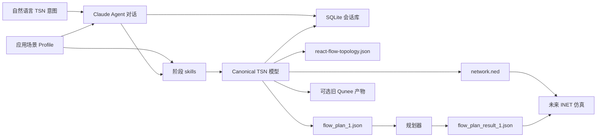

# TSN Agent Tauri 应用需求

## 摘要

构建一个 Tauri 桌面应用，把新手用自然语言描述的 TSN 需求，逐步转换成一个项目目录。MVP 需要直接生成 INET/OMNeT++ 可用的 `.ned` 文件、React Flow 拓扑 JSON，以及规划器输入 `flow_plan_1.json`。应用左侧通过 Claude Agent SDK 驱动对话和阶段引导，右侧以只读方式展示工程状态、默认参数解释、步骤快照和写盘结果。

后续产品需要支持多个 TSN 应用场景，舰载/箭载 TSN 只是其中一个典型场景。场景差异应通过应用场景 Profile 适配阶段文案、默认值、流模板、术语和提示，而不是写死在通用工作流里。

---

## 问题背景

目标用户对 TSN 有基本概念，但面对大量协议概念、参数和文件格式时很容易卡住。现有方式过早暴露底层参数，导致新手必须依赖专家知识才能开始配置。

典型新手期望更像是：“我需要 4 个交换机，每个交换机连接 5 个端系统。” 从这句话开始，应用应该只追问真正阻塞的问题，给出安全默认值，解释默认值的含义，并生成可交给后续规划和 INET/OMNeT++ 仿真的文件。

现有 `tsn-topology` skill 和 `topology.json` 是有价值的历史基础，但 `topology.json` 主要服务于 Qunee 数据源，不应继续约束新应用的核心模型。新产品应以 canonical TSN 模型为源头，再派生 NED、React Flow 数据和规划器输入。Qunee 风格产物如果仍有消费者，可以作为可选兼容导出。

当前交互还需要避免一次性“流式输出全部结果”的体验。Agent 应按拓扑、时间同步、建立流、发送规划/导出准备等阶段推进，在关键阶段给出摘要并等待用户确认、修改或回退。用户还需要看见 Agent 调用了哪些阶段 skill、工具或 MCP，而不是只能在内部日志中看到粗略的请求结果。

多场景支持也要求核心流程保持场景无关。不同场景可以有不同术语、默认拓扑假设、流模板、同步假设和提示文案，但不应各自复制一套 Agent 流程或 UI。

---

## 参与者

- A1. TSN 新手用户：用自然语言描述网络目标，通过引导选择默认值，而不是直接编辑大量底层参数。
- A2. Claude Agent：驱动对话、调用阶段 skill、解释默认值、汇报生成结果。
- A3. TSN skills：把阶段意图转换为确定性产物，覆盖拓扑、同步、流配置，以及后续 INET 导出相关能力。
- A4. 规划器：读取 `flow_plan_1.json`，后续输出 `flow_plan_result_1.json`。
- A5. INET 仿真流程：读取 `.ned`，后续读取由规划结果和 TSN 元数据派生的 INI/配置。
- A6. 应用场景 Profile：提供场景特定术语、默认值、流模板和提示，用于适配未来多个 TSN 应用场景。

---

## 关键流程

- F1. 从自然语言拓扑意图创建新项目
  - **触发：** 用户输入类似“4 个交换机，每个交换机连接 5 个端系统”。
  - **参与者：** A1, A2, A3
  - **步骤：** Agent 解析拓扑意图，只追问阻塞问题，在允许默认时自动补全 ID、端口、布局、链路速率，并生成第一个项目快照。
  - **结果：** 项目拥有 canonical 拓扑、NED 文件、React Flow 拓扑 JSON，以及生成规划器输入所需的拓扑数据。
  - **覆盖：** R1, R2, R3, R8, R9

- F2. 引导式流模板选择
  - **触发：** 拓扑已就绪，用户需要配置业务流。
  - **参与者：** A1, A2, A3
  - **步骤：** Agent 展示常见 TSN 入门模板，用户选择一个模板，应用生成一条带解释的示例流。
  - **结果：** `flow_plan_1.json` 包含一份基于当前拓扑和所选模板的有效规划器输入。
  - **覆盖：** R4, R5, R6, R10

- F3. 步骤快照和回退
  - **触发：** 拓扑、同步、流配置或最终导出步骤完成。
  - **参与者：** A1, A2
  - **步骤：** 应用记录步骤级快照，展示当前步骤状态，并允许用户回到之前的步骤重新生成。
  - **结果：** 用户可以从错误假设中恢复，而不需要手动修 JSON 或编辑字段。
  - **覆盖：** R7, R12

- F4. 会话切换、复制和删除
  - **触发：** 用户需要继续之前的 TSN 配置、对比两个设计分支，或清理不需要的尝试。
  - **参与者：** A1, A2
  - **步骤：** 应用展示会话列表，支持按名称、时间、拓扑摘要和标签检索；用户可以切换会话、复制会话形成新分支，或删除会话。
  - **结果：** 新手可以保留探索过程，不需要通过复制项目文件夹来管理方案版本。
  - **覆盖：** R20, R21, R22, R23

- F5. 项目目录交付
  - **触发：** 用户确认生成配置。
  - **参与者：** A1, A2, A4, A5
  - **步骤：** 应用写入项目产物，展示生成了哪些文件，并标明哪些用于拓扑展示、规划器输入和未来 INET 仿真。
  - **结果：** 下游工具可以直接读取项目目录，不需要重新解释原始对话。
  - **覆盖：** R8, R9, R10, R11

- F6. 分阶段确认和工具可见
  - **触发：** Agent 完成拓扑、时间同步、流配置或发送规划等阶段。
  - **参与者：** A1, A2, A3
  - **步骤：** Agent 展示阶段摘要、默认值解释、调用过的 skill/tool/MCP 事件和下一步动作；用户确认继续、要求修改或回退。
  - **结果：** 用户理解当前阶段发生了什么，不需要从一次性输出中猜测生成链路。
  - **覆盖：** R26, R27, R28, R29

- F7. 场景 Profile 适配
  - **触发：** 用户选择或项目默认绑定某个 TSN 应用场景。
  - **参与者：** A1, A2, A6
  - **步骤：** 应用读取场景 Profile，为阶段导航、默认解释、流模板和提示使用对应场景的术语和默认值。
  - **结果：** 通用 TSN 工作流可以适配舰载/箭载等未来多个应用场景，而不复制核心流程。
  - **覆盖：** R30, R31, R32

---

## 需求

**对话驱动的新手体验**
- R1. 应用必须接受自然语言 TSN 拓扑意图，并按步骤引导用户补齐缺失决策。
- R2. Agent 必须用新手能理解的语言解释关键默认值，尤其是链路速率、端口分配、GM 选择、traffic class、优先级、周期、帧长和时延目标。
- R3. MVP 不应要求用户编辑底层 TSN 参数表单。修改应通过对话提出。
- R4. 拓扑生成后，应用必须提供常见 TSN 入门流模板，例如控制流、视频流、诊断流和后台数据流。
- R5. 用户选择流模板后，必须先生成一条示例流，而不是自动生成完整业务流矩阵。

**阶段 skill 和状态**
- R6. 拓扑、同步默认值和流配置必须分别由阶段专用 skill 处理，避免把领域推理硬编码在 UI 中。
- R7. 应用必须为拓扑、同步、流配置和最终导出保留步骤级快照，并支持回退到之前步骤。
- R8. 左侧对话框必须足够直接地呈现 Claude Agent 输出，让用户能理解 Agent 的推理、工具进展和生成决策。
- R9. 右侧必须是只读工程状态视图，展示拓扑、生成文件、流摘要、参数解释和快照/导出状态。

**Canonical 输出**
- R10. canonical 拓扑模型必须独立于历史 Qunee `topology.json` 形态，并保留稳定节点 ID、名称、端口、链路、链路速率、展示位置、MAC/IP 相关身份和仿真相关元数据。
- R11. MVP 项目导出必须包含 INET/OMNeT++ `.ned` 文件、React Flow 拓扑 JSON 文件和使用当前规划器输入格式的 `flow_plan_1.json`。
- R12. `flow_plan_result_1.json` 不由 MVP 生成，但应用应识别它是规划器输出，用于后续只读展示和仿真衔接。
- R13. `topology.json` 和 `data-server.json` 等 Qunee 产物不应作为新应用的主输出。只有在确有需要时才作为可选兼容导出。

**NED 和 INET 就绪**
- R14. 生成的 `.ned` 必须能表达 INET 兼容的主机/交换机、接口或 gate、链路/channel、datarate 和展示位置。
- R15. canonical 模型必须保留后续 INET INI 生成所需的流身份字段，包括 stream name、UDP port、PCP/VLAN 意图、周期、帧长、时延/抖动要求、源端和目的端。
- R16. 同步输出必须保留后续 gPTP 仿真所需概念，包括 GM 选择、时钟域假设、slave port 关系和已知同步周期默认值。
- R17. 流模板在规划运行前也必须保留 traffic class 和 shaper 意图，避免后续 TAS/CBS/gate schedule 导出重新猜测用户意图。

**规划器交付**
- R18. `flow_plan_1.json` 必须作为 MVP 的规划器输入产物写入项目目录，初期使用仓库中现有样例格式。
- R19. 应用必须清楚区分用于可视化展示、用于规划和用于仿真的文件。

**会话和本地持久化**
- R20. 应用必须有会话概念，一个会话代表一次可恢复的 TSN 配置工作流，包含对话历史、当前阶段、canonical 模型、步骤快照、导出清单和项目路径。
- R21. 用户必须能创建、切换、重命名、复制和删除会话。复制会话必须创建新的会话 ID，并保留来源会话引用，便于把一个设计分支成多个方案。
- R22. 会话列表必须支持基础检索和筛选，至少包括名称、最近更新时间、拓扑规模、流数量、阶段状态、标签或备注。
- R23. MVP 应使用本地 SQLite 保存应用工作台数据和检索索引，但项目导出的 `.ned`、React Flow JSON、`flow_plan_1.json` 和 manifest 仍应作为文件写入项目目录。
- R24. SQLite 不应保存 Claude Code 凭证、本机密钥或下游工具的敏感配置。真实 Claude 配置只在 adapter/wrapper 边界读取。
- R25. 删除会话必须有明确语义：默认删除应用内会话记录和索引；是否同时删除已导出的项目目录必须由用户显式确认。

**分阶段 Agent 交互**
- R26. Agent 必须按阶段推进 TSN 配置流程，至少包括拓扑、时间同步、建立流、发送规划/导出准备。
- R27. Agent 在关键阶段完成后必须展示阶段摘要和下一步动作，并等待用户确认继续、要求修改或回退；不应默认一次性完成所有阶段。
- R28. 左上角步骤导航必须由真实阶段状态驱动，展示当前、已确认、待确认、锁定或错误状态，而不是仅作为静态装饰。
- R29. 应用必须向用户展示 Agent、阶段 skill、tool/MCP、artifact 和导出动作的可理解事件；诊断日志可以保留更多技术细节，但用户不应只能依赖内部日志理解生成过程。

**应用场景 Profile**
- R30. 应用必须预留应用场景 Profile 抽象，用于配置场景显示名、阶段文案、默认值解释、流模板、术语映射和提示。
- R31. 第一版只需要提供通用 TSN Profile 和一个典型场景 Profile 占位，不要求一次性实现全部未来场景。
- R32. 核心阶段工作流、canonical 模型和导出器不应硬编码舰载/箭载等单一场景规则；场景差异应通过 Profile 注入。

---

## 验收示例

- AE1. **覆盖 R1, R10, R11, R14。** 给定用户说“4 个交换机，每个交换机连接 5 个端系统”，当拓扑生成完成后，项目应包含 canonical 拓扑、`network.ned` 和 React Flow JSON，且具备稳定 ID、端口、链路、速率和展示位置。
- AE2. **覆盖 R4, R5, R15, R18。** 给定拓扑已就绪，当用户选择“控制流”模板时，应用应在 `flow_plan_1.json` 中创建一条示例流，包含源/目的、周期、帧长、优先级/PCP 意图、时延目标，以及可用的 route/path 元数据。
- AE3. **覆盖 R3, R7, R9。** 给定用户不满意生成拓扑，当用户要求回退时，应用应回到拓扑快照，而不是要求用户手动编辑 JSON。
- AE4. **覆盖 R12, R19。** 给定后续规划器生成 `flow_plan_result_1.json`，当应用检测到该文件时，应将其识别为规划器输出，而不是用户配置输入。
- AE5. **覆盖 R13。** 给定新的 NED 和 React Flow 输出已存在，当用户没有明确要求 Qunee 兼容时，应用不应把 `topology.json` 当作源数据。
- AE6. **覆盖 R20, R21。** 给定一个已完成拓扑和流模板的会话，当用户复制该会话时，应用应创建新会话 ID，保留原会话引用，并允许在副本中继续调整而不影响原会话。
- AE7. **覆盖 R22, R23。** 给定存在多个会话，当用户搜索“4 switch control”或筛选最近会话时，应用应从本地 SQLite 索引返回匹配会话，而不需要扫描所有导出目录。
- AE8. **覆盖 R25。** 给定会话已经导出项目目录，当用户删除会话但未确认删除文件时，应用应移除会话记录和列表索引，但不删除项目目录。
- AE9. **覆盖 R26, R27, R28。** 给定用户输入拓扑需求，当拓扑阶段生成完成后，应用应停留在拓扑确认状态，展示拓扑摘要和确认/修改动作，而不是直接完成时间同步、流配置和导出。
- AE10. **覆盖 R29。** 给定 Agent 调用了阶段 skill 或 MCP/tool，当用户查看执行步骤时，应看到脱敏后的工具名称、状态、摘要和所属阶段。
- AE11. **覆盖 R30, R31, R32。** 给定项目使用不同应用场景 Profile，当进入同一阶段时，阶段 ID 保持稳定，但展示文案、默认说明和流模板来自当前 Profile。

---

## 成功标准

- 新手可以从一句拓扑意图开始，生成项目目录，而不需要预先理解每个 TSN 参数。
- 生成的项目目录可作为规划器输入，并且保留后续 INET 仿真所需信息，不需要重新解释对话。
- 后续规划不需要再发明输出、回退、右侧编辑或 Qunee 兼容等产品行为。
- 未来 `inet-export` 或仿真工作可以基于已保留的 canonical 元数据继续推进，而不是替换拓扑模型。
- 用户能看懂每个阶段发生了什么、哪些默认值被采用、Agent/skill/tool 做了哪些动作，并能在进入下一阶段前确认或修改。
- 新增应用场景时可以通过 Profile 扩展术语、默认值和模板，不需要复制核心工作流。

---

## 范围边界

- MVP 停在生成规划器输入和 NED-ready 项目文件，不运行规划器，也不评估调度可行性。
- MVP 不展示真实 GCL、WCTA 或规划结果，除非已经存在 `flow_plan_result_1.json` 供只读查看。
- MVP 不做硬件下发。
- MVP 不提供完整专家参数编辑器。
- MVP 不支持字段级选择性回退，只支持步骤快照回退。
- MVP 不根据拓扑自动生成完整业务流矩阵。
- MVP 不需要完整生成 gPTP、TAS、CBS、stream redundancy 或应用流量的 INET INI，但必须保留后续生成所需元数据。
- MVP 不把 SQLite 作为可交付项目产物的唯一来源；项目文件必须可独立被规划器和 INET/OMNeT++ 流程消费。
- MVP 不做跨设备同步和多人协作，会话数据库只面向本机工作台。
- Qunee 兼容低于 NED、React Flow 和规划器输入兼容的优先级。
- MVP 不一次性实现全部未来 8 个应用场景；只建立 Profile 抽象和最小默认/典型 Profile。
- MVP 不把 Profile 做成复杂插件系统、规则引擎或远程加载机制。
- MVP 不把规范差距检查作为用户界面功能；规范文档可作为 Profile 和默认值的背景来源。

---

## 关键决策

- Canonical 模型优先：使用新的 TSN 中心模型作为源头，再派生 NED、React Flow JSON、规划器输入和可选旧产物。
- NED 纳入 MVP：第一版项目导出就应包含 `.ned` 文件，而不是只保留 NED-ready 数据。
- React Flow 方向上替代 Qunee：右侧拓扑展示应基于 React Flow 数据，而不是 `data-server.json`。
- 对话是编辑入口：右侧保持只读，降低新手参数负担，同时让生成状态可检查。
- 流配置以模板起步：一条示例流比自动生成多条流更能帮助用户理解参数意义。
- 会话是工作台单位：会话用于恢复上下文、管理设计分支和检索历史，项目目录用于交付给规划器和 INET/OMNeT++。
- SQLite 作为本地索引库：保存会话、消息、步骤快照、canonical state、导出清单和检索索引；不替代 `.ned`、React Flow JSON 和规划器输入等可交付文件。
- `tsn-topology` 需要演进：现有 skill 应更新或被替代，使拓扑生成面向 NED/React Flow/规划器友好产物，而不是只产出 Qunee 时代文件。
- 阶段确认优先：Agent 默认按阶段推进，关键阶段完成后等待用户确认；“直接生成完整草案”只能作为显式快速路径。
- 工具调用可见：阶段 skill、tool/MCP 和 artifact 事件应进入用户可见时间线，同时保持脱敏和摘要化。
- 场景 Profile 优先于场景硬编码：舰载/箭载等场景差异应通过 Profile 提供，不进入通用流程核心。

---

## 依赖与假设

- 应用可以通过 Claude Agent SDK 或 wrapper 进程复用用户本机 Claude Code 配置，整体思路接近 Happy Coder 风格的本地/远程桥接。
- Claude Agent SDK 消息流可用于捕获 session、streaming chunk、tool/MCP 状态和工具调用摘要，但应用仍需过滤敏感信息并禁止高风险工具默认执行。
- `tests/fixtures/planner/flow_plan_1.json` 和 `tests/fixtures/planner/flow_plan_result_1.json` 可作为临时规划器输入/输出格式参考。
- INET/OMNeT++ 兼容需要 canonical 拓扑能保留或派生稳定 module 名称、interface/gate 映射、链路/channel、datarate 和展示坐标。
- 精确 `.ned` module 选择和 INET package/import 约定可在计划和实现阶段确定。
- 当前 HTML 原型只是产品方向参考，不是 UI 契约。
- 未来 8 个应用场景的完整清单和差异规则尚未全部确定；第一版 Profile 契约需要允许后续扩展，而不承诺一次建完全部场景。

---

## 关系图

---

## 待解决问题

### 推迟到计划阶段

- [影响 R11, R14][需调研] 确定生成 `.ned` 时使用的 INET node module、gate/interface 语法和 NED package/import 约定。
- [影响 R10, R11, R18][技术] 定义 canonical 拓扑/流模型形态，以及派生 NED、React Flow JSON 和 `flow_plan_1.json` 的确定性规则。
- [影响 R6][技术] 决定是原地更新 `tsn-topology`，还是新增一个拓扑 skill 并提供迁移路径。
- [影响 R15, R16, R17][需调研] 决定 MVP 中应保留多少 INET INI 元数据，虽然完整 INI 生成延期。
- [影响 R20-R25][技术] 设计 SQLite schema、迁移策略、全文检索字段，以及会话删除是否提供短期撤销窗口。
- [影响 R26-R29][技术] 设计阶段状态、确认动作和用户可见事件的数据结构。
- [影响 R30-R32][产品/技术] 明确第一批内置 Profile 的命名、默认模板和未来 7 个场景的扩展边界。

---

## 来源与参考

- 原型参考：`docs/prototypes/tsn-agent-prototype-20260509-1430.html`
- 现有拓扑 skill：`tsn-topology/SKILL.md`
- 现有拓扑规则：`tsn-topology/docs/rules.md`
- 规划器输入样例：`tests/fixtures/planner/flow_plan_1.json`
- 规划器输出样例：`tests/fixtures/planner/flow_plan_result_1.json`
- 现有 Qunee 时代拓扑样例：`tests/fixtures/legacy-qunee/topology.json`
- 箭载/舰载 TSN 典型场景背景：`docs/prototypes/箭载TSN技术规范_V1.2_1204-s.docx`
- 场景差距分析背景：`docs/brainstorms/2026-05-20-tsn-agent-rocket-tsn-spec-gap-analysis.md`
- 已查阅的 INET 文档方向：NED 有线拓扑、TSN gPTP、Time-Aware Shaping、gate scheduling、stream identification、stream encoding、PCP/VLAN 映射。
