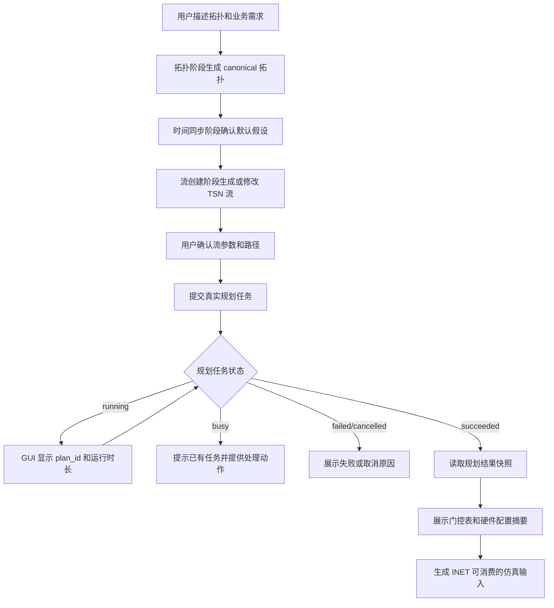

# TSN 规划中转服务对接需求

## Summary

把当前“流量规划”从 MVP 的静态输入导出，升级为真实规划任务闭环：Agent 先从自然语言生成或修改 TSN 流，再把拓扑、流、节点和链路参数提交给规划中转服务，等待任务完成，读取门控表和硬件配置快照，并把结果用于后续 INET 仿真输入。

---

## Problem Frame

当前应用已经有四个用户可见阶段：拓扑、时间同步、流量规划、模拟仿真。MVP 阶段只生成 `planner/flow_plan_1.json` 作为规划器输入，并明确不伪造 `flow_plan_result_1.json`、GCL 或 interface 摘要。现在需要开始对接真实规划器，让应用能完成“流创建之后的规划执行”。

规划中转服务的任务不是即时返回。一次规划可能运行几秒、十几秒、几分钟，甚至更久。用户需要在 GUI 中看到任务已经启动、当前 `plan_id`、运行时长、状态刷新、失败原因和停止入口，而不是只看到智能助手等待动画。

API 文档 `docs/prototypes/TSN 规划中转服务 API 对接文档_20260522.html` 明确第一版只承诺 `time-trigger`/ST 规划闭环。现有 canonical project 已有部分输入来源，例如节点、链路、流端点、周期、帧长、路径和链路速率，但缺少节点级规划参数、链路 ST 队列/macrotick 等规划必填字段的用户可见来源或默认策略。

---

## Actors

- A1. TSN 新手用户：通过自然语言创建拓扑和业务流，需要理解规划任务是否已提交、是否完成、失败在哪里。
- A2. Agent：负责解析用户意图、生成或修改流、解释默认值，并把规划任务进展以用户可理解的方式反馈到会话。
- A3. TSN Agent 应用：维护 canonical project、阶段状态、会话、GUI 等待状态、artifact bundle 和导出边界。
- A4. 规划中转服务：接收完整规划输入，启动任务，返回状态、结果快照和错误信息。
- A5. INET 仿真消费者：读取应用导出的 NED、INI、traffic 和规划结果派生产物，用于后续仿真。

---

## Key Flows

- F1. 创建或修改流
  - **Trigger:** 拓扑和时间同步阶段已确认，用户输入“新增一条视频流”“两条控制流”等需求。
  - **Actors:** A1, A2, A3
  - **Steps:** Agent 解析自然语言；应用基于当前拓扑生成流端点、周期、帧长、PCP、时延/抖动、路径和五元组默认值；GUI 展示流列表和路径高亮；用户确认或要求修改。
  - **Outcome:** canonical project 中有可提交给规划中转服务的流集合。
  - **Covered by:** R1, R2, R3, R4, R5

- F2. 启动真实规划任务
  - **Trigger:** 流创建阶段已确认，用户继续进入真实规划执行。
  - **Actors:** A1, A2, A3, A4
  - **Steps:** 应用把 canonical 拓扑、流和规划参数映射为中转服务入参；提交任务；保存 `plan_id`、开始时间和请求摘要；GUI 进入任务等待状态。
  - **Outcome:** 一个规划任务处于 `running`、`busy`、`failed` 或已立即完成状态，用户能看到清晰状态。
  - **Covered by:** R6, R7, R8, R9, R10

- F3. 等待、轮询和停止
  - **Trigger:** 已有 `plan_id` 且任务尚未结束。
  - **Actors:** A1, A3, A4
  - **Steps:** 应用定期查询任务状态；展示运行时长、内部结果、最近更新时间；用户可请求停止；应用明确提示停止接口会停止当前运行任务，不校验发起人归属。
  - **Outcome:** 任务进入 `succeeded`、`failed`、`cancelled`、`not_found` 等终态，或继续等待。
  - **Covered by:** R11, R12, R13, R14, R15

- F4. 读取结果并回写项目产物
  - **Trigger:** 任务状态为 `succeeded`。
  - **Actors:** A3, A4, A5
  - **Steps:** 应用读取结果快照；保留 `solution_json`、`tsnlight_plan_cfg_json` 和文件指纹；展示门控调度摘要；刷新 artifact bundle；把可映射的 GCL 信息转成 INET 仿真输入。
  - **Outcome:** 项目包含真实规划输出和可追溯的 INET 派生产物，不再伪造规划结果。
  - **Covered by:** R16, R17, R18, R19, R20, R21

---

## Requirements

**阶段语义**
- R1. “流量规划”必须拆成两个用户可理解的子能力：从自然语言创建/修改流，以及把已确认拓扑和流提交给真实规划器执行。
- R2. 稳定阶段 ID 必须继续使用 `topology`、`time-sync`、`flow-template`、`planning-export`；不能为了真实规划器对接重命名核心状态机。
- R3. `flow-template` 阶段必须继续负责流集合创建和确认，不应在用户未确认流参数时提交规划任务。
- R4. `planning-export` 阶段必须演进为真实规划执行与仿真输入准备阶段，完成后才能展示规划输出和派生的 INET 产物。
- R5. 快速路径可以自动串联阶段，但仍必须在内部区分“流创建完成”和“规划任务完成”。

**规划输入映射**
- R6. 提交规划任务时，请求必须包装为 `sendData`，`sendData.mode` 第一版固定为 `time-trigger`。
- R7. 请求必须包含 `source_config.cfg_parameter.cfg_parameter.node`、`source_config.flow_feature` 和 `source_config.topo_feature` 三类输入。
- R8. 节点参数必须能从 canonical 节点或默认配置生成：`node_id`、`system_clock`、`rc_threshold`、`hpriority_policing_threshold`、`lpriority_policing_threshold`、`qbv_or_qch`、`qci_enable`、`port_num`、`node_type`，以及可选 `ptp_threshold`、`vlan_cfg`、`vlan_id`。
- R9. 流参数必须能从 canonical 流生成：`stream_id`、`src_node`、`dst_node`、`path_number`、`size`、`period` 和候选 `path`。
- R10. 路径参数必须能从 canonical 流、节点、链路和默认网络身份生成：`route`、`flow_type`、`latency_requirement`、`jitter_requirement`、`redundant`、`fl_api_flag`、`delay_para`、`src_ip`、`dst_ip`、`src_port`、`dst_port`、`dst_mac`、`ip_protocol`、`fivetuple_mask`。
- R11. 链路参数必须能从 canonical 链路或默认配置生成：`link_id`、`src_node`、`src_port`、`dst_node`、`dst_port`、`speed`、`st_queues`、`macrotick`。
- R12. GUI 或默认值说明必须覆盖当前 canonical 缺失但 API 必填的参数来源，尤其是节点 policing 阈值、`qbv_or_qch`、`qci_enable`、`st_queues`、`macrotick` 和 `delay_para`。
- R13. 应用必须在提交前校验唯一性和引用完整性：节点数字 ID、流 ID、链路 ID 唯一；流端点存在；路径中的链路 ID 存在于拓扑链路集合。

**任务生命周期**
- R14. 应用必须调用启动接口并保存返回的 `plan_id`、`started_at`、`state`、`trace_id` 和响应时间。
- R15. 当启动返回 `busy` 时，GUI 必须展示当前运行任务、运行时长和处理建议，不能假装本次任务已创建。
- R16. 任务运行中必须轮询状态接口，并展示 `state`、`running_duration_ms`、`started_at`、`updated_at`、`finished_at`、`internal_result`、`error_code` 和 `error_message` 的用户可理解摘要。
- R17. 任务终态必须至少区分 `succeeded`、`failed`、`cancelled`、`not_found`；失败和找不到任务时必须保留错误摘要，方便用户修改输入或重试。
- R18. 停止任务必须通过明确用户动作触发，并提示第一版停止接口实际停止当前运行任务，不保证只停止当前会话发起的任务。
- R19. 对可能运行很久的任务，GUI 必须保持有效等待体验：可见运行时长、最近状态、下一次刷新或仍在等待的提示，以及不会阻塞用户查看当前拓扑和流参数。

**结果处理**
- R20. 只有任务 `succeeded` 后才能读取规划结果；未完成时调用结果读取接口返回的状态不能被当成成功结果。
- R21. 成功结果必须保留 `source_outputs.solution_json`、`source_outputs.tsnlight_plan_cfg_json` 和 `output_fingerprints`，并在 artifact 中标记为真实外部观测结果。
- R22. `solution_json[].link_id` 和 `gcl_entries[]` 必须被解析为可展示的门控调度摘要，包括链路、持续区间、门控状态和承载流 ID。
- R23. `tsnlight_plan_cfg_json.network_plan_cfg.node` 必须保留为硬件配置快照；第一版不要求把寄存器地址和数据解释成高级 GUI 参数。
- R24. 结果结构第一版应保持源码输出快照，不强制重塑为自定义结果模型。

**INET 仿真输入**
- R25. 应用必须继续导出现有 INET NED、`omnetpp.ini` 和 UDP traffic 配置。
- R26. 当存在真实规划结果时，应用必须额外生成可追溯的 TAS/GCL 相关 INET 输入或中间产物，使后续仿真能消费门控调度信息。
- R27. 从规划结果到 INET 的映射必须保留链路 ID、流 ID、门控状态和时间区间的来源关系，方便用户追踪仿真参数来自哪次规划任务。
- R28. 单位未确认字段第一版不得擅自换算；`system_clock`、policing 阈值、`speed`、`macrotick`、`delay_para` 和结果 `interval` 应保持源码值，并在 GUI 或文档中标识单位待确认。
- R29. 如果当前 INET 版本或导出器无法直接表达某些 GCL 字段，应用必须导出原始规划结果和转换说明，不能生成看似完整但不可验证的仿真配置。

**GUI 与会话**
- R30. GUI 必须在流列表中补足规划必需参数的可见性，至少能让用户看到或修改周期、帧长、端点、路径、时延、抖动、优先级、冗余和协议/端口信息。
- R31. 拓扑详情必须补足规划必需参数的可见性，至少能让用户看到节点数字 ID、端口数、节点类型、链路数字 ID、链路端口、链路速率、ST 队列数和 macrotick。
- R32. 会话必须持久化当前规划任务状态和结果摘要，应用重启后不能丢失已启动任务的 `plan_id` 和最新状态。
- R33. 执行步骤面板必须记录启动、轮询、停止、读取结果、刷新 artifact 和导出 INET 产物等事件。
- R34. 诊断日志只能保存脱敏摘要，例如 `plan_id`、状态、耗时、响应错误码、artifact 路径和指纹；不得保存凭证或大段原始工具输出。

**边界**
- R35. 第一版只支持 `time-trigger`/ST 规划；CBS、ATS、非时间触发规划不纳入本次范围。
- R36. 第一版不实现多任务排队；当服务返回 busy 时，应用只能等待、稍后重试或由用户主动停止当前运行任务。
- R37. 第一版不伪造 `flow_plan_result_1.json`、GCL 或 interface 摘要；只有真实规划结果返回后才能生成规划输出 artifact。
- R38. 第一版不启用认证和 TLS；Base URL 必须作为配置项提供，默认值使用 HTTP 测试环境，后续可切换不同规划服务环境。

---

## Acceptance Examples

- AE1. **Covers R1, R3, R30.** Given 用户在流创建阶段输入“新增一条视频流”，when Agent 生成流，then GUI 显示该流的端点、路径、周期、帧长、PCP、时延和抖动，并等待用户确认，不自动提交规划任务。
- AE2. **Covers R6-R13.** Given 用户确认流集合，when 应用提交规划，then 请求包含 `mode=time-trigger`、节点参数、流参数、路径参数和链路参数，并在提交前发现缺失引用或重复 ID。
- AE3. **Covers R14-R19.** Given 规划任务启动成功且状态为 `running`，when 用户停留在应用中，then GUI 持续显示 `plan_id`、运行时长、最近更新时间和等待状态，用户仍可查看拓扑和流参数。
- AE4. **Covers R15, R36.** Given 服务返回 `busy`，when 应用收到响应，then 不创建新的本地成功任务，而是展示当前运行任务 ID、运行时长，以及等待/重试/停止的处理入口。
- AE5. **Covers R20-R24, R37.** Given 任务状态为 `succeeded`，when 应用读取结果，then artifact 中包含真实 `solution_json`、`tsnlight_plan_cfg_json` 和指纹；如果任务未成功，则不生成规划输出 artifact。
- AE6. **Covers R25-R29.** Given 成功结果包含某链路的 `gcl_entries`，when 应用刷新仿真输入，then 导出内容能追溯到链路 ID、流 ID、门控状态和区间；单位待确认字段保持源码值。
- AE7. **Covers R18, R33, R34.** Given 用户点击停止规划，when 应用调用停止接口，then GUI 明确提示停止语义，执行步骤记录停止请求和返回状态，诊断日志只保存脱敏摘要。

---

## Success Criteria

- 用户能清楚区分“流已经创建”和“真实规划已经完成”，并能看到长时间规划任务的状态。
- 应用能把当前 canonical 拓扑和流转换成中转服务第一版接受的 `time-trigger` 输入。
- 成功规划后，项目导出中出现真实外部规划结果和可追溯的 INET 派生产物。
- 失败、busy、取消和 not found 都有可理解 GUI 反馈，而不是只表现为智能助手失败。
- 下游计划阶段不需要重新定义 API 生命周期、GUI 等待语义、结果 artifact 边界或第一版范围。

---

## Scope Boundaries

- 第一版仅覆盖 API 文档承诺的时间触发/ST 规划闭环。
- 第一版不实现服务端排队、多用户归属校验或任务所有权隔离。
- 第一版不解释硬件寄存器配置的业务含义，只保留和展示源码快照。
- 第一版不声称完成完整 TSN 行为仿真；INET 输出的目标是消费规划结果并保持可追溯。
- 第一版不把场景逻辑写死为箭载/舰载；场景差异仍通过 `ScenarioConfig` 或默认配置表达。

---

## Key Decisions

- 保持 4 个稳定阶段 ID：避免破坏现有会话、测试和阶段工作流约束。
- 真实规划归入 `planning-export` 阶段：流创建完成后才有足够输入执行外部规划，规划结果也直接影响仿真输入。
- 保留源码结果快照：第一版结果结构和单位仍有待确认，过早二次抽象会制造不可验证语义。
- 把长任务等待做成规划任务状态：规划可能远长于一次 Agent 文本生成，必须有独立 GUI 反馈。

---

## Dependencies / Assumptions

- 规划接口依据 `docs/prototypes/TSN 规划中转服务 API 对接文档_20260522.html`，Base URL 第一版作为配置项提供，默认值为测试环境 `http://100.78.48.43:18080`。
- 当前测试环境不启用认证和 TLS；后续生产环境安全要求不在本需求中定稿。
- 当前 canonical project 已验证包含节点、链路、流、端点、周期、帧长、PCP、路径、IP/MAC、UDP port、链路速率等信息。
- 当前 `planner/flow_plan_1.json` 仍是 MVP `stream_info` 形状，不符合新中转服务 `sendData.source_config` 形状。
- 单位待确认字段需要保持源码值，不做隐式换算。

---

## Outstanding Questions

### Deferred to Planning

- [Affects R8-R12][Technical] 节点级默认参数和链路 `st_queues`/`macrotick` 应放在 canonical model、ScenarioConfig，还是独立 planner defaults 中。
- [Affects R26-R29][Needs research] 当前 INET 导出器应以哪种 INET TAS/GCL 配置格式消费 `solution_json.gcl_entries`。
- [Affects R32][Technical] 长任务状态持久化和应用重启后的补轮询应与现有 session repository 如何衔接。
