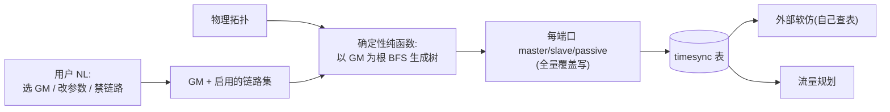

# Stage2 时钟同步 — 需求文档

## Summary

把已存在的占位阶段 `time-sync` 做实：用户用自然语言指定 GM 主时钟和在意的同步参数，系统按「GM + 物理拓扑」确定性算出整棵时钟同步树（每端口 master/slave/passive 角色）、补齐未指定的默认参数请用户确认后落库；之后可继续用自然语言换 GM、改参数、启用/禁用某条链路。配套完成 topology 表演进（mid 改名 + 端口/speed 拆列 + mac/ip/port_count/queue_count 加列）与两张时钟同步表。

## Problem Frame

TSN Agent 的三个用户可见阶段里，topology 已做实、`time-sync` 还是纯本地占位——进入时只读一段固定摘要，没有库、没有工具、没有校验，用户无法在工具内真正配置时钟同步。时钟同步是「把画好的拓扑变成可仿真、可下发的配置」的关键一环：没有它，下游的流量规划和外部软/硬仿拿不到时钟域、端口角色、节点地址。同时 topology 表沿用 Qunee 遗留形态——节点键叫 `sync_name`、端口塞在 `styles_json` 的自由文本标签里、节点没有 mac/ip，这些都挡在时钟同步和后续阶段前面，必须一并理顺。

## Key Decisions

**端口角色是确定性衍生，不是用户输入。** `master_port[]`/`slave_port[]`/`port_ptp_enabled[]` 由 `(GM, 启用的链路集, 拓扑)` 算出、全量覆盖写；大模型只表达「选哪个 GM、改哪个参数、禁哪条链路」的意图。理由：端口角色填错是时钟环路或节点收不到同步，比拓扑填错更隐蔽；弱模型即将上线，按项目层归属规则，「违反会破坏数据」的规则必须确定性兜底、不靠 SKILL.md 文字。这条连锁简化了数据模型（角色当快照存、校验靠重算）和交互（用户掌控 GM、系统兜底树形）。

**真单域，不预留。** `timesync_domain` 一 session 一行、一个 GM。dual-plane 双平面拓扑进 time-sync 塌成单棵 BFS 树（端系统双挂使图连通、单 GM 仍覆盖全网），但「每平面独立时钟冗余」语义本期放弃。将来要多域再做表重建。

**NL 编辑面 = 改 GM + 改参数 + 启用/禁用链路。** 用户不能直接手翻端口角色。禁用一条链路 = 把它排除出同步树（两端 passive、不走 Sync），承载「这条不走时钟」的真实诉求。

**schema 改造与 timesync 捆一个周期。** mid 改名、端口/speed 拆列与 timesync 两表一起落，存量库经命令式守卫自动迁移。mid 改名与 timesync 表外键（按 mid 关联）相接，迁移是两阶段共同前置；技术上 R1-R5 可先行独立落地，本期按 boss 决定单周期一次交付，非不可拆。代价是改动集中、已在用的 topology 阶段一起动、风险叠加——故迁移须重点验证不回归已发布的 topology 阶段。

**复用既有跨阶段基建。** 写库走 sidecar（仿拓扑）；单步撤销接 `domain="timesync"`；确认闸复用 `{ok, caliber, errors}` 结果形状。不另造机制。

**mac/ip 单一确定性分配器；软仿外部只查表。** mac/ip 由一处分配规则产出（节点集 → 每节点不重复地址），timesync/流量规划/外部软仿共用同一套地址。软仿不由本应用编排——它自己查表调接口，应用只保证表做对、可查。

## Requirements

**拓扑表演进**

R1. `topology_nodes` 的 `sync_name` 改名为 `mid`（系统节点 id 标识，导出给规划器）。
R2. `topology_nodes` 新增 `mac`、`ip`、`port_count`(默认 8)、`queue_count`(默认 8) 四列。
R3. `topology_links` 的 `src_sync_name`/`dst_sync_name` 改名为 `src_node`/`dst_node`。
R4. `topology_links` 把端口（`src_port`/`dst_port`）与 `speed` 从 `styles_json` 拆为独立列，取拓扑真实端口连线；`role`/`plane` 仍留 `styles_json`。迁移策略（best-effort 解析 / 置空重采 / 拒迁）取决于历史 `leftLabel`/`rightLabel` 能否可靠映射成整数端口，须进规划前核验真实数据后定（见 Outstanding Questions）。
R5. 上述改造与 timesync 新表在同一周期落地；存量库经命令式守卫自动迁移，旧导出文件兼容不保证。

**时钟树与端口角色**

R6. 时钟树是以用户指定的 GM 为根的 BFS 生成树，覆盖与 GM 连通的全部节点。多条等价最短路或有环拓扑下生成树不唯一，须用确定性 tie-break（按 mid 数值序 + 端口序排序后入队，复用现有转发表 BFS 的同一排序规则）保证同输入逐次产出一致。
R7. 每节点端口角色（master/slave/passive）由 `(GM, 启用的链路集, 拓扑)` 确定性算出、全量覆盖写；用户与大模型不能直接指定端口角色。
R8. 非树边两端端口为 passive；被用户禁用出同步树的链路两端亦为 passive。

**阶段交互**

R9. 进入 time-sync 先引导用户用自然语言指定 GM；GM 未定不能推进到下一阶段。
R10. 用户可在指定 GM 时一并给出在意的同步参数；系统为未指定的入库参数补默认值，整理完整配置请用户确认后落库。
R11. 落库后用户可继续用自然语言换 GM、改参数、启用/禁用某条链路；每次改动重算时钟树并重新请求确认。
R12. time-sync 阶段从纯本地占位升级为「有库、有 MCP 工具、有确认闸」，接入大模型。

**数据模型与校验**

R13. 新建 `timesync_domain` 表，一 session 一行：`gm_mid`（必须指向现存 `topology_nodes.mid`，非「≤ 最大 mid」——删了中间节点会留空洞）、`one_step_mode`(0 两步/1 一步)、`fre_switch`(0/1)。
R14. 新建 `timesync_nodes` 表，`(session_id, mid)` 唯一：`master_port[]`/`slave_port[]`/`port_ptp_enabled[]`（元素 ≤ 对应节点 `port_count`）、`sync_period`(2^n, 0≤n≤15)、`measure_period`(2^n, 0≤n≤15)、`report_enable`(0/1)、`mean_link_delay_thresh`(2^n, 0≤n≤7)、`offset_threshold`(0..4095 整数)。
R15. 存一份「被排除出同步树的链路集」，承载「禁用链路」、作为时钟树重算的输入；落地形态（`timesync_domain` 内 JSON vs 独立 per-link 标志/表）留待规划阶段定。切回 topology 后须校验集内链路仍存在，悬空项剔除或提示。
R16. 取值校验分两层：zod（MCP 入参越界早失败）+ Rust/DB（权威）。端口角色既是衍生，校验靠「重算比对落库快照」，不给数组逐元素写双层规则。重算结果为唯一权威，落库快照仅用于检测漂移；不一致时以重算覆盖快照并记录告警，绝不以快照覆盖重算。
R17. 切回 topology 改动拓扑后回到 time-sync，须按当前拓扑无条件重算整棵树并全量覆盖写端口角色（不仅复验 GM 后沿用旧快照）——`port_count` 缩小或端口连线变化会让旧 `master_port[]` 越界/错配。重算前：`gm_mid` 悬空则拦截提示重选；禁用链路集内已不存在的链路剔除。

**复用与寻址**

R18. timesync 写库工具走 sidecar（MCP → HTTP → axum → sqlx，SQL 全在 Rust）。
R19. 单步撤销接入 `domain="timesync"`，复用既有 pre-image 盖回框架。
R20. 确认闸复用 `{ok, caliber, errors:[{code, message_zh, ref}]}` 结果形状，前端/agent 消费链不改。
R21. 本期为 `topology_nodes` 的 mac/ip 列按确定性规则填充（节点集 → 每节点 session 内不重复地址）。「供 timesync/流量规划/外部软仿跨阶段共用的单一分配器」抽象待下游消费者实际对接时再提升，不在本期范围。
R22. 外部软仿不由本应用编排；应用职责限于把 timesync 相关表结构/数据做对、可查。
R23. BFS 完成后若存在未被时钟树覆盖的节点（与 GM 不连通），确认闸以告警形式显式列出，不静默落库成无时钟态。

## Key Flows

F1. 进入并首配
  - **Trigger：** 用户从 topology 确认推进、或切回 time-sync。
  - **Steps：** agent 引导用户指定 GM（可一并给参数）→ 系统按 GM+拓扑算时钟树 → 补未指定的默认参数 → 整理完整配置请用户确认 → 确认后落 `timesync_domain`/`timesync_nodes` → 画布渲染树。
  - **Outcome：** 一份完整、已确认的单域时钟同步配置入库。
  - **Covers：** R6, R7, R9, R10, R12, R13, R14。

F2. 落库后 NL 微调
  - **Trigger：** 用户对已成树的配置提自然语言修改。
  - **Steps：** 解析意图（换 GM / 改参数 / 启用或禁用某条链路）→ 更新输入（GM / 参数 / 禁用链路集）→ 重算时钟树端口角色、全量覆盖写 → 重新请求确认。
  - **Outcome：** 配置随输入更新，端口角色始终是输入的确定性衍生。
  - **Covers：** R7, R8, R11, R15, R16, R19。

F3. 切回拓扑后的 GM 复验
  - **Trigger：** 用户从 time-sync 切回 topology 改动拓扑后再回到 time-sync。
  - **Steps：** 进 stage 重验 `gm_mid` 仍指向现有节点 → 失效则拦截、提示重选 GM；有效则按当前拓扑重算树请用户确认。
  - **Outcome：** 不让悬空 GM 静默落库或建出错误的树。
  - **Covers：** R17。

## Acceptance Examples

AE1. **禁用链路 → 两端 passive。** 用户说「这条链路不走时钟」→ 该链路进禁用集、两端端口角色变 passive、受影响子树重算、请用户确认。**Covers R8, R11, R15。**

AE2. **GM 悬空拦截。** 用户切回 topology 删掉了原 GM 节点 → 回 time-sync 时 `gm_mid` 失效 → 拦截并提示重选，不静默落库。**Covers R17。**

AE3. **端口角色确定性。** 同一拓扑 + 同一 GM + 同一禁用集，连算两次 → 端口角色逐字节一致。**Covers R7。**

AE4. **只给 GM 不给参数。** 用户只指定 GM、未提任何参数 → 系统补全默认（sync_period 等）、整理完整配置请确认，不要求用户逐个手填。**Covers R10。**

AE5. **dual-plane 单树覆盖。** dual-plane 拓扑指定单 GM → BFS 经双挂端系统覆盖全网、落单棵树（不报双平面错误）；端系统充当跨平面时钟中转是接受限制（见 Scope Boundaries）。**Covers R6。**

AE6. **未覆盖节点告警。** 拓扑存在与 GM 不连通的子图 → 确认闸列出无时钟节点告警，而非静默放过。**Covers R23。**

## Scope Boundaries

**本期不做（将来可能做）**
- 多时钟域 / 每平面独立 GM 冗余——随「真单域」决定一并推后，将来做表重建。**已知限制（boss 拍板接受）**：dual-plane 拓扑进 time-sync 塌成单棵树，单 GM 选在某一平面时端系统会充当跨平面时钟中转、另一平面交换机经端系统取时钟，无每平面独立冗余；这是 dual-plane 在单域下的接受限制，待将来多域解决。
- 软仿（INET）/ 硬仿（task）的编排执行——本应用不发起、不传输、不对账。
- 硬仿 task 接口——零先例，待后续。

**不在本应用职责内**
- 仿真后端的运行：软/硬仿自己查数据库表、调自己的接口；应用只产出可查的正确数据。

## Dependencies / Assumptions

- **迁移机制（已 firsthand 验证）**：生产库无 `_sqlx_migrations`、`tauri_plugin_sql` 的 `migrations()` 向量在真机不跑；schema 真相源是 `safety_net_schema_sql()` + 命令式 `ensure_*` 守卫。加列照 `ensure_topology_nodes_name_column`、改键照 `ensure_topology_rekey_to_sync_name`，并同步 `P0_DOMAIN_SCHEMA_SQL` 与 `SESSION_SCOPED_TABLES`（漏改=导出/导入静默丢数据）。
- **dual-plane 单树覆盖**依赖端系统双挂使全图连通；若出现与 GM 完全不连通的子图，该子图节点本期无时钟（不特殊处理）。
- **软仿查询契约**（软仿查哪几张表、字段口径）由接口方后续给出；本期按「表结构/数据正确可查」交付，不锁定软仿侧 schema。
- **历史端口数据可解析性**：`styles_json` 的 `leftLabel`/`rightLabel` 是否能可靠映射成整数 `src_port`/`dst_port`，需在规划阶段核验真实数据后定迁移策略。

## Outstanding Questions

**进规划前需定**
- 无阻塞决策——三个最难回退的产品决策（真单域、NL 编辑面、捆绑迁移）已拍板，dual-plane 单域限制已接受。

**留待规划阶段**
- **首要调查**：`leftLabel`/`rightLabel` 能否可靠映射成整数 `src_port`/`dst_port`——规划阶段先核验真实端口数据，据此定 R4 迁移策略（best-effort 解析 / 置空重采 / 拒迁）。
- 「被禁用链路集」的落地形态（`timesync_domain` 内 JSON vs 独立 per-link 标志）。
- 端口角色快照存 JSON-in-TEXT vs 拆 `timesync_node_ports` 行表（后者可 SQL 确定性校验但需新 op）。
- timesync 工具并进现有 `tsn_topology` registry vs 独立 stdio server（倾向并进、省进程）。
- mac/ip 具体生成规则（MAC `02:` locally-administered 前缀方案、IP 网段/子网选择）。
