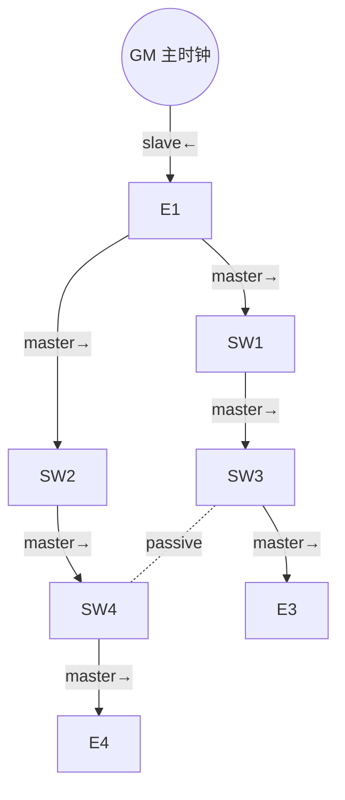
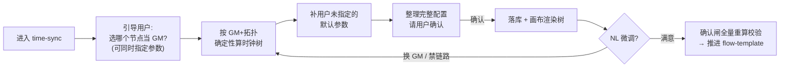

# Ideation：stage2 时钟同步总体设计

这份文档不是需求也不是实现方案，是把「时钟同步阶段怎么做」里**真正待定的设计岔路**摆出来，每条带依据、带代价，供选方向。boss 已经把表结构、字段、校验规则、交互大方向定得很细——这些当**约束**，不在这里重新论证。下面只挑那些「怎么做都行、但选错要返工」的决策点。

## Grounding Context（Codebase Context）

**项目形态**：Tauri 2 + React/TS（`src/`）+ Rust（`src-tauri/`，axum sidecar + sqlx/SQLite）。agent 跑在独立 Node worker（`src-node/`），worker 再 spawn 一个 stdio MCP 子进程。三进程：Tauri 主进程持 sqlx pool + axum sidecar；Claude worker；worker 的 MCP 子进程。

**阶段体系**：`WORKFLOW_STEPS = ["topology", "time-sync", "flow-template"]`（`src/domain/scenario-config.ts`）。`time-sync` 是**已存在的稳定 stage ID**——做的是「把占位做实」不是「新建阶段」。当前只有 `topology` 调大模型；`time-sync` 是纯本地占位 `runTimeSyncStage`（`src/agent/agent-adapter.ts`，读 `scenarioConfig.defaults.timeSyncSummary` 拼一段固定摘要，零工具、零库、零校验）。阶段切换：前进=确定性按钮 `confirmCurrentStage`（不走大模型）；回退=大模型调 in-process 工具 `request_stage_change`，合法目标在应用层硬校验。SKILL.md 注入靠 worker 每次读盘拼进 `systemPrompt`（单字符串 + sentinel，**绝不能 `string[]`**，否则 `redactSecrets` 崩），当前硬编码读 `tsn-topology/SKILL.md`。

**MCP 解耦（拓扑现机制）**：两形态——(a) `tsn_topology` 是 stdio 子进程，8 个工具全部 `fetchSidecar` 转发 HTTP → axum route → sqlx；(b) `tsn_workflow` 是 in-process（`createSdkMcpServer`），承载 `request_stage_change` / `undo_last_change`。`buildAllowedToolsForStage` 按 stage 门控工具（拓扑工具只在 topology 阶段开放）。SQL 全在 Rust（防注入），MCP 只发领域级 JSON。

**topology 现状 schema**：`topology_nodes(session_id, sync_name PK, name, x, y, node_type, insert_order)`；`topology_links(session_id, link_seq PK, name, src_sync_name, dst_sync_name, styles_json)`。端口/speed/plane/role 现在**全塞在 `styles_json`**（`leftLabel`/`rightLabel` 是端口标签）。落库：`persist_initialized_topology`（整表替换）+ `apply_operations`（5 个 op，三态写入幂等）。`build_artifacts` 读内存不读库，`imac`/`sync_type` 现导给规划器。

**迁移机制的真实情况（本会话 firsthand 验证，与某些文档说法相左，以此为准）**：真实 app DB **没有 `_sqlx_migrations` 表、`user_version=0`**——`tauri_plugin_sql` 的 `migrations()` 向量在生产库上**根本没跑**。schema 的真相源是 `safety_net_schema_sql()`（`CREATE/DROP IF EXISTS`，每次连库跑）+ 命令式 `ensure_*` 守卫。加列照 `ensure_topology_nodes_name_column`（`pragma_table_info` 探测 + `ALTER ADD COLUMN`）；改键/改列名照 `ensure_topology_rekey_to_sync_name`（建 `_rekey` 表 → `INSERT…SELECT` → DROP → RENAME）。任何表/列变动**必须同步** `P0_DOMAIN_SCHEMA_SQL`（新库）+ `SESSION_SCOPED_TABLES`（导出/导入单一事实源，漏改=静默丢数据）。v7 migration 可加但只是非承重双保险。

**校验**：zod 在 `src-node/mcp/topology-tools.ts`（镜像 Rust serde）；DB 无 CHECK 约束（靠应用层 op）；`topology_verify.rs` 是纯函数 `{ok, errors:[{code, message_zh, ref}], caliber}`；确认闸 `load_and_verify_topology` 永远全量重算。**弱模型即将上线** → 「违反会落坏数据」的规则要确定性兜底，不能只靠 SKILL.md 文字。

**INET 软仿**：`inet_remote.rs`（ssh/scp 传输层）跨阶段复用；`inet_bundle.rs` 序列化；`verify_inet` 命令；INET 已从拓扑阶段撤出。**boss 校正（2026-06-24）：时钟同步阶段的软仿不由本应用编排**——软仿自己针对数据库相关表查询、然后调它自己的接口；本应用的职责仅是「把时钟同步相关表的结构和数据做对，让外部软仿可查」。故仿真编排、传输层复用、结果对账都**不在本期阶段职责内**。`task` 硬仿=零先例、同样不由本应用编排。

**802.1AS 时钟树（外部事实）**：已知 GM + 已知拓扑 → 时钟树就是**以 GM 为根的 BFS 最短路生成树**。每个非 GM 节点恰好 1 个 slave port（朝 GM/父，收 Sync）+ 1~n 个 master port（朝子，发 Sync）；非树边两端=passive（防环）。标准支持 `externalPortConfiguration` 静态预置端口角色、绕过动态 BMCA 选举。参数 `2^n` 是 `logMessageInterval` 的 log2 编码。数据建模惯例=域级（domain）+ 端口级（per-node port roles）两层。

## Topic Axes

1. 拓扑表演进——`sync_name→mid` 改键、加 mac/ip/port_count/queue_count 列、links 拆 src_port/dst_port/speed 列、迁移落地
2. 时钟同步数据模型——`timesync_nodes` / `timesync_domain` 表、数组列存法、DB + zod 双层校验、单域 vs 多域
3. 时钟树构建算法——从 GM + 物理拓扑算 master/slave/passive 端口角色、默认推荐、真实端口连线映射、冗余链路
4. 阶段交互与 agent 接入——time-sync 占位做实、GM 引导、NL 改树、SKILL.md 注入、确认闸
5. MCP/仿真解耦——timesync 工具走 sidecar、inet_remote 复用、task 硬仿空白

---

## Ranked Ideas

跳转：[1 时钟树纯函数](#1-时钟树是确定性纯-rust-函数端口角色是算出来的不是填出来的) · [2 端口一等公民](#2-端口提升为一等公民和-mid-改名一次表演进做对) · [3 存储形态与校验分层](#3-时钟同步存储形态角色存计算快照校验靠重算并在此决定单域还是多域) · [4 阶段做实](#4-time-sync-做实用户先选-gm--可指定参数--系统补默认--确认向拓扑阶段看齐) · [5 工具解耦形态](#5-timesync-工具走-sidecar-仿拓扑并进-registry-还是独立-server) · [6 复用安全网](#6-复用既有跨阶段安全网undo-domaintimesync--确认闸同形) · [7 寻址与仿真预留](#7-macip-跨阶段寻址分配器外部软仿只查表不编排)

### 1. 时钟树是确定性纯 Rust 函数；端口角色是「算出来的」不是「填出来的」

**Description：** boss 给 `timesync_nodes` 定了 `master_port[]` / `slave_port[]` / `port_ptp_enabled[]` 三个数组。最关键的一个决定：这三个数组到底是**用户/大模型填的输入**，还是**「拓扑 + GM」算出来的衍生产物**？建议是后者——写一个纯 Rust 函数 `compute_clock_tree(nodes, links, gm_mid) -> 每节点端口角色`，从 GM 出发对 `topology_links` 做 BFS 生成树：朝根的端口=slave（恰 1 个），朝叶的端口=master（1~n 个），非树边两端=passive。大模型只表达「GM 是哪个节点」+「把某条链路禁掉」这类自然语言意图，端口数组由 Rust 全量覆盖写、人/模型无权直接写。这一个函数同时喂三个消费方：进 stage 的默认推荐、确认闸的合法性校验、将来软/硬仿的「期望 vs 实测」对账。

**Axis：** 3 时钟树构建算法
**Basis：** `external:` 802.1AS——已知 GM + 拓扑即一棵以 GM 为根的 BFS 生成树，每非 GM 节点 1 slave + 1~n master、非树边 passive，`externalPortConfiguration` 支持静态预置绕过 BMCA。`direct:` `topology_verify.rs` 的 `build_adjacency` / `reachable_from` 已是「纯函数、不碰网络」的 BFS 基建可复用；`topology_compute.rs` 的 `build_legacy_mac_forwarding_table`（无向图最短路 BFS 取首跳）与时钟树同构、且模块注释已论证「按构造即无环、每目的唯一出端口」——正是时钟树需要的不变式。
**Rationale：** 端口角色填错=时钟环路或节点收不到同步，比拓扑填错更隐蔽（画布看得见拓扑，看不见端口角色）。弱模型即将上线，把这块做成确定性算法 = 切弱模型时这块零回归。同一拓扑 + 同一 GM 连跑 N 次端口数组逐字节一致（大模型填则不可能稳定复现）。
**Downsides：** 把端口角色降级为「树的投影」后，要回答 spec 里它们为何还列在 `timesync_nodes` 的唯一约束行内——是落库快照（推荐）还是真输入源。若未来有「端口在树里是 master/slave 但用户想关掉 PTP」的真实场景，`port_ptp_enabled[]` 才需要独立存储，否则它就是角色的纯衍生、可删。
**Confidence：** 85%
**Complexity：** 中（算法本身小，但要把 `topology_verify` / `topology_compute` 的私有 BFS 函数提成共享基建）

### 2. 端口提升为一等公民，和 mid 改名「一次表演进」做对

**Description：** boss 要 `topology_links` 把 `styles_json` 里的端口拆成 `src_port` / `dst_port` 独立列、`topology_nodes` 加 `port_count`，同时 `sync_name→mid` 改名。这几件事**应该一次重建做完**：因为 `sync_name` 是主键，改名属「改键」，必须照 `ensure_topology_rekey_to_sync_name` 的表重建范式（建 `_rekey` 表→`INSERT…SELECT`→DROP→RENAME），而表重建那一刀顺手把新列也加了，比「先 rekey 再分步 ALTER 加四个列」少跑几遍守卫、少几个半迁移中间态。更进一步：把「端口」定义成跨阶段稳定的整数引用空间（每节点 `0..port_count`），让时钟同步的 master/slave port、未来流量规划的转发表出端口、INET 的 gate index 全部引用同一套端口号，而不是各自 `serde_json::from_str(styles_json)` 取 `leftLabel`。

**Axis：** 1 拓扑表演进
**Basis：** `direct:` `topology_verify.rs` 的 `link_ports_paired` 现在对 `leftLabel/rightLabel` 只判「存在且非空」，从不校验是不是合法端口号；`topology_ops.rs` 测试里 styles_json 实际是 `{"leftLabel":"P1",...}`——`"P1"` 是带前缀字符串不是裸端口号。spec 自己说 src_port「看真实端口连线、非直接对应」=承认 `leftLabel↔src_port` 不是恒等映射。`ensure_topology_rekey_to_sync_name`（`db.rs`）已有一次 imac→sync_name 改键的完整范式可照抄。
**Rationale：** 端口现在被 JSON 字符串「软引用」，每个下游各自解析、各自定键名，是典型「未来每阶段都要再付一次解析+约定成本」的负债。这次时钟同步逼着拆列，是一次性还清的便宜窗口——错过，流量规划会再拆一遍、INET 会再解析一遍，三套端口语义漂移。
**Downsides：** 迁移最大的坑是**历史 `leftLabel` 是脏自由文本**（`"P1"`、被 speed 污染的 `"1000"`、`"GE0/1"`），拆成整数端口列时无法可靠 parse、信息根本不全。要先定迁移策略：best-effort parse + 标记不可信 / 拆列后置空强制 stage2 重采 / 拒迁。另外牵连面广——`sync_name` 字面量在 Rust/TS/SQL 散布约 30 处（5 个 op、三态读回、verify 建图、`SESSION_SCOPED_TABLES` 列清单、zod、build_artifacts），漏一处=运行时列不存在 panic 或导出静默丢列。旧导出 `.db` 不再兼容（项目已有「不维护双轨」惯例，可接受）。
**Confidence：** 75%
**Complexity：** 高（改键 + 加列 + 脏数据迁移 + 全链路列名同步）

### 3. 时钟同步存储形态：角色存「计算快照」、校验靠「重算」；并在此决定单域还是多域

**Description：** 既然端口角色是算出来的（idea 1），`timesync_nodes` 的三个数组就该当**计算快照**存——落库是为了导出/规划器消费，不是为了让用户编辑。由此校验也简化：不需要给每个数组列写一套「≤port_count、master/slave 不重叠」的 DB CHECK + zod 双层规则，而是「重算一遍树、比对落库快照是否等于重算结果」就够（确定性校验，弱模型跳不过）。存法上有岔路：(a) JSON-in-TEXT 跟随 `styles_json` 先例、改动小；(b) 拆成 `timesync_node_ports(mid, port_index, role)` 行级表、能用 SQL 聚合确定性校验但要新一套 op。**同时这里必须拍一个决定**：`timesync_domain` 是「一 session 一行」（单时钟域）还是 `(session_id, domain_id)` 多行——因为航天 dual-plane 双平面是已落库验收过的真实场景（A/B 平面各一个 GM），单行表会把双平面塌成单域、把已有先例做废。

**Axis：** 2 时钟同步数据模型
**Basis：** `direct:` `topology_undo_snapshots` 按 `(session_id, domain)` 整表序列化 blob 盖回——已证明「整表态当快照存」在本仓是成熟模式；`topology_ops.rs` 的 `json_or_string_eq` 证明 JSON-in-TEXT 的幂等比对要逐个加语义比较（数组若存 JSON 串，重序列化的键序/空白变化会触发假阳性碰撞）；`topology_compute.rs` 的 `dual_plane_descriptor` + 节点带 `plane:A|B` 双挂是已落库的真实场景（MEMORY 记 f137a7f 真机走通 8 节点）。
**Rationale：** 「角色存快照、校验靠重算」把数据模型从「多个可写数组要保持互不矛盾」简化成「一份衍生数据 + 一次等值比对」，一致性负担骤降。dual-plane 的决定影响主键形态，越晚改越贵（改主键又是一次表重建）。
**Downsides：** 拆行表查询/校验强但和现有「一节点一行」apply_operations 模型不一致、要新 op；多域 `domain_id` 让所有 timesync 查询多一个维度，单域场景显得重。这两个选择都难「以后再改」——存储形态和主键定下就固化了。
**Confidence：** 70%
**Complexity：** 中
**Note：** dual-plane 是否本期就支持，是 boss 的架构决策（涉及数据流），不在此替你定，但强烈建议在动表前拍板——它和 idea 1 的「每域各跑一次 BFS」直接耦合。

### 4. time-sync 做实：用户先选 GM + 可指定参数 → 系统补默认 → 确认（向拓扑阶段看齐）

**Description：** 交互范式向 topology 阶段看齐，但**由用户主导起手**（boss 定，给用户参与感和掌控感）：进 time-sync 后，agent 先引导用户**表明想把哪个节点当 GM**，并允许用户同时指定他在意的时钟同步参数（sync_period、GM 等）。用户给了 GM 后，系统按「GM + 拓扑」确定性算出时钟树（端口角色，见 idea 1），并对**用户没指定**的、需要入库的参数填默认值，整理成一份完整配置让用户**确认**。确认后落 `timesync_nodes`/`timesync_domain`、画布渲染树。之后仍可 NL 微调（换 GM / 改 period / 禁某链路）重算重确认。这要求把 time-sync 从纯本地占位 `runTimeSyncStage` 升级成「有库、有 MCP 工具、有确认闸」——加 time-sync 阶段发 worker 的分支、放开 worker 的非拓扑本地拦截、worker 按 stage 选 `tsn-time-sync/SKILL.md`、`buildAllowedToolsForStage` 加 time-sync 工具门控。

**Axis：** 4 阶段交互与 agent 接入
**Basis：** `direct:` boss 校正（2026-06-24）——「让用户先表明选哪个 GM，有参与和掌控感；可同时指定参数；再建议未指定的默认参数让用户确认；整体向拓扑阶段看齐」；spec 也写「进 stage 即引导用户给 GM」。`agent-adapter.ts` 的 `runTimeSyncStage` 现状=读固定摘要零工具、注释已记 time-sync 回退路径脆弱（停在 current 且无确认按钮=死胡同）。`reasoned:` 用户给定 GM 后端口角色是确定性衍生（idea 1），所以「用户主导选 GM」和「确定性算树」不冲突——用户掌控的是 GM 与他在意的参数，系统兜底的是树形与剩余默认。
**Rationale：** 用户主导选 GM = 参与感/掌控感（boss 的核心诉求），同时「系统补默认 + 用户确认」把零知识用户也能一路确认下去。与拓扑阶段「先有东西、再确认推进」一致，用户已熟悉。
**Downsides：** GM 悬空问题——用户可切回 topology 删节点/重 initialize（整表替换），回来后 `gm_mid` 可能指向已不存在的 mid（与「会话删除复活/指针残留」同构）；DB 无跨表 FK，要在进 stage、apply、切回后都重验 `gm_mid ∈ 现有节点集`。「用户还没选 GM」时这一步是阻塞式引导（必须先拿到 GM 才能算树），要处理「用户进 stage 但迟迟不给 GM」的悬空态。
**Confidence：** 85%
**Complexity：** 高（time-sync 从占位到完整接入是本期主要工作量）

### 5. timesync 工具走 sidecar 仿拓扑——并进 registry 还是独立 server？

**Description：** 时钟树的读写工具（设 GM / 预览树 / 改参数）该怎么暴露给 agent？三个选项要拍一个：(a) 并进现有 `tsn_topology` 的 registry——同 sidecar、同 token、同 `fetchSidecar` 链路，省一个进程，改动最小；(b) 新起独立 `tsn_clocksync` stdio server——隔离干净但多一个进程、多一份 env 透传和启动失败点；(c) in-process（`tsn_workflow`）——仅适合纯编排、不落库的操作。判据很清楚：**读写 DB → 走 sidecar（并 topology 或独立 server）；纯本地编排 → in-process**。时钟树数据全在 SQLite，所以走 sidecar；在「并进 topology registry」和「独立 server」之间，建议**并进 registry**（进程数=运维/打包/认证面，多一个 stdio server 多一份启动失败点）。

**Axis：** 5 MCP/仿真解耦
**Basis：** `direct:` worker 已有「stdio topology + in-process workflow」两形态共存（`mcpServers` 拼装）；`buildAllowedToolsForStage` 已按 stage 门控工具（time-sync 阶段不含 apply_operations）；MEMORY `packaged-app-runtime-deps` 记打包态有 worker entry / topology server 等四样运行时依赖、多进程=多失败点。`reasoned:` timesync 数据同库同 sidecar，复用 `fetchSidecar` 转发链路即可，无需第三个进程；SQL 全在 Rust 的「防注入」边界不能破。
**Rationale：** 这是把「时钟同步怎么接进现有 MCP 架构」一次定清，避免实现到一半才发现进程模型选错。并进 registry 是改动最小、复用最大的路径。
**Downsides：** 并进 registry 会让 `tsn_topology` 工具集变大、stage 门控逻辑要更细（同一 server 的工具按 topology / time-sync 分别放行）；独立 server 隔离更干净但要复制一套 `tsn-topology-server.ts` 模板 + `build:worker` 多一条。
**Confidence：** 70%
**Complexity：** 中

### 6. 复用既有跨阶段安全网：undo `domain="timesync"` + 确认闸同形

**Description：** 两个现成基建几乎零成本就能让 time-sync 变成「一等阶段」：(1) 单步撤销 `topology_undo.rs` 已经是「写前整表序列化 blob → 按 `(session_id, domain)` 覆盖式存 → 盖回」的结构，表本身就有 `domain` 列做主键、注释明说「本期只撤 topology」是预留的——给 timesync 写库时把 domain 参数化、接 `domain="timesync"`，时钟同步就免费获得「改坏一键撤回」（period 的 2^n、threshold 范围正是弱模型容易写错处）。(2) 拓扑确认闸的 `{ok, caliber, errors:[{code, message_zh, ref}]}` 结果形状已打磨稳定——timesync 校验直接产同一个形状（新增 caliber 如 `timesync_structural`、新 code 如 `GM_NOT_SET`/`PORT_OUT_OF_RANGE`），前端渲染、agent 转告中文结论、apply 后自动带 validation 的整条消费链零改动复用。

**Axis：** 4 阶段交互 / 2 数据模型
**Basis：** `direct:` `topology_undo.rs` 的 `UNDO_DOMAIN="topology"` 写死成常量、`topology_undo_snapshots` PK 是 `(session_id, domain)`、worker 注释「撤销工具只在拓扑阶段开放……在时间同步/流量规划阶段撤销会错误回退拓扑」——三处都证实框架按多 domain 预留、当前只接了一个；`topology_verify.rs` 的 `VerifyResult{ok, caliber, errors}` + `workflow-stage-result.ts` 的 `WorkflowStageValidationReport` 已是 agent 消费的标准位。
**Rationale：** 撤销框架最贵的部分（blob 表、覆盖快照语义、盖回事务、「撤销后无可再撤」R11、两面入口共用核心）全建好真机验过；确认闸的结果形状是阶段与前端/agent 之间的接口——timesync 复用同形 = 每新增一个阶段都白嫖同一套展示与消费，不复用就要写第二套渲染、agent 学第二套约定。
**Downsides：** undo 接入要给 timesync 提供它自己的两表序列化形状（和拓扑三表不同）；确认闸要决定 timesync 校验放进哪条路径（注意拓扑的教训：廉价缓存不能放进 fail-closed 确认闸够得着的共享核心，否则拿到过期结论，确认闸路径永远全量重算）。
**Confidence：** 75%
**Complexity：** 小~中

### 7. mac/ip 跨阶段寻址分配器（外部软仿只查表、不编排）

**Description：** boss 校正（2026-06-24）：**软仿不由本应用编排**——软仿自己查数据库相关表、再调它自己的接口。所以本应用在仿真这块的全部职责，就是**把时钟同步相关表的结构和数据做对、做完整、可被外部查询**，不需要传输层、不需要结果对账、不需要 caliber 这类「验到哪一档」的钩子。这把 MCP/仿真解耦这条轴**大幅减负**到只剩一件实事：mac/ip 寻址。boss 要给 `topology_nodes` 加 mac/ip 列、规则待定——把「给定节点集合 → 确定性产出每节点不重复地址」抽成单一事实源 `assign_addressing(nodes) -> {mid→mac, mid→ip}`，时钟同步落库用它、流量规划寻址用它、外部软仿查表时拿到的也是这套一致地址。具体可借 DHCP/IPAM 成熟方案：MAC 用 `02:` 开头的 locally-administered 前缀 + 节点序号，IP 用固定子网 + host 位，复用 `topology_ops.rs` 现成的三态写入碰撞报错挡重号。

**Axis：** 1 拓扑表演进 / 5 MCP/仿真解耦
**Basis：** `direct:` boss 校正——「软仿只需针对数据库相关表查询之后调用接口即可」，即应用职责=表可查；`db.rs` 的 `topology_nodes` 当前无 mac/ip 列（本期新增）；`topology_ops.rs` 三态写入已有碰撞报错可挡重号。`reasoned:` 同一节点被时钟同步、流量规划、外部软仿先后查询，必须拿到同一地址否则对不上号——「地址全局一致」反推出「分配规则该是单一真值」。
**Rationale：** 软仿既然只读表，表里的地址就是软仿的输入；地址分配若分散在各阶段、同一节点 timesync 落一个 MAC 别处算另一个，外部软仿查出来就矛盾。把分配规则收口成一处确定性真值，是让「外部只查表」这条契约成立的前提。
**Downsides：** mac/ip 分配规则触及跨阶段数据流（按 boss 工作规则属需确认项，已在顶部决策点列出）；要确认「软仿查的到底是哪几张表、字段口径」，否则表结构做对了但软仿那侧期望的列名/形态对不上——这需要软仿接口方给出查询契约（boss 说后续补）。
**Confidence：** 70%
**Complexity：** 低~中

---

## Rejection Summary

| # | Idea | Reason Rejected |
|---|------|-----------------|
| 1 | 参数 2^n（sync_period 等）按链路速率/拓扑规模自动推导默认值 | 好的 UX，但属 idea 4「默认树即落库」下的实现细节，brainstorm 阶段再定具体推导规则 |
| 2 | 拓扑改一条链路只重算受影响的时钟树子树（增量重算） | 过早优化——≤200 节点全量重算成本可忽略，复杂度不值；真有性能问题再说 |
| 3 | 默认推荐树 vs 用户 NL 改动按 git 三方合并（base/ours/theirs）呈现 | 有意思的 UX，但是 idea 4 交互的呈现细节、非架构决策，留 brainstorm |
| 4 | 移除 `timesync_nodes` 显式 mid 输入、复用 topology 节点身份做纯外键 | 并入 idea 2/3——「timesync 节点 ⊆ topology 节点」是存储形态决策的一部分 |
| 5 | MAC/IP 当 DHCP 租约池维护占用集合 | 并入 idea 7——是寻址分配器的具体实现手法，非独立方向 |
| 6 | GM 悬空指针校验单独成项 | 并入 idea 4/6——是「阶段做实」和「确认闸复用」要处理的已知风险，非独立 idea |
| 7 | 移除 `port_ptp_enabled[]`、由角色推导 | 并入 idea 1 的 downsides——是「角色是衍生」决策的直接推论 |
| 8 | timesync 配置塞进 topology_nodes 扩展列/styles_json（存储预算为 0 极端） | 并入 idea 3 作对照极端——boss 已定独立表，此极端用于评估独立表接入成本，非候选方向 |
| 9 | 时钟域 desired-state / 仿真实测 actual-state 全套对账层（Terraform plan 式） | 并入 idea 7 的 caliber 预留——本期仿真后端不存在，只留最小字段缝，不建整套对账层 |
