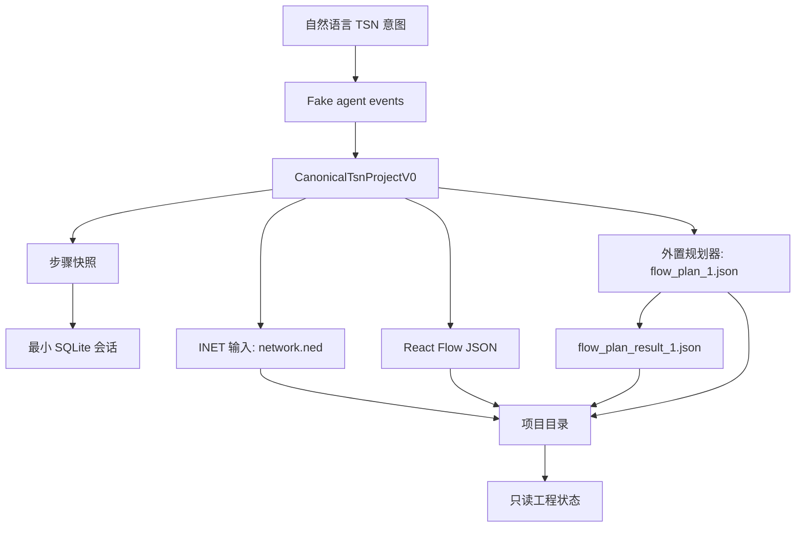
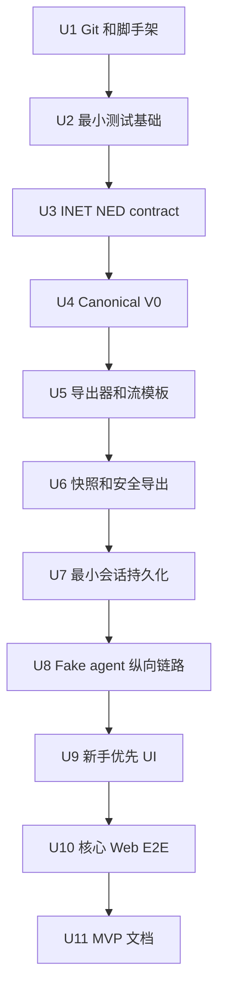

# feat: 构建 TSN Agent Tauri MVP

## 摘要

把根目录建设成一个可运行、可测试的 Tauri + React MVP，但首要交付目标不是完整工作台平台，而是一条可演示的新手纵向闭环：用户输入一句拓扑意图，fake agent 生成 canonical TSN 模型，并从同一模型派生两类互不冲突的输出：一类给 INET/OMNeT++ 的 `network.ned` 和后续仿真元数据，另一类给 React Flow 展示和外置规划器。右侧只读展示结果、文件用途和当前导出状态。

完整会话检索、流式 Claude 事件、真实 skill 调度、桌面壳 E2E、文档一致性测试和旧 `tsn-topology` skill 迁移都放到纵向闭环通过后的 hardening 阶段。当前实现已有最小 Claude Agent SDK bridge 实验能力，但 MVP 验收不依赖它；Web/E2E 和确定性导出仍以 fake agent 路径为准。

---

## 问题背景

需求文档定义了面向 TSN 新手的配置应用。用户的核心痛点是不了解大量 TSN 参数，不知道如何从“4 个交换机，每个交换机连接 5 个端系统”走到可用于规划和仿真的配置文件。

当前计划要避免两个偏差：

- 不要把 MVP 做成完整平台工程，导致很晚才验证新手体验。
- 不要把历史 Qunee `topology.json` 或 `tsn-topology/` 的旧契约继续作为新应用主模型。

---

## 计划需求

计划内需求使用 `PR#`，避免和来源文档的 `R1-R25` 混淆。

- PR1. 搭建根目录 Tauri + React 应用，并初始化根目录 git 边界。
- PR2. 保护 `tsn-topology/` 嵌套仓库状态；未确认归属前不修改其中内容。
- PR3. 建立最小测试基础：TypeScript/Vitest、React 组件测试、一个 Web smoke/E2E 入口。
- PR4. 定义 `CanonicalTsnProjectV0`，只强校验 MVP 当前消费者需要的字段。
- PR5. 生成 MVP 两类交付文件：INET `network.ned` 输入文件，以及 React Flow/外置规划器输入文件。
- PR6. 在 U4 前固定最小 INET NED contract，包括目标 INET 版本、package/import、TSN module、channel/datarate 和后续 `.ini` 非承诺边界。
- PR7. 提供一条控制流模板和少量默认值解释，避免自动生成完整业务流矩阵。
- PR8. 实现步骤快照和 staged export，保证导出文件不出现新旧混杂。
- PR9. 实现最小会话持久化：当前会话、最近会话列表、canonical state、快照和 manifest；完整复制/删除/搜索后置。
- PR10. 实现 fake agent 纵向链路；Claude bridge 只作为非验收实验能力保留，完整流式事件和 skill 调度后置到 hardening。
- PR11. 实现新手优先 UI：首屏以对话和当前工程状态为主，会话侧栏和高级检索渐进披露。
- PR12. 添加本地安全护栏：Tauri capability 最小化、路径 canonicalize、manifest guard、敏感信息不落库。

### 来源需求映射

| 计划需求 | 来源需求 |
|---|---|
| PR1 | 实施前置条件，支撑全部来源需求 |
| PR2 | R13 的 Qunee 降级，以及嵌套仓库安全约束 |
| PR3 | 用户新增测试框架要求 |
| PR4 | R10, R15-R17 |
| PR5, PR6 | R11, R14, R15-R19；`flow_plan_result_1.json` 仅作外部结果识别，不作为默认生成物 |
| PR7 | R4, R5, R15, R17 |
| PR8 | R7, R11, R19 |
| PR9 | R20, R23, R24；部分支撑 R21/R22，复制、复杂筛选和 R25 删除语义后置 |
| PR10 | R8；R6 的真实阶段 skill 调度后置 |
| PR11 | R1-R3, R8, R9 |
| PR12 | R23-R25 |

---

## 范围边界

MVP 包含：

- fake agent 驱动的一句话拓扑输入流程。
- 一个当前会话和最近会话列表。
- `CanonicalTsnProjectV0`。
- 最小 INET NED contract spike 和对应 exporter。
- React Flow 拓扑 JSON exporter。
- 一条控制流模板和外置规划器 `flow_plan_1.json` exporter。
- 导出 manifest 中明确标记文件用途：`simulation-inet`、`workspace-visualization`、`planner-input`；`planner-output` 只在外部结果文件实际存在时作为 `observed_external` 记录。
- 步骤快照、staged export、manifest。
- 新手优先只读 UI。
- 一个 Web E2E 验证核心纵向闭环。

MVP 不包含：

- 真实外置规划器执行。
- GCL/WCTA 展示或 `flow_plan_result_1.json` 内容摘要。
- 完整 INET gPTP、CBS、ATS、FRER/stream redundancy 导出。
- `omnetpp.ini`、INET gate schedule configurator 输入、规划模式切换和真实 INET 校验。
- 完整会话复制、删除项目目录、复杂搜索/筛选、FTS5、损坏恢复。
- 完整流式 Claude SDK/wrapper/sidecar 接入。
- 桌面壳 E2E 自动化。
- 文档一致性测试。
- 修改 `tsn-topology/SKILL.md` 或 `tsn-topology/docs/rules.md`。
- 跨设备同步、多人协作、云端账户、RBAC 或字段级加密。

### Hardening 阶段

- 完整 SQLite 会话管理：复制、删除、搜索、筛选、软删除/purge。
- 完整流式 Claude Agent SDK 或 wrapper 接入。
- Tauri command/Rust-side DB 覆盖扩展。
- 桌面壳 E2E opt-in。
- 规划器结果摘要和后续仿真衔接。
- 旧 `tsn-topology` skill 迁移或替代。
- 文档一致性测试和更完整开发者文档。

---

## 关键技术决策

- **纵向闭环优先。** 先证明新手从一句话到导出文件的路径可用，再扩展会话平台和真实 agent bridge。
- **Canonical V0 收窄但保持可转换。** 强校验节点、端口、链路、速率、位置、示例流端点和流参数。INET、React Flow、外置规划器输出都从 canonical 派生，彼此不能互相作为源数据。
- **输出分两类。** INET 类输出在 MVP 只承诺 `network.ned` 和后续 `.ini` 所需元数据；工作台/规划类输出面向 UI 和外置工具，包含 React Flow JSON、`flow_plan_1.json`，以及仅在外部存在时识别的 `flow_plan_result_1.json`。两类文件可相互转换或对照，但必须以 canonical 为共同源头。
- **规划模式后置。** INET 支持 `EagerGateScheduleConfigurator`、`Z3GateScheduleConfigurator`、`TSNschedGateScheduleConfigurator` 等 gate schedule configurator，但 MVP 不生成 configurator 输入、不执行调度、不暴露模式切换；只在文档中保留为后续 `inet-export` spike 的候选方案。
- **INET NED contract 先冻结。** 在 exporter 前完成最小 NED contract spike，避免 golden fixture 只锁住字符串但不能被 INET/OMNeT++ 消费。
- **SQLite 是最小恢复层。** MVP 使用 SQLite 保存当前会话、最近会话、canonical state、快照和 manifest。复杂检索和完整会话生命周期后置。
- **Fake agent 先行，Claude bridge 不进验收路径。** MVP 用 fake agent 和本地确定性导出保证产品体验和测试稳定；已有 Claude bridge 只作为实验能力保留，不承担 canonical model update 或 export request。
- **右侧只读，修改回到对话。** 右侧可以提供“让 Agent 解释/修改此项”的上下文动作，但不暴露专家参数表单。
- **项目目录是交付边界。** INET 文件、React Flow JSON、规划器输入/输出引用和 manifest 必须写入项目目录，不以 SQLite 作为唯一来源。

---

## 输出结构

    .
    ├── docs/
    │   ├── adr/
    │   ├── brainstorms/
    │   └── plans/
    ├── e2e/
    │   ├── fixtures/
    │   └── specs/
    ├── src/
    │   ├── agent/
    │   ├── app/
    │   ├── domain/
    │   ├── export/
    │   ├── project/
    │   ├── sessions/
    │   ├── test/
    │   └── ui/
    ├── src-tauri/
    │   ├── capabilities/
    │   └── src/
    └── tests/
        └── fixtures/

---

## 高层技术设计

---

## 实施单元

### U1. 建立根仓库和应用脚手架

**目标：** 建立根目录应用边界，同时保护 `tsn-topology/` 嵌套仓库。

**需求：** PR1, PR2, PR12

**依赖：** 无

**文件：**
- 新建：`.gitignore`
- 新建：`package.json`
- 新建：`tsconfig.json`
- 新建：`vite.config.ts`
- 新建：`index.html`
- 新建：`src/main.tsx`
- 新建：`src/app/App.tsx`
- 新建：`src-tauri/Cargo.toml`
- 新建：`src-tauri/tauri.conf.json`
- 新建：`src-tauri/build.rs`
- 新建：`src-tauri/src/main.rs`
- 新建：`src-tauri/src/lib.rs`
- 新建：`src-tauri/capabilities/default.json`

**方案：**
- 初始化根目录 git 或记录用户选择的替代方案。
- 记录 `tsn-topology/` 当前 `.git`、修改和未跟踪文件状态。
- 明确门禁：未确认 `tsn-topology/` 是 submodule、vendor copy、迁移源还是独立参考前，不修改其中任何文件。
- Tauri capability 默认最小化，只允许主窗口调用已列明的 app commands；不启用未使用的 shell/fs/open 泛用能力。

**测试场景：**
- 成功路径：根应用能启动最小 App shell。
- 成功路径：`tsn-topology/` 状态被记录，且没有被移动、改写或删除。

**验证：**
- 根目录具备最小 Tauri + React 入口。
- `.gitignore` 覆盖 Node、Rust、Tauri build、测试产物和项目导出产物。

---

### U2. 添加最小测试基础

**目标：** 建立足够支撑 MVP 纵向切片的测试入口，不搭完整平台级测试矩阵。

**需求：** PR3

**依赖：** U1

**文件：**
- 新建：`vitest.config.ts`
- 新建：`src/test/setup.ts`
- 新建：`src/app/App.test.tsx`
- 新建：`playwright.config.ts`
- 新建：`e2e/specs/smoke.spec.ts`
- 修改：`package.json`

**方案：**
- Vitest 覆盖 domain/export/project/session 的纯逻辑测试和关键 React 组件测试。
- Playwright 先只提供 Web smoke/E2E，不引入桌面壳自动化。
- 不添加文档一致性测试。
- `package.json` 默认测试入口不运行桌面壳 E2E。

**测试场景：**
- 成功路径：App shell 渲染出对话区和工程状态区 landmark。
- 成功路径：Playwright 能打开 Web app 并完成 smoke。

**验证：**
- 后续 domain/export/UI 单元可以直接添加测试。
- 桌面壳 E2E 只在文档中作为 hardening opt-in 记录。

---

### U3. 固定最小 INET NED contract

**目标：** 在写 exporter 前固定 MVP `network.ned` 的最小可用契约，并明确 `.ini` 暂不承诺。

**需求：** PR5, PR6

**依赖：** U2

**文件：**
- 修改：`docs/ned-contract.md`
- 修改：`src/export/ned-contract.ts`
- 修改：`src/export/exporters.test.ts`

**方案：**
- 固定目标 INET/OMNeT++ 版本假设。
- 固定 NED package/import、TSN 端系统 module、TSN 交换机 module、channel/datarate 语法和展示坐标写法；默认优先使用 `inet.node.tsn.TsnDevice` 和 `inet.node.tsn.TsnSwitch`，避免普通 `StandardHost`/`EthernetSwitch` 无法承载后续 TSN 能力配置。
- 明确 MVP 只生成 `network.ned`，不生成 `omnetpp.ini`，不生成 INET gate schedule configurator 输入，不执行 INET 内置规划。
- 在 `docs/ned-contract.md` 中记录后续 `.ini` 需要的元数据边界，例如 stream name、UDP port、PCP、period、frame size、latency/jitter 和 route/path。
- 如果本机没有 INET 校验工具，先使用文本 fixture，并在文档中标注后续要接入真实 INET 校验。

**测试场景：**
- 成功路径：最小 4 交换机、20 端系统 topology 的 expected NED 包含 package/import、`TsnSwitch`、`TsnDevice`、connections、datarate 和 display position。
- 边界情况：缺少 `.ini`、规划结果或 INET 校验工具时，MVP 导出仍然完成，但 manifest 标记后续仿真配置待补齐。

**验证：**
- U4/U5 不再自行猜测 INET module/import 或 `.ini` 范围。

---

### U4. 定义 CanonicalTsnProjectV0

**目标：** 定义只服务 MVP 当前消费者的 canonical 模型。

**需求：** PR4, PR7

**依赖：** U3

**文件：**
- 修改：`src/domain/canonical.ts`
- 修改：`src/domain/validation.ts`
- 修改：`src/domain/topology-factory.ts`
- 修改：`src/domain/topology-factory.test.ts`

**方案：**
- 复用现有 `CanonicalTsnProjectV0`，不新建并行 `tsn-model.ts`。
- 强校验当前消费者字段：节点、端口、链路、链路速率、位置、稳定 ID、示例流端点、周期、帧长、优先级/PCP 意图、时延目标。
- 同步和未来 INI 信息先放入 `simulationHints`，不因缺少 gPTP/TAS/CBS 细节阻塞 MVP 导出。
- 不继承 Qunee `imac` 作为主键。

**测试场景：**
- 成功路径：4 交换机、20 端系统 canonical fixture 校验通过。
- 成功路径：简单控制流 fixture 校验通过。
- 错误路径：重复 node ID、端口复用、非法链路速率、流端点不存在会失败。
- 边界情况：缺少未来 INI hints 不阻塞 MVP 校验。

**验证：**
- 导出器只依赖 `CanonicalTsnProjectV0`，不读取 `topology.json`。

---

### U5. 实现导出器和一条控制流模板

**目标：** 从 canonical V0 派生两类互不冲突的文件，并生成一条控制流示例。

**需求：** PR5, PR7

**依赖：** U4

**文件：**
- 修改：`src/export/ned-exporter.ts`
- 修改：`src/export/planner-exporter.ts`
- 修改：`src/export/react-flow-exporter.ts`
- 修改：`src/export/artifact-bundle.ts`
- 修改：`src/export/exporters.test.ts`
- 修改：`src/domain/topology-factory.ts`
- 修改：`src/domain/topology-factory.test.ts`

**方案：**
- INET 类输出：
  - `network.ned` 严格实现 U3 contract。
  - 不生成 `omnetpp.ini`，但确保 canonical 和 manifest 能表达后续 `.ini` 所需元数据。
- 工作台/规划类输出：
  - React Flow exporter 输出只读拓扑展示需要的 nodes/edges 和端口/链路摘要。
  - 复用现有 `planner-exporter.ts` 生成 `flow_plan_1.json`，不新建第二套 `flow-plan-exporter.ts`。
  - `flow_plan_result_1.json` 不作为默认生成物；仅在外部文件实际存在时由 manifest 记录为 `observed_external`。后续 hardening 再解析 GCL/interface 摘要并反向派生 INET GCL/TAS。
- 控制流模板只生成一条示例流，不生成完整业务流矩阵。
- manifest 必须用用途字段明确区分 `simulation-inet`、`workspace-visualization`、`planner-input`；外部结果文件只在存在时记录为 `planner-output` + `observed_external`。

**测试场景：**
- 成功路径：同一 canonical fixture 导出稳定 `network.ned`。
- 成功路径：同一 canonical fixture 导出稳定 React Flow JSON。
- 成功路径：控制流 fixture 导出 `flow_plan_1.json`。
- 成功路径：导出时不创建 `flow_plan_result_1.json`；当外部结果文件存在时，manifest 能标记它但不解析内容。
- 错误路径：无效 canonical 不产出部分结果。

**验证：**
- AE1 和 AE2 的文件产物可由测试 fixture 覆盖。

---

### U6. 实现步骤快照和安全导出

**目标：** 管理步骤级快照，并安全写入项目目录。

**需求：** PR8, PR12

**依赖：** U5

**文件：**
- 新建：`src/project/project-state.ts`
- 新建：`src/project/snapshots.ts`
- 新建：`src/project/export-manifest.ts`
- 新建：`src/project/project-writer.ts`
- 新建：`src/project/project-state.test.ts`
- 新建：`src/project/project-writer.test.ts`

**方案：**
- 支持拓扑、流模板和导出步骤快照。
- staged export：先写 staging，校验 manifest，再替换可见输出。
- `project_path` 必须 canonicalize。
- 拒绝根目录、home、repo 根、app config、相对路径逃逸和 symlink 逃逸。
- 删除项目目录不在 MVP 中实现；hardening 阶段如需删除，必须只删除带本应用 manifest 且 session id 匹配的目录。

**测试场景：**
- 成功路径：快照可回退，后续导出状态失效。
- 成功路径：manifest 正确标记 INET 输入、React Flow JSON、规划器输入和规划器输出引用。
- 错误路径：写盘前校验失败不替换输出。
- 错误路径：危险路径和 symlink 逃逸被拒绝。

**验证：**
- 项目目录可独立交付给规划器和 INET/OMNeT++ 后续流程。

---

### U7. 实现最小 SQLite 会话持久化

**目标：** 支撑 MVP 恢复当前工作，不建设完整会话平台。

**需求：** PR9, PR12

**依赖：** U6

**文件：**
- 修改：`src/sessions/session-repository.ts`
- 修改：`src/sessions/session-repository.test.ts`
- 修改：`src-tauri/src/db.rs`
- 修改：`src-tauri/src/session_store.rs`
- 修改：`src-tauri/src/lib.rs`
- 修改：`src-tauri/tauri.conf.json`
- 修改：`src-tauri/Cargo.toml`

**方案：**
- 复用现有 SQLite session store 和 repository，不新建并行 session model。
- MVP 只保存当前会话、最近会话列表、canonical state、快照、manifest 和项目路径。
- 基础搜索只支持名称和最近会话列表；标签、备注、最近消息摘要、FTS5 后置。
- 不保存 raw stdout/stderr、环境变量、凭证样式字符串、Claude Code 配置内容或下游敏感配置。
- 写入前做基础 secret redaction。
- raw SQL 只集中在 `session-repository.ts`；UI 和 agent 模块不直接导入 SQL plugin。

**测试场景：**
- 成功路径：创建/读取当前会话，恢复 canonical state 和 manifest。
- 成功路径：最近会话列表可读取。
- 错误路径：敏感字段被 redaction 后不进入 SQLite。
- 边界情况：空数据库时创建默认会话。

**验证：**
- 会话恢复不阻塞 fake-agent 纵向闭环。
- 完整复制、删除、复杂搜索明确留到 hardening。

---

### U8. 实现 fake agent 纵向链路

**目标：** 用确定性的 fake agent 事件验证对话到模型更新的产品路径；已有 Claude bridge 只作为实验能力保留，不进入 MVP 验收路径。

**需求：** PR10, PR11, PR12

**依赖：** U6；SQLite 恢复层可在 U7 完成后接入，不阻塞 fake agent 到 UI 的纵向闭环。

**文件：**
- 修改：`src/agent/fake-agent.ts`
- 修改：`src/agent/fake-agent.test.ts`
- 修改：`src/agent/agent-adapter.ts`
- 修改：`src/agent/agent-adapter.test.ts`
- 修改：`src-tauri/src/commands.rs`
- 修改：`src-tauri/src/lib.rs`

**方案：**
- 复用现有 `runFakeTsnAgent` 和 `runTsnAgent`，不新建并行 fake adapter 或 agent event 层。
- fake adapter 对输入“4 个交换机，每个交换机连接 5 个端系统”返回确定性拓扑和后续控制流。
- Claude 文本只用于左侧对话展示；canonical model 和导出文件仍由确定性本地逻辑生成。
- 结构化 `canonical model update` / `export request` 事件 schema 延后到真实 agent 能修改 canonical 时再做。
- 已有 Node worker / Tauri command 保持实验可用，但不作为 U10 E2E 或 MVP 验收门槛。
- Tauri command capability 只开放 MVP 必需命令。

**测试场景：**
- 成功路径：fake adapter 输出拓扑、控制流和导出 artifact。
- 错误路径：agent error 进入对话状态，不破坏当前快照。

**验证：**
- UI 和 E2E 不依赖真实 Claude 凭证；已有 Claude bridge 不影响确定性导出。

---

### U9. 实现新手优先 UI

**目标：** 构建首个可演示的新手界面，而不是完整工作台。

**需求：** PR11

**依赖：** U8

**文件：**
- 新建：`src/ui/layout/AppShell.tsx`
- 新建：`src/ui/chat/ConversationPane.tsx`
- 新建：`src/ui/topology/TopologyFlow.tsx`
- 新建：`src/ui/project/GeneratedFilesPanel.tsx`
- 新建：`src/ui/project/SnapshotTimeline.tsx`
- 新建：`src/ui/flows/FlowSummaryPanel.tsx`
- 新建：`src/ui/explain/DefaultsExplanationPanel.tsx`
- 新建：`src/ui/sessions/RecentSessionsButton.tsx`
- 新建：`src/app/app-state.ts`
- 新建：`src/app/App.integration.test.tsx`
- 新建：`src/ui/topology/TopologyFlow.test.tsx`

**方案：**
- 首屏默认只显示对话区和当前工程状态摘要。
- 会话入口默认收起，只展示最近会话；完整侧栏、复制、删除、复杂搜索后置。
- 右侧按阶段渐进披露：
  - 拓扑阶段：拓扑图和关键默认值。
  - 流阶段：一条控制流和参数解释。
  - 导出阶段：文件 readiness 和 manifest。
  - 快照：默认 compact stepper，只有用户请求回退时展开。
- 右侧保持只读；提供单一上下文动作“让 Agent 解释/修改此项”，回到对话路径。
- 响应式要求覆盖单栏、双栏和桌面三种布局；键盘顺序和 ARIA landmarks 覆盖会话入口、对话区和工程状态区。

**测试场景：**
- 成功路径：fake agent 生成拓扑后，右侧显示拓扑和文件状态。
- 成功路径：选择控制流后，显示一条示例流和解释。
- 成功路径：右侧没有专家参数编辑表单。
- 成功路径：上下文动作把修改请求送回对话区。
- 边界情况：未选择流模板时显示空状态，不阻塞拓扑检查。

**验证：**
- 新手可以从一句话进入配置流程，界面不要求理解底层参数表。

---

### U10. 添加核心 Web E2E

**目标：** 用一个确定性 Web E2E 验证 MVP 纵向闭环。

**需求：** PR3, PR5, PR7, PR8, PR10, PR11

**依赖：** U9

**文件：**
- 新建：`e2e/specs/new-project-export.spec.ts`
- 新建：`e2e/fixtures/fake-agent-session.json`
- 新建：`e2e/fixtures/generated-project.expected.json`
- 新建：`e2e/desktop/README.md`
- 修改：`playwright.config.ts`
- 修改：`package.json`

**方案：**
- E2E 只使用 fake agent 和 isolated app data。
- 验证一句话拓扑输入、控制流模板、右侧只读展示和两类导出文件。
- E2E 不验证 `omnetpp.ini`、planning mode、真实 Claude bridge 或 `flow_plan_result_1.json` 解析。
- `e2e/desktop/README.md` 只记录未来桌面壳 opt-in 方法，不新增 `e2e/desktop/smoke.spec.ts`。

**测试场景：**
- 成功路径：输入“4 个交换机，每个交换机连接 5 个端系统”，生成拓扑展示。
- 成功路径：选择控制流，生成一条示例流和 `flow_plan_1.json`。
- 成功路径：导出目录包含 `network.ned`、React Flow JSON、`flow_plan_1.json` 和 manifest。
- 错误路径：fake agent 错误显示在对话区，且不创建导出成功状态。

**验证：**
- MVP 是否成立由这个核心 Web E2E 和 exporter fixtures 共同判断。

---

### U11. 更新 MVP 文档

**目标：** 提供足够运行和交付的文档，不建设完整开发者文档体系。

**需求：** PR1, PR3, PR5, PR9, PR12

**依赖：** U10

**文件：**
- 修改：`README.md`
- 新建：`docs/testing.md`
- 修改：`docs/ned-contract.md`
- 修改：`docs/adr/0001-local-sqlite-session-store.md`

**方案：**
- README 说明如何运行应用、运行测试、生成 MVP 导出。
- `docs/testing.md` 只列 MVP 必需测试和 hardening opt-in 测试。
- `docs/ned-contract.md` 是唯一权威 INET NED contract；不要新增并行 `inet-export-contract.md` 或 `mvp-export-contract.md` 重新定义同一边界。
- README 说明 INET 输入、React Flow JSON、`flow_plan_1.json`、外部 `flow_plan_result_1.json` 识别、manifest 和 SQLite 的边界。
- ADR 同步注明 SQLite MVP 先做最小恢复层，完整会话管理后置。
- 不修改 `tsn-topology/` 中的文件。
- 不新增 `src/test/docs-consistency.test.ts`。

**测试场景：**
- 文档不设自动一致性测试；由 U10 和单元测试覆盖实际行为。

**验证：**
- 新实现者能跑起 MVP，并理解哪些内容属于 hardening。

---

## Hardening backlog

- 完整会话侧栏：创建、切换、重命名、复制、删除、搜索、筛选。
- 会话删除项目目录：manifest guard、二次确认、purge、文件数量展示。
- 完整流式 Claude Agent SDK 或 wrapper/sidecar 接入。
- `docs/agent-bridge.md` 和更完整 bridge 安全契约。
- 阶段 skill 调度框架，以及 `tsn-topology` skill 迁移或替代。
- 桌面壳 E2E：`tauri-driver` opt-in，不进入默认 test。
- `flow_plan_result_1.json` 结果摘要、GCL/interface 只读展示。
- 完整 INET `omnetpp.ini` / `inet-export` skill：gPTP、TAS/GCL、CBS、ATS、FRER、转发表和结果指标。
- `flow_plan_result_1.json` 到 INET GCL/TAS 的转换器，以及 INET 内置 configurator 输出和外置规划器结果的差异对照视图。
- 文档一致性测试。
- FTS5、标签、备注、最近消息摘要和数据库损坏恢复。

---

## 系统级影响

- **核心闭环：** fake adapter -> canonical V0 -> exporters -> project writer -> read-only UI；Claude bridge 保持非验收实验能力。
- **数据边界：** SQLite 只保存最小恢复状态；项目目录仍是对外交付边界。所有 INET、React Flow 和规划器文件都从 canonical 派生，避免某个导出文件反向污染源模型。
- **仿真边界：** MVP 的 INET 类输出只承诺 `network.ned`；完整 `omnetpp.ini`、调度配置和结果回写进入 hardening。工作台/规划类输出服务右侧展示、外置规划器和后续结果导入。
- **安全边界：** 本地 MVP 不做云端权限体系，但必须做好 Tauri capability、路径安全、manifest guard 和敏感信息不落库。
- **测试边界：** MVP 必需测试证明模型、导出和一条 Web 纵向流程；桌面壳和文档一致性后置。
- **迁移边界：** `tsn-topology/` 在归属决策前只读参考。

---

## 风险与缓解

| 风险 | 缓解 |
|---|---|
| 纵向闭环仍被基础设施拖慢 | U1-U2 只做最小脚手架和测试入口，U10 作为 MVP gate。 |
| INET NED fixture 不代表完整仿真可用 | U3 先固定最小 NED contract，完整 INET 校验后置。 |
| Canonical 模型过度膨胀 | 使用 `CanonicalTsnProjectV0`，未来 INI 字段先放非阻塞 `simulationHints`。 |
| INET 内置规划和外置规划器语义混淆 | MVP 不暴露 planning mode；只记录后续 `.ini`/GCL 所需元数据，模式切换进入 hardening。 |
| 两类输出发生不一致 | 以 canonical 为唯一源头，React Flow、INET 和规划器导出都通过 fixture 覆盖同一 canonical 输入。 |
| SQLite schema 过早复杂化 | MVP 只做当前会话和最近会话恢复，完整会话平台进入 hardening。 |
| 项目导出或删除触达危险路径 | MVP 不实现删除项目目录；导出路径 canonicalize 并拒绝危险目录。 |
| Claude 集成阻塞产品验证 | MVP 验收以 fake agent 和确定性导出为准；Claude bridge 保持实验能力，不进入默认测试门槛。 |
| `tsn-topology/` 脏状态被误改 | U1 记录状态并设置门禁，MVP 不修改嵌套仓库。 |

---

## 来源与参考

- 来源文档：`docs/brainstorms/2026-05-20-tsn-agent-tauri-ned-requirements.md`
- 原型参考：`docs/prototypes/tsn-agent-prototype-20260509-1430.html`
- 现有拓扑 skill：`tsn-topology/SKILL.md`
- 现有拓扑规则：`tsn-topology/docs/rules.md`
- 现有 fixture 回归模式：`tsn-topology/tests/run-e2e.js`
- 规划器输入样例：`tests/fixtures/planner/flow_plan_1.json`
- 规划器输出样例：`tests/fixtures/planner/flow_plan_result_1.json`
- Qunee 时代拓扑样例：`tests/fixtures/legacy-qunee/topology.json`
- Tauri v2 文档：https://v2.tauri.app/
- Vitest 文档：https://vitest.dev/
- Playwright 文档：https://playwright.dev/
- React Flow 文档：https://reactflow.dev/
- INET Framework 文档：https://inet.omnetpp.org/
- INET TSN gate scheduling configurators：`showcases/tsn/gatescheduling/index.rst`
- INET TSN gPTP/TAS 组合示例：`showcases/tsn/combiningfeatures/gptpandtas/`
- INET TSN 时间感知整形示例：`showcases/tsn/trafficshaping/timeawareshaper/`
- Tauri SQL Plugin 文档：https://github.com/tauri-apps/tauri-plugin-sql
- 架构决策：`docs/adr/0001-local-sqlite-session-store.md`
