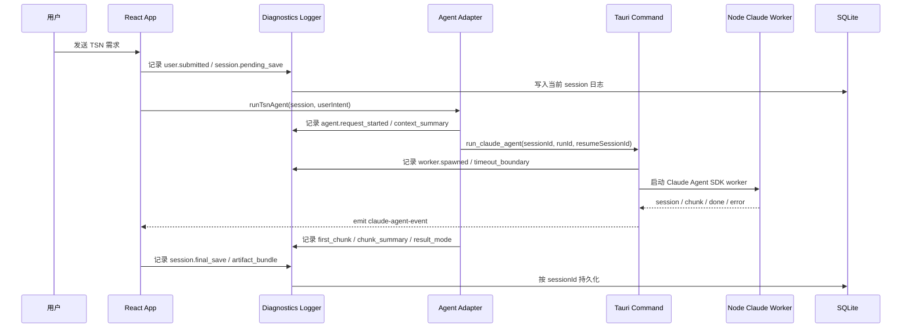

# feat: 添加会话级诊断日志

## 摘要

为 TSN Agent 添加按会话归属的结构化诊断日志，覆盖 Claude 交互、流式输出状态、会话持久化动作和 artifact bundle 刷新。日志在 Tauri 运行时持久化到现有 SQLite 边界，在浏览器测试环境使用本地 fallback，并在应用中提供一个可点击打开的当前会话日志查看入口。

---

## 问题背景

当前应用已经接入 Claude Agent SDK bridge、会话持久化和流式 UI，但调试时只能从界面结果、终端输出或测试失败推断问题。用户已经遇到过“左侧回复和右侧拓扑不一致”“输入后 UI 不流式更新”“上下文像丢失”的问题，这类问题需要能按 session 回看每次模型交互、上下文传递、回退路径和状态写入。

---

## 需求

- R1. 每个会话必须拥有独立的诊断日志时间线，能按时间查看该会话内发生的大模型交互、session 状态变更和 artifact 更新。
- R2. 每次 Claude 交互必须记录请求开始、run id、是否 resume、Claude session id 变化、首个流式片段时间、chunk 统计、最终模式、耗时和错误回退。
- R3. 会话创建、切换、复制、删除、pending save、final save、保存失败等关键状态写入必须产生日志，方便定位 UI 状态和持久化状态不一致。
- R4. artifact bundle 刷新必须产生日志，至少记录生成文件路径、文件用途、内容长度或摘要，以及失败原因。
- R5. 日志必须经过敏感信息脱敏，不保存 Claude Code 凭证、API token、环境变量原文、完整 stdout/stderr 或 Claude 配置文件内容。
- R6. 日志查看入口必须在 Tauri UI 中可发现，默认聚焦当前会话，支持基本筛选或刷新，不阻塞主工作流。
- R7. 新增行为必须有单元测试、Rust command/store 测试和至少一个 e2e 覆盖日志入口。

**来源需求映射：**

- R1, R3, R6 支撑来源文档的会话恢复、步骤快照和右侧工程状态可检查性。
- R2 支撑来源文档中“左侧对话直接呈现 Claude Agent 输出”和阶段 skill 可诊断性。
- R4 支撑来源文档中 NED、React Flow JSON、规划器输入和 manifest 的边界清晰。
- R5 延续来源文档和 ADR 中“不保存 Claude 凭证、本机密钥或敏感配置”的约束。

---

## 范围边界

- 本计划只做本机应用内诊断日志，不接入外部日志平台、云端同步或远程 telemetry。
- 本计划不做完整项目目录写盘审计；当前只覆盖 artifact bundle 生成和刷新。真实 project writer 落地后再复用同一日志机制扩展文件写盘日志。
- 本计划不保存完整原始 prompt/context/stdout/stderr；只保存脱敏后的用户输入预览、上下文摘要、字符数、消息数、拓扑摘要、错误摘要和必要 ID。
- 本计划不把日志混入 `TsnSession.payload` 主体，避免会话列表和恢复路径因为日志增长而变慢。
- 本计划不实现复杂检索、FTS5、跨会话全局日志搜索或日志导出包。
- 本计划不改变 Claude Agent SDK 的权限模式、工具白名单或 TSN 领域生成逻辑。

### 推迟到后续工作

- 真实项目目录写盘审计：在 project writer 和 staged export 真正落地后，记录每个文件写入、manifest 校验、替换和失败回滚。
- 全局日志检索和导出：后续可按时间、category、session、run id 导出诊断包。
- 日志保留策略设置页：当前先使用固定上限，后续再让用户配置保留天数或条数。

---

## 上下文与调研

### 相关代码与模式

- `src/agent/agent-adapter.ts` 已经形成 fake/Claude 双模式边界，并持有 `runId`、`resumeSessionId`、`conversationContext`、`onChunk` 和 fallback 路径，是前端诊断日志的主要插桩点。
- `src-node/claude-agent-worker.mjs` 已经从 Claude Agent SDK `query()` 读取 `system`、`assistant`、`stream_event` 和 `result` 消息，并有 `redactSecrets()`，适合补充 worker 侧事件统计和错误摘要。
- `src-tauri/src/commands.rs` 已经负责启动 Node worker、读取 stdout/stderr、向前端 emit `claude-agent-event`，并有 prompt/context 长度限制、超时和脱敏错误处理。这里适合记录 worker 生命周期和后端失败。
- `src/sessions/session-repository.ts`、`src-tauri/src/session_store.rs` 和 `src-tauri/src/db.rs` 已经建立 Browser/SQLite repository 抽象和 Tauri command store 模式。诊断日志应沿用这个边界，而不是散落在组件 local state 中。
- `src/app/App.tsx` 当前集中处理发送、保存、会话抽屉和 artifact 刷新。日志 UI 可以先以 drawer/modal 形式接入 header，再逐步拆出 `src/ui/diagnostics/` 组件。
- 现有测试覆盖 `src/agent/agent-adapter.test.ts`、`src-node/claude-agent-worker.test.mjs`、`src/sessions/session-repository.test.ts`、`src/app/App.test.tsx`、Rust command/store tests 和 `e2e/specs/smoke.spec.ts`，新增测试应沿这些文件分层补齐。

### 项目经验

- 当前仓库没有 `docs/solutions/` 可复用经验。
- `docs/adr/0001-local-sqlite-session-store.md` 已接受 SQLite 作为会话工作台数据库，同时明确不保存 Claude Code 凭证、本机密钥、API token、raw stdout/stderr、环境变量或 Claude 配置内容。

### 外部参考

- Tauri 2 官方文档确认前端通过 command 调用后端、后端通过 event/channel 向前端发送进度是推荐模式；当前项目已经在 `run_claude_agent` 和 `claude-agent-event` 中使用该模式。
- Claude Agent SDK 官方文档确认 TypeScript `query()` 是异步消息流，`resume` 使用 session id 恢复上下文，`includePartialMessages` 可用于部分消息事件。这与当前 worker 的 `session_id` 捕获和流式 chunk 处理方向一致。

---

## 关键技术决策

- **结构化日志优先于纯文本日志。** 使用 `DiagnosticLogEntryV0` 记录 category、level、session id、run id、阶段、摘要、脱敏 details、时间和耗时，UI 再格式化展示。这样后续能筛选和诊断，而不是只能全文搜索。
- **日志独立持久化，不塞进 session payload。** Tauri 使用同一个 SQLite 数据库新增日志表和 command，浏览器环境用 localStorage/memory fallback。这样不会让最近会话列表因为日志增长而变慢。
- **前端和后端都写日志，但共享同一 session/run 关联。** 前端记录用户动作、UI 状态和 agent adapter 决策；Rust command 记录 worker 启动、stdout 事件、stderr 错误、超时和退出状态。`run_claude_agent` 请求需要携带应用 session id。
- **持久化日志做 compact streaming。** 不把每个 token 长期落库；记录 first chunk 时间、chunk 计数、累计字符数、最后片段预览和关键阶段事件。前端仍然用实时 event 更新对话框。
- **脱敏和体积限制是写入前约束。** 日志写入前统一经过脱敏、预览截断和 details 大小限制；写日志失败只能降级为 console warning，不应破坏用户生成流程。
- **复制会话不复制历史日志。** 新会话只记录“从来源会话复制”事件并保留 source id 摘要，避免副本日志混入旧 session 的运行轨迹。
- **删除会话默认删除该会话日志。** 这符合本机隐私预期；后续如需要保留删除前诊断包，应另做显式导出。

---

## 待解决问题

### 计划阶段已解决

- 日志是否放入 SQLite：是。沿用现有 SQLite 会话工作台边界，但使用独立表和 commands。
- 日志是否展示在主界面：是。提供一个默认隐藏、点击打开的诊断日志 drawer/modal，不常驻占用新手主流程。
- 是否保存完整 prompt/context：否。保存脱敏预览和结构化摘要，避免把敏感上下文和超长 payload 沉淀进数据库。

### 推迟到实现阶段

- 具体保留上限：实现时根据 UI 和测试可读性选择一个固定上限，例如按 session 最近若干百条；后续再产品化配置。
- 具体筛选控件：第一版至少能按 category/level 或文本过滤其一；实现时根据现有 CSS 空间决定最终控件形态。
- Rust 和 TypeScript 脱敏规则是否完全共用：当前先保持等价测试覆盖，后续如果规则膨胀再抽取共享测试 fixture。

---

## 高层技术设计

> *该图只用于说明设计方向，帮助评审理解组件关系；实现时应把它当作上下文，而不是需要逐字照搬的实现规格。*

---

## 实施单元

### U1. 定义诊断日志模型和前端 repository

**目标：** 建立日志数据契约、脱敏入口和浏览器 fallback，让后续 UI 和 agent 插桩有稳定边界。

**需求：** R1, R5, R7

**依赖：** 无

**文件：**
- Create: `src/diagnostics/diagnostic-log.ts`
- Create: `src/diagnostics/diagnostic-log-repository.ts`
- Create: `src/diagnostics/diagnostic-log-repository.test.ts`
- Modify: `src/sessions/session-repository.ts`

**方案：**
- 定义日志 entry 的最小字段：session 归属、可选 run 归属、category、level、message、details、createdAt 和可选 duration。
- Browser fallback 复用 localStorage/memory 存储模式，但日志独立 key，并按 session 和时间排序。
- 新增统一脱敏/截断 helper，复用现有 session redaction 的敏感词覆盖范围，额外限制 details 大小。
- repository 写入采用 best effort：失败时不抛到主流程。

**执行提示：** 先写 repository 行为测试，再接入调用方。

**遵循模式：**
- `src/sessions/session-repository.ts` 的 Browser/SQLite repository 分层。
- `src/sessions/session-repository.test.ts` 的 memory database 测试方式。

**测试场景：**
- Happy path：写入同一 session 的多条日志，按 createdAt 倒序或正序按契约返回。
- Happy path：不同 session 的日志互不混淆。
- Edge case：日志 details 过长时被截断，列表仍能展示摘要。
- Error path：日志包含 token、api key、Authorization bearer 时，持久化 payload 中只出现 `[redacted]`。
- Error path：fallback storage 写入失败时，调用方收到成功或 no-op，不影响主流程。

**验证：**
- 前端可以在非 Tauri 测试环境创建、读取、过滤当前 session 日志。
- 日志写入失败不会破坏现有会话 repository 行为。

---

### U2. 添加 Tauri SQLite 日志 store 和 commands

**目标：** 在 Tauri 运行时把诊断日志持久化到 SQLite，并提供前端可调用的 list/append/clear 边界。

**需求：** R1, R3, R5, R7

**依赖：** U1

**文件：**
- Create: `src-tauri/src/diagnostic_store.rs`
- Modify: `src-tauri/src/db.rs`
- Modify: `src-tauri/src/lib.rs`
- Modify: `src-tauri/capabilities/default.json`
- Test: `src-tauri/src/diagnostic_store.rs`
- Test: `src-tauri/src/db.rs`

**方案：**
- 在现有 SQLite schema 中新增 `diagnostic_logs` 表和 session/time/category 索引。
- commands 覆盖追加日志、读取当前 session 日志、按 session 清理日志。
- `remove_session` 删除 session 时同步删除该 session 日志，避免孤儿日志和隐私残留。
- Rust 侧写入也必须调用同一脱敏/截断规则；数据库错误返回脱敏摘要。

**遵循模式：**
- `src-tauri/src/session_store.rs` 的 `SessionStore`、`OnceCell<Pool<Sqlite>>` 和 command 风格。
- `src-tauri/src/db.rs` 的 schema 常量和 migration 管理方式。

**测试场景：**
- Happy path：append 后按 session 读取，返回时间线和 category/level/details。
- Happy path：删除 session 后，该 session 日志被清理，其他 session 日志保留。
- Edge case：读取不存在 session 返回空列表。
- Error path：包含敏感 token 的 Rust-side details 写入后不可从 DB 读回原文。
- Integration：schema migration 包含 `diagnostic_logs` 表和必要索引。

**验证：**
- Tauri command 边界可由前端 repository 使用。
- `cargo test` 覆盖 schema、append/list/remove 关键路径。

---

### U3. 插桩 Claude Agent bridge 和 worker 生命周期

**目标：** 记录每次大模型交互的完整诊断轨迹，尤其是上下文、resume、流式输出和 fallback。

**需求：** R2, R5, R7

**依赖：** U1, U2

**文件：**
- Modify: `src/agent/agent-adapter.ts`
- Modify: `src/agent/agent-adapter.test.ts`
- Modify: `src-node/claude-agent-worker.mjs`
- Modify: `src-node/claude-agent-worker.test.mjs`
- Modify: `src-tauri/src/commands.rs`
- Test: `src-tauri/src/commands.rs`

**方案：**
- `runTsnAgent` 接收或创建 diagnostics logger，记录请求开始、上下文摘要、Tauri/fake 模式、fallback 和最终结果。
- `run_claude_agent` 请求携带应用 session id 和 run id，使 Rust-side worker 日志能关联到同一 session。
- Rust command 记录 worker path 解析、spawn 成功、stderr 摘要、timeout、exit failure、done response 和 session id。
- worker 输出仍以 JSON lines 给 Rust 解析；新增必要事件统计，但不把 raw stdout/stderr 原文长期保存。
- 流式日志以 compact summary 为主：first chunk 时间、chunkCount、totalChars、lastPreview。

**遵循模式：**
- `src/agent/agent-adapter.ts` 的 deterministic result + Claude text 覆盖模式。
- `src-tauri/src/commands.rs` 的 `ClaudeAgentEventPayload` 和 `redact_error`。
- `src-node/claude-agent-worker.mjs` 的 `normalizeError` / `redactSecrets`。

**测试场景：**
- Happy path：Tauri Claude 成功时写入 request started、context summary、first chunk、done、mode=claude 日志。
- Happy path：有 `claudeSessionId` 时日志显示 resume 被使用，返回新 session id 时记录 session id 更新。
- Edge case：没有 `onChunk` 时仍记录最终 chunk 统计为零或未启用，不影响成功结果。
- Error path：Tauri command rejected 时记录 fallback 到 fake，并且错误已脱敏。
- Error path：worker stderr 包含 token 时，Rust 错误日志不含原 token。
- Integration：前端传入的 run id 与后端 emitted event、日志 entry run id 一致。

**验证：**
- 用户可以从当前会话日志中看出本轮请求是否真的 resume、是否收到流式 chunk、何时 fallback、最终用了 fake 还是 Claude。

---

### U4. 插桩会话动作和 artifact bundle 刷新

**目标：** 让会话生命周期和“文件更新”类动作可诊断，覆盖 UI 状态与持久化状态之间的关键转折点。

**需求：** R3, R4, R5, R7

**依赖：** U1, U2

**文件：**
- Modify: `src/app/App.tsx`
- Modify: `src/app/App.test.tsx`
- Create: `src/diagnostics/app-diagnostics.ts`
- Create: `src/diagnostics/app-diagnostics.test.ts`

**方案：**
- 在 `handleSubmit` 中记录 user submitted、pending session save、agent completed、final session save、save failure。
- 在会话新建、选择、复制、删除时记录动作、源 session、新 session 和结果；复制不继承历史日志。
- 在 `refreshBundle` 中记录 artifact paths、purpose、content length/hash 或摘要，以及失败。
- 日志失败不应阻塞会话保存、删除或 agent 生成。

**遵循模式：**
- `src/app/App.tsx` 当前对 `repository.save()`、`repository.list()`、`runTsnAgent()` 的 try/catch/finally 结构。
- `src/export/artifact-bundle.ts` 的 manifest 和 artifact path/purpose 结构。

**测试场景：**
- Happy path：用户发送需求后，日志包含 pending save、agent completed、final save。
- Happy path：刷新 artifact bundle 后，日志列出 `network.ned`、`react-flow-topology.json`、`flow_plan_1.json` 和 `manifest.json`。
- Happy path：复制会话后，新 session 有复制来源日志，但不包含旧 session 的 Claude run 日志。
- Error path：pending save 失败时，UI 仍恢复按钮，并写入保存失败日志或 best-effort fallback。
- Error path：删除当前 session 时，该 session 日志清理，切换到下一 session 后不会展示旧日志。

**验证：**
- 从日志能定位某次 UI 状态更新对应的是 pending、agent running、final save 还是失败回退。

---

### U5. 添加 Tauri UI 日志查看入口

**目标：** 在应用中提供默认隐藏但可点击打开的日志查看界面，帮助现场调试当前会话。

**需求：** R1, R6, R7

**依赖：** U1, U2, U3, U4

**文件：**
- Create: `src/ui/diagnostics/DiagnosticsDrawer.tsx`
- Create: `src/ui/diagnostics/DiagnosticsDrawer.test.tsx`
- Modify: `src/app/App.tsx`
- Modify: `src/app/App.css`
- Modify: `src/app/App.test.tsx`
- Modify: `e2e/specs/smoke.spec.ts`

**方案：**
- Header 增加“日志”按钮，打开当前会话诊断 drawer/modal；默认不展示 session 框和日志框，保持主界面清爽。
- 日志视图按时间线展示 level、category、message、run id、耗时和可展开 details。
- 提供刷新和基础筛选；无日志时显示空状态。
- 当 agent 正在运行时，日志 drawer 能刷新或自动反映新增关键事件，但不需要实现完整实时 tail。
- 样式沿用当前 prototype 风格，避免新增重型布局。

**遵循模式：**
- `src/app/App.tsx` 的 session drawer 展开/关闭模式。
- `src/app/App.css` 当前 header、drawer、button、mono、empty state 样式。

**测试场景：**
- Happy path：点击“日志”按钮打开日志查看器，能看到当前 session 的提交、agent 和 artifact 日志。
- Happy path：切换 session 后打开日志，只展示新 session 日志。
- Edge case：当前 session 没有日志时展示空状态，不报错。
- Error path：日志加载失败时展示可理解错误，不影响主对话和拓扑展示。
- E2E：完成一次新手请求后打开日志入口，页面能看到本轮 agent run 和 artifact bundle 相关日志。

**验证：**
- 用户不用看终端即可在 Tauri 界面检查当前 session 的模型交互和文件更新轨迹。

---

### U6. 文档和运行诊断说明

**目标：** 记录日志契约、隐私边界和调试使用方式，避免后续把日志扩展成不受控的数据沉淀。

**需求：** R5, R6, R7

**依赖：** U1-U5

**文件：**
- Create: `docs/diagnostics-log-contract.md`
- Modify: `README.md`
- Modify: `docs/adr/0001-local-sqlite-session-store.md`

**方案：**
- 文档说明日志 category、level、保留范围、脱敏规则和不落库内容。
- README 增加“如何查看当前会话日志”和“日志能诊断什么问题”的短说明。
- ADR 补充 SQLite 中新增诊断日志属于工作台数据，不属于项目交付产物。

**遵循模式：**
- `docs/adr/0001-local-sqlite-session-store.md` 的数据放置规则。
- `docs/ned-contract.md` 的契约说明风格。

**测试场景：**
- 测试预期：无 -- 文档更新本身没有运行时行为；由 U1-U5 的测试覆盖日志行为。

**验证：**
- 开发者能从文档判断什么应该写入日志、什么必须脱敏或禁止记录。

---

## 系统影响

- **交互关系：** 新增日志会经过 React App、agent adapter、Tauri commands、Node worker 和 SQLite；需要避免循环依赖，例如 diagnostics repository 不应依赖 App 组件。
- **错误传播：** 日志写入失败必须降级，不得让用户发送、保存、删除、复制或生成 artifact 失败。
- **状态生命周期风险：** 运行中的 agent 请求和删除 session 存在竞态；日志写入需要先检查 session 是否仍存在，或允许删除时清理孤儿日志。
- **接口一致性：** Browser fallback、Tauri SQLite 和 Rust-side worker 日志必须使用同一条 entry 契约，否则 UI 和测试会出现环境差异。
- **集成覆盖：** 单元测试不能证明 Tauri command、event、前端 drawer 和 app action 的组合体验，必须保留 e2e 覆盖日志入口。
- **不变约束：** 日志不改变 canonical project、exporter 输出、Claude 权限配置和 session payload 恢复契约。

---

## 风险与缓解

| 风险 | 缓解 |
|------|------|
| 日志过多导致 SQLite 或 UI 变慢 | 使用每 session 固定上限、compact chunk summary、分页或限制读取条数 |
| 日志泄露用户输入或凭证 | 写入前脱敏、预览截断、禁止 raw stdout/stderr/env/Claude 配置入库，并加测试覆盖 |
| 日志写入失败影响主流程 | 所有日志写入 best effort，主流程只保留 console warning 或错误摘要 |
| 前后端各自记录导致重复或不一致 | 使用 session id + run id 关联，category/message 语义在契约文档中固定 |
| UI 再次增加复杂度 | 日志入口默认隐藏，只在 header 点击打开，不改变主对话和拓扑工作流 |

---

## 文档 / 运维说明

- 日志数据库仍是本机工作台数据，不是项目交付文件；删除会话默认删除对应日志。
- 调试 Claude 上下文问题时，应先查看当前 session 的最新 run：确认 resume id、context 摘要、first chunk 和 final mode。
- 调试“右侧文件/拓扑不一致”时，应查看 artifact bundle 和 final session save 的日志顺序。
- 不要用诊断日志代替未来的项目 manifest 或 planner/INET 输入输出契约。

---

## 来源与参考

- **来源文档：** `docs/brainstorms/2026-05-20-tsn-agent-tauri-ned-requirements.md`
- **现有计划：** `docs/plans/2026-05-20-001-feat-tsn-agent-tauri-mvp-plan.md`
- **SQLite ADR:** `docs/adr/0001-local-sqlite-session-store.md`
- 相关代码：`src/agent/agent-adapter.ts`
- 相关代码：`src-node/claude-agent-worker.mjs`
- 相关代码：`src-tauri/src/commands.rs`
- 相关代码：`src/sessions/session-repository.ts`
- 相关代码：`src-tauri/src/session_store.rs`
- 相关代码：`src/app/App.tsx`
- 外部文档：`https://v2.tauri.app/develop/calling-frontend/`
- 外部文档：`https://docs.claude.com/en/docs/agent-sdk/typescript`
- 外部文档：`https://docs.claude.com/en/api/agent-sdk/sessions`
