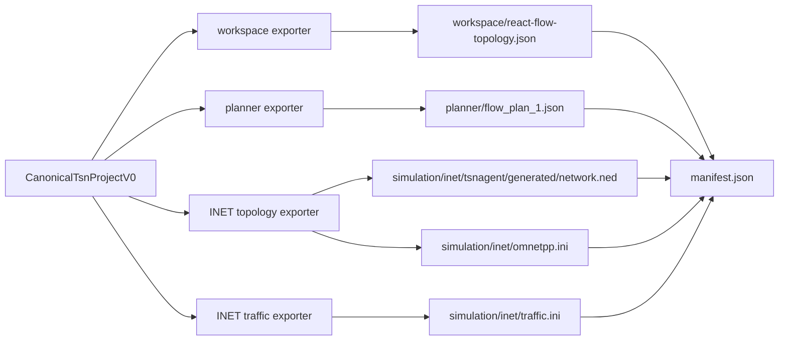

# feat: 隔离导出产物并生成 INET 业务流输入

## 摘要

将当前扁平的导出 bundle 改成按消费方分组的项目目录：`workspace/` 面向 React Flow 和应用工作台，`planner/` 面向外部规划器，`simulation/inet/` 面向 INET/OMNeT++。同时为 INET 增加第一版可发包的 UDP source/sink 配置，让 Qtenv/Cmdenv 不再只加载拓扑后立即结束。

---

## 问题背景

当前导出文件混在同一层：`network.ned` 和 `omnetpp.ini` 能被 INET 加载，但三条业务流只存在于 `flow_plan_1.json` 中，INET 不会读取它。用户在 Qtenv 点击 Run 时只看到设备初始化和短暂高亮，容易误以为流量规划已经进入仿真，实际只是拓扑 smoke。

这个计划落实原始需求中“清楚区分用于可视化展示、用于规划和用于仿真的文件”的要求，并补上第一版 INET traffic 输入，但不把它扩展成完整 TSN 行为仿真。

---

## 需求

- R1. 导出目录必须按消费方隔离 React Flow 工作台文件、外部规划器文件和 INET/OMNeT++ 文件，避免混淆 `flow_plan_1.json` 与 INET 输入。
- R2. UI 和日志必须能展示文件分组、用途、入口文件和外部观测文件；优先从 artifact path 与现有 `purpose` 派生，只有现有契约无法表达入口语义时才增加最小字段。
- R3. `flow_plan_1.json` 继续作为外部规划器输入；`flow_plan_result_1.json` 只在外部存在时作为 observed planner output，不由应用伪造。
- R4. INET 文件必须保留最小拓扑加载能力，并新增第一版业务流 UDP source/sink 配置，使当前 canonical flows 能在 INET 中产生 packet。
- R5. 第一版 INET traffic 只承诺业务流发包和接收，不承诺 gPTP、TAS/GCL、CBS、PSFP、FRER、确定性时延或规划结果回写。
- R6. 旧 session 和旧 bundle 必须能继续展示；刷新或重新导出时使用新目录结构。
- R7. 导出写盘边界继续拒绝危险路径、绝对 artifact path、路径逃逸和无效 manifest。

**源需求参与者:** A1 TSN 新手用户, A4 规划器, A5 INET 仿真流程, A7 INET smoke runner
**源需求关键流程:** F5 项目目录交付, F9 INET smoke 验证
**源需求验收示例:** AE4 区分规划器输出, AE15 INET smoke 验证, AE16 阶段通知和日志摘要

---

## 范围边界

- 不执行外部规划器，不生成或修改 `flow_plan_result_1.json`。
- 不实现 INET 内置 gate scheduling configurator，不生成 GCL/TAS 或把规划器结果回写到 gate schedule。
- 不实现 gPTP、CBS、PSFP、FRER、VLAN/PCP stream coding 的完整仿真行为；只在目录命名和文档中保留后续扩展余地。
- 不把 SQLite 改成可交付项目文件的唯一来源；导出目录仍是下游工具消费边界。
- 不改变 canonical model 的核心 schema；若 INET traffic 需要派生字段，优先从现有 flow endpoint、period、frame size、UDP port、route 中导出。

### 后续工作

- 完整 INET TSN 行为配置：独立计划实现 gPTP、stream identification/coding、TAS/GCL、CBS、FRER 和规划结果回写。
- 外部规划器执行与结果解析：独立计划处理 `flow_plan_result_1.json` 的观测、解析、展示和向仿真配置转换。
- devserver smoke 一键运行：已有计划覆盖 runner/transport；本计划只保证导出目录和 INET 输入形态可被 runner 使用。

---

## 上下文与调研

### 相关代码和模式

- `src/export/artifact-bundle.ts` 当前生成扁平 bundle：`tsnagent/generated/network.ned`、`omnetpp.ini`、`react-flow-topology.json`、`flow_plan_1.json`、`manifest.json`。
- `src/export/ini-exporter.ts` 当前 `omnetpp.ini` 只包含最小网络加载配置，并明确 gPTP、TAS/GCL、真实流应用配置后续扩展。
- `src/export/planner-exporter.ts` 已从 canonical flows 导出规划器输入所需的 UDP port、PCP、period、frame size、route/node path。
- `src/project/export-manifest.ts` 和 `src-tauri/src/project_writer.rs` 已有 manifest 校验、observed planner output 约束和安全写盘边界。
- `src/app/App.tsx` 的“导出文件”面板当前直接平铺 `bundle.artifacts`，适合改为按用途分组展示。
- `docs/ned-contract.md` 已明确当前 NED/INI 是最小可加载契约，完整业务流和 TSN 行为由后续 `inet-export` 扩展。

### 项目内经验

- 当前仓库没有 `docs/solutions/` 条目；计划沿用 AGENTS.md 中关于中文文档、分阶段工作流、导出边界和不伪造规划器输出的约束。

### 外部参考

- INET 4.6 示例使用 `UdpSourceApp` / `UdpSinkApp` 配置业务流，例如 `showcases/tsn/combiningfeatures/gptpandtas/omnetpp.ini` 和 `showcases/tsn/gatescheduling/eager/omnetpp.ini`。
- INET TSN 示例中业务流、stream identification/coding、gate scheduling 常在 `.ini` 中分层配置；第一版可以只导出 UDP app/sink，后续再扩展 stream 和 gate schedule。

---

## 关键技术决策

- **目录按消费方隔离，而不是按生成器文件名隔离。** 推荐结构为 `workspace/`、`planner/`、`simulation/inet/`，这样用户和下游工具都能从目录名判断用途。
- **`simulation/inet/omnetpp.ini` 是 INET 入口文件。** 它负责加载网络并 include 或引用同目录下的 traffic 配置；运行命令的工作目录固定为 `simulation/inet`，NED path 指向该目录或导出根目录。
- **NED package 路径继续与 `tsnagent/generated/network.ned` 匹配。** 在新结构中路径变为 `simulation/inet/tsnagent/generated/network.ned`，package 仍是 `tsnagent.generated`。
- **第一版 INET traffic 使用 UDP source/sink，而不是 EthernetSourceApp。** canonical flow 已包含 IP、UDP port、period 和 frame size，使用 `UdpSourceApp` / `UdpSinkApp` 更贴近后续 stream identification、PCP 和 TSN shaping 扩展。
- **React Flow 文件保留工作台语义。** `workspace/react-flow-topology.json` 是 UI 展示数据，不应被 INET 或外置规划器依赖。
- **规划器文件保持当前格式和文件名。** `planner/flow_plan_1.json` 是外部规划器输入，便于和现有规划器脚本迁移；旧根目录文件名不再作为新导出的主路径。
- **分组优先由路径前缀和现有 `purpose` 派生。** UI、日志和写盘校验不应为了本期目标大幅扩展 manifest schema；如入口语义无法稳定派生，只增加一个最小的 entrypoint 标记。
- **旧 bundle 只做读兼容，不做双写兼容。** 历史 session 仍能显示旧路径；刷新 bundle 后只生成新结构，避免长期维护两套输出。

---

## 开放问题

### 规划中已解决

- INET traffic 是否纳入本计划：纳入。用户选择“目录隔离 + 第一版 INET 业务流配置”，因此本计划会让当前 flows 在 INET 中产生 UDP packet。
- 是否生成完整 TSN 行为配置：不纳入。第一版只验证业务流发包，不承诺 gPTP/TAS/GCL/FRER 等确定性行为。

### 推迟到实现阶段

- `omnetpp.ini` include 写法的最终选择：实现时需用 devserver INET 4.6 实测 `include` 与相对路径行为；若 include 不稳定，可在入口文件中直接聚合生成内容，同时保留源文件分层。
- INET 对当前 `TsnDevice` 多 app 与自动 IP/ARP 配置的最小必需参数：实现时用 devserver Qtenv/Cmdenv 验证，必要时增加最小 configurator 或 address 配置。
- 多条流同源/同宿时 app index 的稳定分配规则：实现时按 nodeId 聚合并写测试锁定顺序。

---

## 输出结构

    <export-root>/
      manifest.json
      workspace/
        react-flow-topology.json
      planner/
        flow_plan_1.json
        flow_plan_result_1.json        # 可选，外部观测，不由应用生成
      simulation/
        inet/
          omnetpp.ini                  # INET 入口
          traffic.ini                  # 第一版 UDP source/sink 业务流
          tsnagent/
            generated/
              network.ned

`streams.ini`、`routing.ini`、`schedule.ini` 属于后续完整 TSN 仿真计划，本期不生成空文件或占位文件。

---

## 高层技术设计

> *这里展示的是方案形态，用于评审方向，不是实现规格。实现时应把它当作上下文，而不是要逐字复刻的代码。*

Artifact 分组派生示意：

| 派生分组 | 示例路径 | 消费方 | 入口语义 |
|---|---|---|---|
| `workspace` | `workspace/react-flow-topology.json` | TSN Agent UI / React Flow | 工作台展示数据 |
| `planner` | `planner/flow_plan_1.json` | 外部规划器 | planner input |
| `simulation-inet` | `simulation/inet/omnetpp.ini` | INET/OMNeT++ | INET entrypoint |
| `simulation-inet` | `simulation/inet/traffic.ini` | INET/OMNeT++ | UDP traffic config |

---

## 实施单元

### U1. 重组导出路径并保持轻量 manifest 契约

**目标:** 将现有扁平导出改为按消费方分组的新结构，同时沿用现有 manifest/purpose 和写盘安全边界，避免为了 UI 分组引入过重的新 schema。

**需求:** R1, R2, R3, R6, R7

**依赖:** 无

**文件:**
- 修改: `src/export/artifact-bundle.ts`
- 修改: `src/export/ned-contract.ts`
- 修改: `src/project/export-manifest.ts`
- 修改: `src/project/project-writer.ts`
- 修改: `src-tauri/src/project_writer.rs`
- 修改: `src/export/exporters.test.ts`
- 修改: `src/project/project-exporter.test.ts`
- 修改: `src/project/project-writer.test.ts`
- 修改: `src/app/App.test.tsx`

**实现思路:**
- 新 bundle 路径改为：
  - `workspace/react-flow-topology.json`
  - `planner/flow_plan_1.json`
  - `simulation/inet/tsnagent/generated/network.ned`
  - `simulation/inet/omnetpp.ini`
  - `manifest.json`
- `NED_CONTRACT.relativePath` 可继续描述 package 内相对路径，但 artifact path 由 INET export layer 拼接到 `simulation/inet/` 下，避免把 NED contract 和项目目录布局绑死。
- UI/日志分组优先用 artifact path 前缀和现有 `purpose` 派生；只有入口文件无法稳定派生时，才给 manifest 增加一个最小的 entrypoint 标记。
- manifest 校验继续要求非 observed 文件必须存在对应 artifact；`planner-output` 仍必须 `observedExternal=true`，新路径允许 `planner/flow_plan_result_1.json`。
- Rust writer 和 TypeScript writer 继续拒绝重复路径、绝对路径、`..` 路径逃逸和 manifest 引用缺失；不为了新子目录放宽安全边界。
- browser preview、Tauri write 和 export status 的文件数更新为新结构文件数。
- 不为旧根目录文件双写兼容；需要旧路径的外部消费者应读取 manifest 或迁移到新路径。

**遵循模式:**
- `src/export/artifact-bundle.ts` 当前集中组装 artifacts 的方式。
- `src/project/export-manifest.ts` 现有 `planner-output` 校验。
- `src-tauri/src/project_writer.rs` 现有 manifest 引用校验和路径安全校验。
- `src/app/App.test.tsx` 现有导出文件列表和导出状态测试。

**测试场景:**
- 正常路径：生成 4 交换机项目后，artifact path 等于新目录结构，manifest files 与 artifacts 一致。
- 正常路径：browser preview 返回的新 `writtenFiles` 包含新路径。
- 正常路径：manifest 中 observed `planner/flow_plan_result_1.json` 无 artifact content 也通过。
- 边界情况：历史 session 中 `bundle.artifacts` 仍是旧路径时，导出文件 tab 能展示旧路径，不要求自动迁移。
- 错误路径：刷新 bundle 后不再输出旧根目录 `omnetpp.ini`、`react-flow-topology.json` 或 `flow_plan_1.json`。
- 错误路径：manifest 引用 `simulation/inet/missing.ini` 但 artifacts 未提供时失败。
- 错误路径：artifact path 为 `../omnetpp.ini`、绝对路径或重复路径时失败。

**验证:**
- 新导出目录结构在测试快照/断言中固定；旧 session 展示行为不回归；写盘安全边界不放松。

### U2. 生成第一版 INET UDP traffic 配置

**目标:** 从 canonical flows 生成 `simulation/inet/traffic.ini`，让当前控制流、心跳流、视频流等在 INET 中真正产生 UDP packet。

**需求:** R4, R5

**依赖:** U1

**文件:**
- 新建: `src/export/inet-traffic-exporter.ts`
- 修改: `src/export/ini-exporter.ts`
- 修改: `src/export/artifact-bundle.ts`
- 修改: `src/export/exporters.test.ts`
- 修改: `docs/ned-contract.md`
- 测试: `src/export/exporters.test.ts`

**实现思路:**
- 新增 `exportInetTrafficIni(project)`，按 source node 聚合 flow，为每个源端系统生成 `UdpSourceApp`，为每个目的端系统生成 `UdpSinkApp`。
- `UdpSourceApp` 字段来自 canonical flow：`io.destAddress` 使用目的节点 NED id，`io.destPort` 使用 destination UDP port，`source.packetLength` 使用 frame size，`source.productionInterval` 使用 period。
- `UdpSinkApp` 按目的节点和 localPort 聚合，避免同一目的端多个 sink app index 冲突。
- 应用 index 生成必须稳定：先按拓扑节点顺序，再按 flow numericId 排序。
- `omnetpp.ini` 继续作为入口，加载 network、sim-time-limit、基础非交互配置，并通过 include 或聚合方式纳入 `traffic.ini`。实现时以 devserver INET 4.6 实测结果为准。
- `traffic.ini` 顶部写清楚这是第一版 UDP traffic，不含 TSN shaping、gPTP、TAS/GCL 或规划结果。

**遵循模式:**
- INET 示例 `showcases/tsn/combiningfeatures/gptpandtas/omnetpp.ini` 的 `UdpSourceApp` / `UdpSinkApp` 参数。
- `src/export/planner-exporter.ts` 从 flow 派生 endpoint、period、frame size 的方式。
- `src/export/ned-exporter.ts` 的 NED id 转换规则。

**测试场景:**
- 正常路径：单条控制流导出一个 source app 和一个 sink app，destAddress/localPort/packetLength/productionInterval 与 canonical flow 一致。
- 正常路径：当前箭载双冗余拓扑的三条 flow 会生成三组可区分的 source/sink 配置，视频流 `nic5 -> nic6` 使用对应端口和周期。
- 边界情况：同一源节点多条流时，`numApps` 与 app index 稳定递增。
- 边界情况：同一目的节点接收多个不同 UDP port 时，sink app 不互相覆盖。
- 错误路径：flow 引用不存在的 source/destination node 时，导出失败并给出可诊断错误，而不是生成无效 INI。

**验证:**
- `traffic.ini` 能被 manifest 列为 INET 文件；devserver 上使用 Qtenv/Cmdenv 运行时能看到 packet 产生，而不只是初始化后结束。

### U3. 更新 UI 导出文件面板和诊断摘要

**目标:** 让用户在 Tauri UI 中按消费方理解导出文件，并明确 INET 入口、规划器输入和工作台数据的差异。

**需求:** R1, R2, R3, R5, R6

**依赖:** U1, U2

**文件:**
- 修改: `src/app/App.tsx`
- 修改: `src/app/App.css`
- 修改: `src/app/App.test.tsx`
- 修改: `src/diagnostics/app-diagnostics.ts`
- 测试: `src/app/App.test.tsx`
- 测试: `src/diagnostics/app-diagnostics.test.ts`

**实现思路:**
- “导出文件”面板改为按分组展示：工作台展示、外部规划器、INET 仿真输入、清单。
- 对 `simulation/inet/omnetpp.ini` 显示入口标记；对 `planner/flow_plan_1.json` 显示“规划器输入”；对 `planner/flow_plan_result_1.json` 显示“外部观测输出”。
- 面板文案避免说“仿真输入文件”覆盖所有产物，改为“项目导出文件”或“按用途分组的导出文件”。
- 诊断日志 `artifactBundleSummary()` 增加派生分组、入口文件和 `observedExternal` 摘要，但继续只保存文件路径、用途、长度等脱敏信息。
- 旧 bundle 使用兼容标签，不强制用户刷新。

**遵循模式:**
- `src/app/App.tsx` 当前 tab panel 结构。
- `src/diagnostics/app-diagnostics.ts` 当前 artifact 摘要。

**测试场景:**
- 正常路径：完成 planning-export 后，导出 tab 展示工作台、外部规划器、INET 仿真输入三个分组。
- 正常路径：保存后状态显示新文件数量和导出目录，并可打开目录。
- 边界情况：旧 bundle 只有旧路径时，导出 tab 仍展示文件，不出现空分组或崩溃。
- 错误路径：导出失败时错误提示仍显示在导出 tab，且不会误导为 INET traffic 生成成功。

**验证:**
- 用户能从 UI 直接看出 `flow_plan_1.json` 不属于 INET 输入；`traffic.ini` 属于 INET 输入。

### U4. 更新文档并做 INET 验证

**目标:** 更新开发文档，让开发者能用 devserver 验证新 INET 入口和第一版 UDP traffic；本期不新增完整 fixture 树，避免样例文件先于 smoke runner 漂移。

**需求:** R4, R5

**依赖:** U2

**文件:**
- 修改: `docs/testing.md`
- 修改: `docs/ned-contract.md`

**实现思路:**
- 文档中的 INET 命令改为以 `simulation/inet` 为工作目录，或明确 NED path 需要包含导出根/INET 目录。
- 明确当前 INET 验证分两层：拓扑可加载和 UDP traffic 可发包；不代表完整 TSN 确定性行为。
- 只在文档中说明后续完整 TSN 仿真可能引入 `streams.ini`、`routing.ini`、`schedule.ini`，本期不生成占位文件。
- 等后续 smoke runner 真正消费样例时，再新增 `tests/fixtures/export-bundle/`。

**遵循模式:**
- `docs/testing.md` 当前默认测试和手动 INET 验证说明。
- `docs/ned-contract.md` 对最小 NED/INI 契约的说明方式。

**测试场景:**
- 测试预期：无。文档本身不引入运行时代码；目录结构和 INET 配置由 U1-U3 测试覆盖。

**验证:**
- 文档中的 devserver 命令能指向新入口；后续 fixture 目录仅作为 smoke runner 工作的输入，不在本期创建。

---

## 系统影响

- **交互关系:** Agent/fake agent 仍产出 canonical project 和 bundle；导出器内部重组 paths 后，App、session storage、diagnostics、Tauri writer 都消费同一 bundle。
- **错误传播:** INET traffic 导出失败应阻止 bundle 生成，进入现有 agent/export 错误路径，而不是生成缺失 traffic 的半成品并声称可仿真。
- **状态生命周期风险:** 旧 session 存储了旧 bundle payload；UI 必须兼容展示，刷新 bundle 后才迁移到新结构。
- **API 表面对齐:** Web preview、Tauri write、diagnostics summary 和 manifest validation 都需要理解新路径；分组信息优先在展示层派生。
- **集成覆盖:** 单元测试能覆盖路径和 INI 字符串；真实 INET 兼容性仍需要 devserver 手动或后续 smoke runner 验证。
- **不变约束:** 右侧工程状态仍来自 canonical project/bundle；`flow_plan_1.json` 仍是外部规划器输入；`flow_plan_result_1.json` 仍不由应用生成。

---

## 风险与依赖

| 风险 | 缓解 |
|------|------------|
| INET `.ini` include 相对路径在 devserver 与本机表现不同 | 实现时先用 devserver INET 4.6 验证；若不稳定，入口 `omnetpp.ini` 可聚合 traffic 内容，同时保留 `traffic.ini` 作为可读分层文件 |
| `UdpSourceApp` 需要额外网络配置才发包 | 用当前 NED 的 `TsnDevice`/`TsnSwitch` 在 devserver 验证，必要时增加最小 configurator/address 配置，但不扩展到完整 TSN 行为 |
| 用户误以为 `traffic.ini` 等于 TSN 规划结果 | UI、manifest label 和文档明确“业务流发包”与“TAS/GCL/规划结果”不同 |
| 下游脚本仍读取根目录 `flow_plan_1.json` | 新 manifest 是迁移契约；不双写旧路径，避免长期混乱。必要时在文档里给出新路径 |
| 入口语义如果需要最小字段，可能影响旧 session | 优先由路径和 `purpose` 派生；只有确需新增字段时保持可选，并让旧 manifest 继续按现有字段展示 |

---

## 文档与运行说明

- 更新 `docs/testing.md` 的 devserver 命令，明确 `simulation/inet/omnetpp.ini` 是入口。
- 更新 `docs/ned-contract.md`，把 NED contract 与导出目录布局拆开描述。
- 在 UI 文案中避免把所有导出文件统称为“仿真输入文件”；使用“项目导出文件”并按用途分组。
- 计划完成后，后续 `ce-work` 至少应运行 `npm test`、`npm run build`、`npm run cargo:test`；改动 UI 主流程时补跑 `npm run e2e`。真实 INET 验证用 devserver 手动命令或后续 smoke runner。

---

## 来源与参考

- **来源文档:** [docs/brainstorms/2026-05-20-tsn-agent-tauri-ned-requirements.md](../brainstorms/2026-05-20-tsn-agent-tauri-ned-requirements.md)
- 相关需求背景: [docs/brainstorms/2026-05-20-tsn-agent-rocket-tsn-spec-gap-analysis.md](../brainstorms/2026-05-20-tsn-agent-rocket-tsn-spec-gap-analysis.md)
- 当前 NED 契约: [docs/ned-contract.md](../ned-contract.md)
- 当前测试说明: [docs/testing.md](../testing.md)
- 当前 bundle 组装: `src/export/artifact-bundle.ts`
- 当前 INET 入口导出: `src/export/ini-exporter.ts`
- 当前规划器导出: `src/export/planner-exporter.ts`
- 当前 Tauri 写盘边界: `src-tauri/src/project_writer.rs`
- 规划参考的 INET 示例: `showcases/tsn/combiningfeatures/gptpandtas/omnetpp.ini`, `showcases/tsn/gatescheduling/eager/omnetpp.ini`
