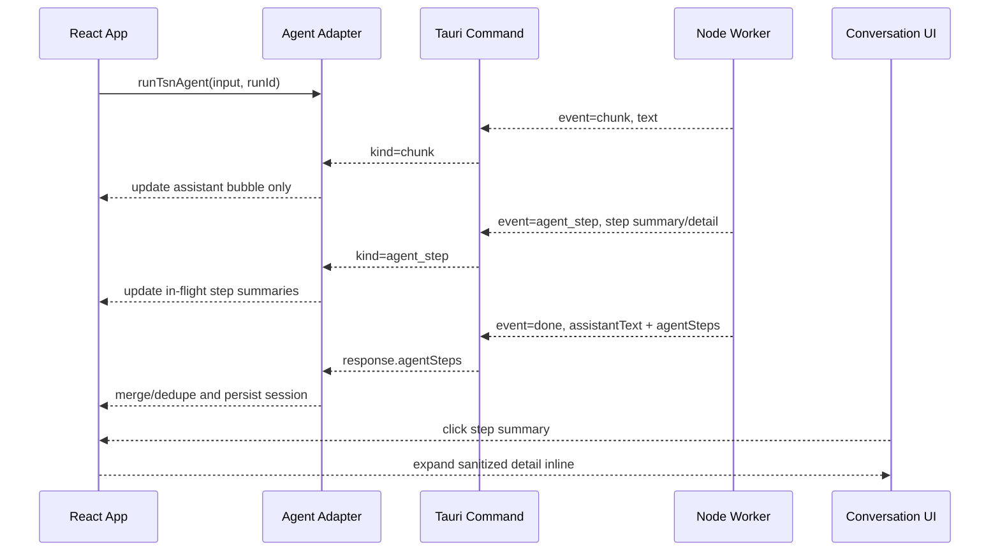
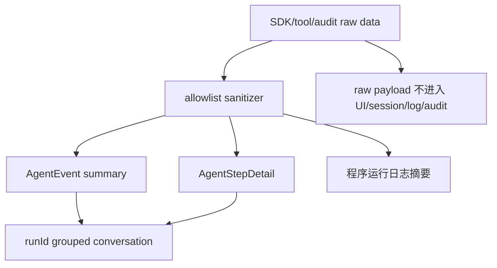

# feat: 整合 Agent 会话步骤与运行日志体验

## Summary

把当前分散在会话内容、执行步骤和执行日志里的 Agent 信息，收敛成一个更清楚的 MVP 垂直切片：主会话流展示业务回复和本轮步骤摘要，点击步骤摘要在会话内展开脱敏详情；侧栏“执行日志”改名为“日志”，定位为程序运行日志。第一版只解决会话降噪、步骤摘要/详情、运行日志命名和隐私边界，不建设通用 tracing 系统，不承诺完整细粒度 SDK tool trace 解析，也不改变 topology MCP、阶段确认、project/bundle/plannerRun 业务行为。

---

## Problem Frame

当前真实 Agent 路径会把工具 trace 作为文本 prepend 到 assistant 回复里，Tauri event 再按 `chunk` 推给前端，`App.tsx` 将这些 chunk 直接写入对话消息。结果是主会话流同时承载自然语言回复、工具调用、工具结果和阶段 trace，信息密度高、顺序难扫，且长内容会被截断。

底部“执行步骤”页签已经有 `AgentEvent[]`，但它和会话内容割裂。用户需要在“对话、执行步骤、执行日志”之间来回切换才能理解一次 Agent 运行。侧栏“执行日志”的命名也容易让用户误以为它是业务步骤记录，而不是开发排障用的程序日志。

目标体验是：用户在主会话流里看到当前 run 的 A/B/C/D 步骤摘要；点击 A 就在该步骤下方展开 A 的脱敏详情；侧栏“日志”只展示 runtime、MCP、session、artifact、耗时、计数和错误等程序层信息。

---

## Requirements

**会话与步骤整合**

- R1. 主会话流只展示用户需要阅读的自然语言回复、阶段摘要、确认提示和 Agent 步骤摘要，不再内联展示 `[工具]`、`[工具结果]`、`[文件]` 等操作 trace。
- R2. 流式输出仍要保留首 chunk 等待体验，但工具 trace 不应作为普通 assistant 文本追加到聊天气泡。
- R3. 真实 Agent、fixture/UI smoke 和错误结果的用户可见文案都必须继续经过供应商名脱敏。
- R4. 每次用户请求生成一个 `runId`，用户消息、步骤摘要、assistant 回复、错误 fallback 和相关日志都必须带同一个 `runId`。
- R5. 主会话流按 run 派生展示：用户消息 -> 本轮步骤摘要组 -> assistant 阶段摘要/确认提示；步骤编号 A/B/C 在 run 内重置。历史 run 默认保留摘要，不抢占当前 run 阅读焦点。

**步骤摘要与详情**

- R6. Agent 步骤摘要必须作为主会话流的一部分展示，至少包含顺序、阶段、类型、状态、标题、短摘要和时间。
- R7. 点击某个步骤摘要后，在该步骤下方展开详情；第一版同一时间只展开一个步骤。窄屏沿用同一折叠详情，不引入第二种抽屉交互。
- R8. 同一个 `toolUseId` 在主会话流中只对应一个逻辑步骤：`tool_use` 创建 pending 步骤，`tool_result` 尽力更新为 success/error；没有 `toolUseId` 或无法配对时才显示独立未配对步骤。
- R9. 步骤详情只展示脱敏摘要字段，例如工具名、输入摘要、输出摘要、错误摘要、`runId`、`traceId`、`toolUseId`、耗时和必要计数，不展示完整 raw payload。
- R10. 会话恢复后，步骤摘要和已保存详情仍可查看；旧 session 没有详情字段时应优雅降级为摘要展示。

**日志与隐私边界**

- R11. 侧栏入口和抽屉标题从“执行日志”改为“日志”；副标题/空态说明必须体现“程序运行日志”定位。
- R12. 日志保存 runtime 连接、MCP 调用、session、artifact、耗时、计数和错误等开发排障摘要；日志不承担普通用户理解业务步骤的主入口。
- R13. 完整 prompt、完整 conversation context、raw stdout/stderr、完整 topology/changeSet/artifact、raw tool payload、凭证和请求头不得进入主会话流、步骤详情、普通日志或 worker audit 文件。
- R14. 步骤详情和日志的摘要生成必须使用 allowlist sanitizer，而不是只做截断。默认丢弃或摘要化 `prompt`、`conversationContext`、`messages`、`content`、`stdout`、`stderr`、`env`、`headers`、`cookie`、`authorization`、`full`、`topology`、`changeSet`、`artifact` 等 raw-bearing key。
- R15. 旧 session 中已内联的 `[工具]`、`[工具结果]`、`[文件]` trace 行，在渲染主会话时必须隐藏或清洗，避免新体验上线后仍展示历史 trace。

**集成和测试**

- R16. Worker、Tauri command、agent adapter、session repository 和 UI 使用同一套最小事件/详情契约，避免一边显示摘要、一边丢失详情。
- R17. React/UI 测试和 fixture/UI smoke 可以使用显式命名 fixture 生成可展开步骤；完整 E2E 必须通过真实 Agent/MCP 链路验证，不再依赖 fake agent。
- R18. 现有 topology MCP、阶段确认、project/bundle/plannerRun 行为不因这次 UI/日志改造改变。
- R19. 底部配置区不再提供“执行步骤”作为独立主页签；步骤查看入口来自主会话流中的步骤摘要。

---

## Scope Boundaries

本计划包含：

- 对话主消息降噪，移除工具 trace 内联展示。
- 定义最小 `AgentEvent` 摘要字段和独立 `AgentStepDetail` 详情字段。
- 将现有 worker operation trace 从 `chunk` 改为 best-effort `agent_step` 摘要事件。
- `agent_step` 同时支持流式 emit 和 final response 权威回传，保证 session 持久化不依赖前端 listener 是否及时收到事件。
- 按 `runId` 将步骤摘要嵌入主会话流，并通过点击摘要展开详情。
- 移除底部配置区的“执行步骤”独立页签。
- 将“执行日志”UI 文案改为“日志”，并把内容边界收敛为程序运行日志。
- 将 worker audit 文件纳入隐私边界。
- 相关单元测试、React 测试和 worker/Tauri bridge 契约测试。

本计划不包含：

- 修复 topology MCP 的模板、dryRun、打包或 session repair 问题。
- 重新设计 TSN 拓扑、流量规划、仿真导出业务逻辑。
- 建设完整 tracing 系统、远程 telemetry 或日志导出包。
- 展示未脱敏 raw tool payload、完整 prompt/context、完整大 JSON。
- 对每个 MCP server 做专门详情 renderer，例如 topology operation diff 可视化。
- 日志和步骤详情的双向索引或一跳跳转；第一版只共享 `runId` / `traceId` 作为排障定位字段。

### Deferred to Follow-Up Work

- 多 run 聚合视图、按工具名/阶段的高级过滤和全文搜索。
- 用户显式导出诊断包。
- 对每个 MCP server 的专门详情 renderer。
- 日志与步骤详情的双向跳转或诊断包导出。
- 更完整的 SDK `tool_use/tool_result` 细粒度解析；当前第一版只做 best-effort 摘要化。

---

## Context & Research

- `src-node/claude-agent-worker.mjs` 已有 `extractOperationTraceEvents()`，能从 SDK `tool_use` / `tool_result` 中生成文本 trace；当前通过 `emitOperationTrace()` 作为 `chunk` 发送，并由 `prependOperationTrace()` 拼进最终 assistantText。
- `src-node/claude-agent-worker.mjs` 还有 worker audit 输出路径；这次隐私边界必须覆盖 audit JSON，不能只覆盖 UI 和诊断日志。
- `src-tauri/src/commands.rs` 当前只识别 worker stdout event 中的 `chunk`、`session`、`done`，并把 `chunk` 继续通过 `claude-agent-event` 发给前端。
- `src/agent/agent-adapter.ts` 当前 `listenToClaudeChunks()` 只消费 `kind: "chunk"`，`App.tsx` 的 `onChunk` 直接更新 pending assistant message。
- `AgentEvent` 和 `AgentEventKind` 需要从 fake agent 模块抽离为独立 Agent contract；当前事件只有 `title/content/status` 等摘要字段，没有 `runId`、`traceId`、`toolUseId` 或详情引用。
- `src/app/App.tsx` 的配置区当前包含“执行步骤”页签，直接 map `currentSession.agentEvents`，没有和主会话流按 run 关联。
- `src/app/App.tsx` 的工作台工具栏当前把 diagnostics 入口显示为“执行日志”，`workspacePanelLabel()` 也返回“执行日志”。
- `src/ui/diagnostics/DiagnosticsDrawer.tsx` 已有日志列表和详情面板，可作为“日志”改名后的基础结构。
- `docs/diagnostics-log-contract.md` 已规定诊断日志不得保存完整 prompt、conversation context、raw stdout/stderr 和大 JSON；这次计划必须把同样边界扩展到步骤详情和 worker audit。

---

## Key Technical Decisions

- **MVP 先做垂直切片。** 第一版只解决主会话降噪、run 分组步骤摘要、可展开脱敏详情、日志改名和隐私边界；完整 tracing、专门 renderer、双向日志关联推迟。
- **`AgentEvent` 仍是摘要时间线，不是工程状态权威来源。** 阶段结果仍以 `workflow.stages[stageId]` 为准，工程文件仍以 project/artifact 状态为准，日志仍以 diagnostics 为准。
- **步骤详情独立于 `AgentEvent`。** `AgentEvent` 保留稳定摘要和 `detailRef`/`traceId`；详情使用 `AgentStepDetail` map/list 保存已脱敏字段，避免把 `AgentEvent` 扩成半个 trace store。
- **`done` response 是持久化权威源。** worker 在内存中累计规范化后的 `agentSteps`，流式 emit 只服务运行中体验；`done` stdout 和 Tauri response 返回 `agentSteps`，adapter 用 final response 合并去重后保存 session。
- **一个 `toolUseId` 对应一个逻辑步骤。** `tool_use` 创建 pending，`tool_result` 尽力更新同一步骤；缺失配对时按独立 best-effort 步骤展示。
- **主会话按 `runId` 派生展示。** App 在创建本轮用户/assistant 消息前生成 `runId`，传给真实 Agent 或测试 fixture；同一 run 的消息、步骤、错误和日志通过 `runId` 归属。
- **详情交互固定为会话内折叠。** 点击步骤摘要后，在该步骤下方展开详情；同一时间只展开一个步骤。这样避免桌面/移动端两套交互分叉。
- **日志 UI 标题改为“日志”，但副标题说明“程序运行日志”。** 内部 `diagnostics` 命名可暂时保留，避免不必要大重命名。
- **隐私边界以 allowlist 为准。** 步骤详情、日志、worker audit 都只能保存允许字段的摘要、计数、状态和 id；禁止 raw-bearing key 直接落盘。
- **旧 session 显示时清洗历史 trace。** 新契约不追溯强制迁移所有旧数据，但渲染主会话时必须隐藏或清洗历史 `[工具]` trace 行。

---

## High-Level Technical Design

---

## Implementation Units

### U1. 定义最小步骤契约和 sanitizer

**Goal:** 明确 `AgentEvent` 摘要、`AgentStepDetail` 详情、ID 语义和 allowlist sanitizer，避免 worker/Tauri/adapter/UI 各自发明字段。

**Requirements:** R3, R6, R8, R9, R10, R13, R14, R16, R17

**Dependencies:** None

**Files:**

- Add or modify: `src/agent/agent-types.ts`
- Add or modify: `src/test/agent-result-fixtures.ts`
- Modify: `src/sessions/session-repository.ts`
- Test: `src/sessions/session-repository.test.ts`
- Test: `src/app/App.test.tsx`
- Test: `src/sessions/session-repository.test.ts`

**Approach:**

- 保持 `AgentEvent` 作为摘要时间线：`id`、`kind`、`title`、`content`、`status`、`stage`、`skillName`、`createdAt` 继续可用。
- 在 `AgentEvent` 上只增加最小关联字段：`runId`、`traceId`、`sequence`、`toolUseId?`、`detailRef?`。不要在 `AgentEvent` 上保存 `children`、`diagnosticLogIds` 或完整 raw payload。
- 定义 `AgentStepDetail`，只保存已脱敏字段：`traceId`、`runId`、`toolUseId?`、`toolName?`、`inputSummary?`、`outputSummary?`、`errorSummary?`、`durationMs?`、`counts?`、`status`。
- ID 词汇表固定为：`runId` 表示一次用户请求/Agent run；`traceId` 表示一个逻辑步骤；`toolUseId` 只用于 tool call/result 配对；`sequence` 用于 run 内稳定排序。
- 定义 `sanitizeAgentStepDetail()` 或等价 helper，使用 allowlist 字段生成摘要，默认丢弃 raw-bearing key。
- 显式测试 fixture 生成带 `runId`、`traceId`、`sequence` 和 `detailRef` 的可展开步骤详情，覆盖 React/UI smoke；真实 Agent 路径由 worker final response 覆盖。
- session normalize 时接受旧事件缺少新字段；旧 assistant message 渲染时隐藏或清洗 trace-prefixed lines。

**Test scenarios:**

- Happy path：新事件和详情序列化/反序列化后字段保持，`AgentEvent` 仍可作为摘要渲染。
- Happy path：fixture 生成的 stage/tool/artifact 事件都有可展开详情。
- Edge case：旧 session 事件只有 `title/content` 时仍能打开，详情区显示降级提示。
- Security：`prompt`、`conversationContext`、`stdout`、`stderr`、`headers`、`authorization`、`full.topology` 等字段不会进入详情。
- Security：供应商名出现在 fake detail、真实 detail 或错误 fallback 时，用户可见内容被脱敏。
- Legacy：旧 assistant message 中的 `[工具]` / `[工具结果]` / `[文件]` trace 行在主会话渲染中被隐藏或清洗。

**Verification:**

- 类型层面不要求每个旧 `AgentEvent` 都有详情；新事件有稳定 ID 和最小详情，不形成第二套工程状态权威来源。

---

### U2. 改造 worker 事件通道和 audit 隐私边界

**Goal:** 让 worker 不再把 operation trace 作为 `chunk` 写入对话，而是 best-effort 生成 `agent_step` 摘要事件，并通过 final response 权威回传。

**Requirements:** R1, R2, R8, R9, R13, R14, R16, R18

**Dependencies:** U1

**Files:**

- Modify: `src-node/claude-agent-worker.mjs`
- Modify: `src-node/claude-agent-worker.test.mjs`
- Modify: `src-tauri/src/commands.rs`
- Test: `src-node/claude-agent-worker.test.mjs`
- Test: `src-tauri/src/commands.rs`

**Approach:**

- 将 `extractOperationTraceEvents()` 的输出从“文本 trace”调整为 `agent_step` draft；第一版只复用现有可稳定获得的工具名、摘要、状态、`toolUseId`。
- `emitOperationTrace()` 不再调用 `onEvent({ event: "chunk" })`；改为流式发送 `event: "agent_step"`。
- worker 在内存中累计规范化后的 `agentSteps`；`done` stdout 和 Tauri `run_claude_agent` response 都返回 `agentSteps`。
- `prependOperationTrace()` 不再把工具 trace 拼入最终 assistantText；最终回复只包含模型自然语言和必要阶段结果文案。
- 对有 `toolUseId` 的 call/result 尽力合并为一个逻辑步骤；没有配对时保留独立 best-effort 步骤。
- Tauri `ClaudeWorkerEvent` 识别 `agent_step`，通过前端 event bridge 发送 `kind: "agent_step"`，并在最终 response 中保留 `agentSteps`。
- worker audit JSON 只能保存摘要、计数、状态、fingerprint 和短 id；不得保存完整 prompt、完整 conversation context、raw stdout/stderr、raw tool payload、完整 topology/changeSet/artifact。

**Test scenarios:**

- Happy path：operation trace 产生 `agent_step`，包含 `runId`、`traceId`、`sequence`、工具名和摘要。
- Happy path：`done` response 返回与流式事件可去重的 `agentSteps`。
- Happy path：同一 `toolUseId` 的 call/result 在 final `agentSteps` 中合并为一个逻辑步骤。
- Error path：工具失败时步骤状态为 error，摘要包含脱敏错误。
- Integration：最终 `assistantText` 不包含 `[工具]`、`[工具结果]`、`[文件]` 前缀。
- Security：`latest.json` 或 audit 输出不包含完整 prompt/context/raw payload。
- Regression：topology MCP、阶段确认、project/bundle/plannerRun 相关字段仍从原有 stage/project/artifact 路径返回，不被 `agent_step` 替代。

**Verification:**

- 真实 Agent 运行时，聊天气泡不再出现工具 trace；即使流式事件丢失，final response 仍能保存步骤摘要。

---

### U3. 接入 adapter、run model 和会话保存

**Goal:** 前端 adapter 使用 `runId` 将消息、步骤和日志归属到同一 run，并以 final response 为权威源保存步骤。

**Requirements:** R1, R2, R3, R4, R5, R10, R16, R18

**Dependencies:** U1, U2

**Files:**

- Modify: `src/agent/agent-adapter.ts`
- Modify: `src/app/App.tsx`
- Modify: `src/sessions/session-repository.ts`
- Test: `src/agent/agent-adapter.test.ts`
- Test: `src/app/App.test.tsx`
- Test: `src/sessions/session-repository.test.ts`

**Approach:**

- App 在创建 pending user/assistant message 前生成 `runId`，传给 `runTsnAgent`；同一 `runId` 写入本轮两条消息和所有 fake/real/error step events。
- 扩展 Tauri event payload 类型，支持 `kind: "agent_step"` 和最小 step payload。
- `listenToClaudeChunks()` 拆成更通用的运行事件监听，同时接收 `chunk` 和 `agent_step`。
- 收到 `chunk` 时只更新 pending assistant 气泡；收到 `agent_step` 时只更新 in-flight step buffer，不追加 assistant message 文本。
- 运行完成后，以 final response `agentSteps` 为持久化权威源，和流式 step buffer 按 `runId`、`traceId`、`toolUseId`、`sequence` 去重合并。
- 如果运行失败但已收到部分步骤，仍保存这些步骤并追加错误步骤；迟到事件必须按 `runId` 归属，不写入当前可见 run。
- 旧 session 没有 `runId` 时，UI 使用 createdAt 降级排序，但不尝试重建完整 run。

**Test scenarios:**

- Happy path：用户消息、assistant 回复和 steps 共享同一 `runId`。
- Happy path：收到 `chunk` 时只更新 assistant 气泡，收到 `agent_step` 时只更新 step buffer。
- Happy path：Agent 完成后，session 保存 assistantText 和 agentEvents/detail，二者内容不重复。
- Error path：Agent 失败时，已收到的步骤仍可在 session 中查看，并追加错误事件。
- Edge case：同一个 trace id 重复到达时只保存一次。
- Edge case：切换 session 后，旧 run 的迟到事件不会写入新 session 的当前 run。
- Regression：阶段确认仍能推进，project/bundle/plannerRun 仍按原行为生成或保留。

**Verification:**

- 主会话可按 run 派生步骤摘要；session 恢复后步骤归属稳定。

---

### U4. 将步骤摘要整合进主会话流

**Goal:** 移除底部独立“执行步骤”页签，将步骤摘要按 run 放入主会话流，并支持点击展开详情。

**Requirements:** R5, R6, R7, R8, R9, R10, R17, R18, R19

**Dependencies:** U1, U3

**Files:**

- Modify: `src/app/App.tsx`
- Modify: `src/app/App.css`
- Test: `src/app/App.test.tsx`

**Approach:**

- 从 `CONFIG_TABS` 中移除 `steps` 页签，避免底部配置区继续出现“执行步骤”独立入口。
- 主会话流按 run 渲染：用户消息 -> 步骤摘要组 -> assistant 回复/确认卡片。当前 run 展示步骤摘要；历史 run 可以折叠为简短“本轮 N 个步骤”摘要。
- 步骤摘要卡片展示 run 内编号、状态、阶段、类型、标题和一行摘要；长文本截断。
- 点击步骤摘要后，在该步骤下方展开详情；同一时间只展开一个步骤。再次点击关闭，点击其他步骤切换详情。
- 详情字段化展示：概览、工具名、输入摘要、输出摘要、错误摘要、时间、耗时、`runId`、`traceId`、`toolUseId`。
- 无详情的旧事件显示摘要内容和“该步骤没有保存更多详情”的降级状态。
- 可访问性规格：步骤摘要使用 button；`aria-expanded` 和 `aria-controls` 指向详情区域；Enter/Space 打开；Escape 关闭详情并把焦点还给触发按钮；运行中新增步骤使用 `aria-live="polite"`；触摸目标不小于 36px；长摘要 wrap，详情 JSON/文本有 max-height 和 scroll。

**Test scenarios:**

- Happy path：主会话流展示本轮多条步骤摘要，点击第一条后在下方展开详情。
- Happy path：同一 `toolUseId` 的 call/result 在主会话流显示为一张逻辑步骤卡。
- Happy path：失败步骤在摘要和详情中都有 error 状态。
- Edge case：旧 session 事件没有详情时，详情区显示降级提示。
- Edge case：超长输出只在详情中显示截断摘要，布局不被撑开。
- Accessibility：`aria-expanded`、`aria-controls`、Escape 焦点回退和 `aria-live` 行为可测试。
- Responsive：窄屏下详情不遮挡输入框和主拓扑画布。
- Regression：底部配置区不再出现“执行步骤”页签。
- Regression：阶段确认提示仍贴近对应 assistant 回复。

**Verification:**

- 用户可以直接在会话流完成“扫摘要 -> 点 A -> 看 A 详情 -> 点 B -> 看 B 详情”的操作。

---

### U5. 将执行日志改为运行日志

**Goal:** 将面向用户的“执行日志”改名为“日志”，并用文案明确它是程序运行日志；这部分不依赖完整步骤详情链路。

**Requirements:** R11, R12, R13, R14, R18

**Dependencies:** None for UI rename; U3 for run summary counts

**Files:**

- Modify: `src/app/App.tsx`
- Modify: `src/ui/diagnostics/DiagnosticsDrawer.tsx`
- Modify: `src/diagnostics/diagnostic-log.ts`
- Modify: `src/diagnostics/app-diagnostics.ts`
- Test: `src/app/App.test.tsx`
- Test: `src/ui/diagnostics/DiagnosticsDrawer.test.tsx`
- Test: `src/diagnostics/app-diagnostics.test.ts`

**Approach:**

- 将 `WorkspaceToolRail`、`workspacePanelLabel()`、抽屉标题、空态和测试断言中的“执行日志”改为“日志”。
- 抽屉副标题或空态说明使用“程序运行日志”，避免用户误解为业务步骤列表。
- 日志筛选保留当前结构，但用户可见标签收敛为“全部 / 运行时 / Agent / 会话 / 文件 / 错误”或等价文案。
- 日志条目标题采用程序语义，例如“运行完成 · 7 个步骤 · 1 个错误”，避免复用业务阶段标题作为主标题。
- 日志 details 可增加轻量 run summary，例如 `runId`、`stepCount`、`errorStepCount`、`traceIds`，但不保存完整 step detail，不保存 `diagnosticLogIds` 反向索引。
- 日志和步骤详情共享 `runId` / `traceId` 用于排障定位；第一版不做双向跳转。
- 保持 `DiagnosticLogEntry.details` 的最大长度、深度和敏感 key 脱敏规则，并迁移到 allowlist 方向。

**Test scenarios:**

- Happy path：工具栏按钮显示“日志”，抽屉标题显示“日志”，副标题或空态说明“程序运行日志”。
- Happy path：Agent run 完成日志包含 step count 摘要，不包含 raw tool payload。
- Happy path：日志详情展示 `runId` / `traceId`，用户可和步骤详情对应。
- Edge case：details 中嵌套对象超过深度时仍被截断或摘要化。
- Error path：工具失败摘要可在日志详情看到，但凭证和 raw stderr 不出现。
- Regression：现有 session/artifact/planner 日志仍能按筛选器展示。
- Regression：topology/project/planner 行为不因日志改名改变。

**Verification:**

- 会话步骤解释用户流程，日志解释程序运行上下文；两者数据边界清晰。

---

### U6. 更新文档与回归用例

**Goal:** 固化新的输出分层契约，防止后续再次把工具 trace 拼回对话主消息，或把 raw payload 写入步骤详情/日志/audit。

**Requirements:** R1, R3, R11, R13, R14, R16, R18

**Dependencies:** U1-U5

**Files:**

- Modify: `docs/diagnostics-log-contract.md`
- Modify: `docs/staged-agent-workflow.md`
- Modify: `docs/testing.md`
- Test: `src-node/claude-agent-worker.test.mjs`
- Test: `src/app/App.test.tsx`

**Approach:**

- 文档明确三层输出：主会话流、步骤详情、日志。
- 在 workflow 文档中说明工具/MCP trace 进入步骤详情，不进入 assistant text。
- 在 diagnostics 文档中说明“日志”是程序运行日志，不是业务执行步骤列表；worker audit 也必须遵守同样隐私边界。
- 在 testing 文档中补充人工测试路径：真实 Agent 输出、fixture/UI smoke、会话步骤摘要点击详情、日志脱敏、旧 session trace 清洗。
- 增加回归断言：assistant text 不包含 `[工具]` / `[工具结果]` / `[文件]`；主会话流出现步骤摘要，步骤详情仍包含对应摘要。

**Test scenarios:**

- Regression：包含工具调用的 worker fixture 最终 assistant text 不包含工具 trace。
- Regression：App 中使用显式 fixture 完成一次请求后，会话步骤详情可打开并显示详情。
- Regression：面向用户 UI 不再出现“执行日志”，改为“日志”。
- Regression：worker audit 不保存完整 prompt/context/raw stdout/stderr/raw tool payload。
- Regression：阶段确认、project/bundle/plannerRun 仍按原 workflow 行为工作。

**Verification:**

- 后续实现者能从文档判断什么进入主会话流、什么进入步骤详情、什么进入日志和 audit。

---

## Acceptance Examples

- AE1. 给定真实 Agent 调用了 `topology.initialize`，当工具调用和工具结果返回时，则聊天气泡只显示“拓扑已生成/等待确认”类自然语言，主会话流本轮步骤组出现一条或多条步骤摘要，点击后能看到工具名、输入摘要、输出摘要和状态。
- AE2. 给定同一个 `toolUseId` 先返回调用、后返回结果，当用户查看主会话流时，则只看到一个逻辑步骤；步骤状态从 pending 更新为 success/error，详情中分字段展示调用和结果摘要。
- AE3. 给定某个工具结果失败，当用户查看主会话流中的步骤摘要时，则失败步骤标红或标为 error，详情中展示脱敏错误摘要；主对话不出现 raw error 或完整 stderr。
- AE4. 给定连续两轮用户请求，当用户查看会话时，则每轮步骤按自己的 `runId` 分组，A/B/C 编号在 run 内重置，旧 run 的步骤不会混入当前 run。
- AE5. 给定旧 session 中只有 `AgentEvent.title/content`，当用户打开步骤详情时，则步骤摘要仍可显示，详情区域显示无更多详情的降级状态。
- AE6. 给定旧 assistant message 中已有 `[工具]` / `[工具结果]` 行，当用户打开该 session 时，则主会话不展示这些 trace 行。
- AE7. 给定日志中包含 agent run 完成记录，当用户打开“日志”抽屉时，则能看到程序运行日志摘要、step count 和 `runId` / `traceId`，但看不到完整 prompt、完整 context、raw stdout/stderr 或完整 topology/changeSet。
- AE8. 给定用户完成一次真实 Agent 请求或 fixture/UI smoke 请求，当用户查看底部配置区时，则看不到“执行步骤”页签；当用户查看侧栏工具时，则看到“日志”而不是“执行日志”。
- AE9. 给定拓扑阶段等待确认，当用户确认继续时，则阶段推进、project/bundle/plannerRun 行为与改造前一致。

---

## System-Wide Impact

- **Agent runtime:** Worker event 协议新增 `agent_step`，并在 final response 中返回 `agentSteps`；旧 `chunk/session/done` 语义保持。
- **Session payload:** `agentEvents` 保持摘要时间线，详情通过独立 `AgentStepDetail` 保存最小脱敏字段，需要控制大小。
- **UI information architecture:** 会话、步骤详情、日志三层职责更清楚，减少“对话/执行步骤/执行日志”三个入口之间的重复。
- **Privacy boundary:** 脱敏从“诊断日志写入”前移到“步骤详情生成”和“worker audit 输出”阶段。
- **Testing:** 需要覆盖 worker event、final response、Tauri bridge、adapter 合并、run 分组、UI 点击详情、日志改名、旧 session 兼容和业务回归。

---

## Risks & Dependencies

| Risk | Mitigation |
| --- | --- |
| 主会话嵌入步骤后时间线变乱 | 所有消息和步骤带 `runId`；UI 按 run 派生，历史 run 折叠摘要 |
| 详情字段导致 session payload 过大 | `AgentEvent` 只存摘要和引用；`AgentStepDetail` 只保存 allowlist 字段、计数和短摘要 |
| 工具 trace 从对话移除后用户看不到运行进度 | 运行中实时追加本轮步骤摘要，并保留全局 running 状态 |
| worker/Tauri/adapter 事件协议漂移 | 用共享 JSON fixture 覆盖 `agent_step` stdout envelope、final response 和前端事件映射 |
| 流式事件丢失导致 session 不完整 | final response `agentSteps` 作为持久化权威源，adapter 合并去重 |
| 旧 session 打开失败或继续显示历史 trace | 新字段可选；渲染时清洗旧 trace-prefixed lines |
| 敏感信息进入步骤详情、日志或 audit | allowlist sanitizer + raw-bearing key 回归测试 |
| 工具调用和结果无法配对 | 优先用 `toolUseId` 更新同一逻辑步骤；缺失时按独立 best-effort 步骤展示 |
| 业务行为被 UI/日志改造影响 | R18 回归覆盖阶段确认、project/bundle/plannerRun 和 topology MCP 行为 |

---

## Documentation / Operational Notes

- `docs/diagnostics-log-contract.md` 需要明确：步骤详情和 worker audit 也不得保存完整 prompt/context/raw stdout/stderr/raw tool payload；“日志”是程序运行日志。
- `docs/staged-agent-workflow.md` 需要说明：工具/MCP 调用是步骤详情事件，不是 assistant 对话正文。
- `docs/testing.md` 需要补充人工测试路径：运行一次真实 Agent 或 fixture/UI smoke、查看会话是否降噪、点击步骤详情、打开日志核对脱敏摘要、打开旧 session 核对 trace 清洗。

---

## Sources & Research

- Related completed plan: `docs/plans/2026-05-26-001-feat-workspace-tool-detail-panels-plan.md`
- Related workflow plan: `docs/plans/2026-05-20-003-feat-staged-agent-workflow-plan.md`
- Diagnostics contract: `docs/diagnostics-log-contract.md`
- Workflow doc: `docs/staged-agent-workflow.md`
- Worker trace extraction: `src-node/claude-agent-worker.mjs`
- Tauri worker bridge: `src-tauri/src/commands.rs`
- Agent adapter: `src/agent/agent-adapter.ts`
- Agent event model: `src/agent/agent-types.ts`
- Main conversation and tool rail: `src/app/App.tsx`
- Log drawer pattern: `src/ui/diagnostics/DiagnosticsDrawer.tsx`
