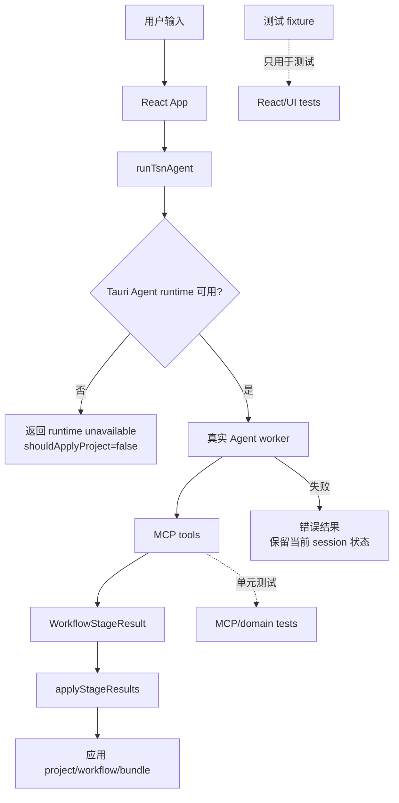

# refactor: 移除 fake agent 运行时与 fallback

## Summary

移除 `runFakeTsnAgent()` 作为产品运行路径、Web 自动生成路径和真实 Agent 失败 fallback。后续确定性能力由 MCP/domain 单元测试覆盖，React/UI 测试使用显式 fixture，完整 E2E 使用真实 Agent 和 MCP 服务参与。

---

## Problem Frame

fake agent 最初用于 MVP 阶段快速跑通“自然语言输入 -> 项目草案 -> UI 展示 -> 导出”的纵向链路。现在 topology MCP 已经把拓扑能力拆成原子化、可验证、可单测的服务，继续保留 fake agent 会带来三个问题：

- 它在 Web/non-Tauri 环境下生成看似真实的项目，容易掩盖真实 Agent、MCP host、Tauri bridge 不可用的问题。
- 它在真实 Agent 失败时作为 fallback，会让用户误以为请求成功，只是结果由另一套逻辑生成。
- 它把测试目标混在一起：单元测试、本地域测试、UI 夹具测试和完整 Agent/MCP E2E 都在依赖同一个“假智能助手”。

目标是让运行时失败明确失败，确定性能力由 MCP/domain 自己证明，UI 测试只验证 UI 行为，完整产品 E2E 则通过真实 Agent 调 MCP 服务验证。

---

## Requirements

**运行时边界**

- R1. `runTsnAgent()` 不再调用 `runFakeTsnAgent()`，也不再返回 `mode: "fake"`。
- R2. Web/non-Tauri 环境不得自动生成拓扑或项目；如果缺少 Tauri Agent runtime，应返回明确的“智能助手运行时不可用”结果，并且不应用新 project/bundle。
- R3. 真实 Agent 调用失败时只保留当前 session 已有的 project/workflow/bundle，并返回错误说明；不得生成新的默认拓扑或本地 fallback project。
- R4. `VITE_TSN_AGENT_MODE=fake` 不再作为产品能力保留；如果测试需要 fixture，应在测试层显式 mock。
- R5. 阶段推进、确认、导出门禁仍以 `WorkflowState`、`WorkflowStageResult`、project/bundle 为权威来源，不由测试 fixture 或运行日志推导。

**类型和数据契约**

- R6. 将 `AgentEvent`、`AgentEventKind`、Agent result 等通用契约从 `src/agent/fake-agent.ts` 抽离到独立类型文件，避免 session、adapter、UI 继续依赖 fake agent 模块。
- R7. Agent result 需要表达三种运行结果：真实 Agent 成功、真实 Agent 失败但保留当前状态、运行时不可用；其中后两者都不得伪装成生成成功。
- R8. `buildStageRunnerInput()`、conversation context 和 stage result application 不能再依赖 deterministic fake result；它们应只从当前 session、workflow、user intent 和真实 stage result 构造。

**测试策略**

- R9. 删除或迁移 `src/agent/fake-agent.test.ts` 中的 staged workflow 覆盖；拓扑生成、拓扑修改、模板、校验、project bridge 由 `src/topology/*.test.ts`、`src-node/mcp/topology-tools.test.ts`、`src/domain/topology-factory.test.ts`、`src/project/project-state.test.ts` 覆盖。
- R10. `src/app/App.test.tsx` 不再调用 `runFakeTsnAgent()`；React 测试使用显式命名 fixture，例如“拓扑待确认结果”“Agent 失败保留状态”“运行时不可用结果”。
- R11. `src/agent/agent-adapter.test.ts` 不再验证 fake 模式；改为验证 runtime unavailable、真实 Agent stage result 应用、失败保留状态和诊断日志。
- R12. 完整 E2E 应有真实 Agent 和 MCP 服务参与；如果仍保留快速 UI smoke，则必须命名为 fixture/UI smoke，不能称作完整 E2E。

**文档和体验**

- R13. 更新 `docs/testing.md`、`docs/diagnostics-log-contract.md` 和相关计划文档，移除“fake agent 是默认测试/回退路径”的描述。
- R14. 用户可见文案继续使用“智能助手”“Agent”“智能助手运行时”等中性名称，不暴露底层供应商名。
- R15. 诊断日志只记录运行时不可用、真实 Agent 调用失败、MCP/stage result 摘要等程序信息，不保存 raw prompt、raw tool payload 或完整 artifact。

---

## Scope Boundaries

本计划包含：

- 删除 fake agent 在产品运行时、Web 运行时和真实 Agent 失败 fallback 中的职责。
- 抽离通用 Agent 类型，让 session、adapter、UI 不再从 `src/agent/fake-agent.ts` import 类型。
- 把当前 fake agent 测试迁移为 MCP/domain/project-state 测试和 UI fixture 测试。
- 建立真实 Agent/MCP 完整 E2E 与 fixture/UI smoke 的命名边界。
- 更新测试、诊断和步骤摘要相关文档。

本计划不包含：

- 新增 topology MCP 能力、拓扑模板或双平面规则。
- 重做 Agent 步骤摘要 UI；该部分仍由 `docs/plans/2026-05-29-002-feat-agent-step-summary-detail-plan.md` 承担，但需要遵守本计划的 fake agent 移除边界。
- 建设完整 tracing/telemetry 系统。
- 在本计划中决定所有桌面 E2E 工具选型；实现阶段可在 Tauri runner、Playwright desktop harness 或本地手动 gate 之间做最小可行选择。

---

## Key Technical Decisions

- **运行时 fail closed。** 缺少 Agent runtime 或真实 Agent 失败时，系统显示错误并保留当前状态，不生成“看似成功”的本地项目。这样问题能被测试和用户立即发现。
- **fixture 不是 agent。** 测试可以有确定性 fixture，但 fixture 必须是命名数据构造器，只服务单元/组件/UI smoke，不解析自然语言，也不模拟完整 Agent。
- **MCP/domain 对自己的确定性负责。** topology 初始化、节点/链路增删改查、模板目录、校验、project bridge 等固定逻辑由 MCP/domain 测试覆盖，不通过 fake agent 间接证明。
- **完整 E2E 包含真实 Agent。** 产品级端到端验证应覆盖“用户自然语言 -> 真实 Agent -> MCP 工具 -> stage result -> UI/session/project”的链路；fixture smoke 只能验证 UI 不坏。
- **adapter 只负责真实 Agent 编排和结果应用。** `src/agent/agent-adapter.ts` 不再先跑一遍 deterministic result，也不再把 deterministic result 作为 stage result fallback。
- **保留状态不是 fallback 生成。** 失败时保留已有 session 状态是安全恢复；失败后新生成默认拓扑才是要删除的 fallback。

---

## High-Level Technical Design

---

## Implementation Units

### U1. 抽离 Agent 类型并断开 fake-agent 类型依赖

**Goal:** 让 session、adapter、UI 使用独立 Agent contract，而不是从 fake agent 模块 import 类型。

**Requirements:** R6, R7, R14

**Files:**

- Add: `src/agent/agent-types.ts`
- Modify: `src/agent/agent-adapter.ts`
- Modify: `src/sessions/session-repository.ts`
- Modify: `src/app/App.tsx`
- Test: `src/sessions/session-repository.test.ts`
- Test: `src/agent/agent-adapter.test.ts`

**Approach:**

- 将 `AgentEventKind`、`AgentEvent` 和 Agent result 基础字段迁到 `src/agent/agent-types.ts`。
- 将 `TsnAgentResult.mode` 从 `"claude" | "fake"` 改为表达真实运行状态的 union，例如真实成功、失败保留、运行时不可用；最终命名由实现阶段结合现有调用点确定。
- `TsnSession.agentEvents` 改用新类型。
- 保持旧 session 中已有事件可 normalize，避免历史会话打开失败。

**Test scenarios:**

- 旧 session payload 中的 `agentEvents` 能 normalize 成新类型。
- adapter result 类型不再需要 fake mode 也能覆盖成功、失败和 runtime unavailable。
- `rg "from \"../agent/fake-agent\"" src` 不再命中非测试迁移残留。

### U2. 移除 `runTsnAgent()` 的 fake 运行路径和失败 fallback

**Goal:** `src/agent/agent-adapter.ts` 只编排真实 Agent、stage result 应用和失败保留状态，不再先生成 deterministic fake result。

**Requirements:** R1, R2, R3, R4, R5, R7, R8, R11, R15

**Files:**

- Modify: `src/agent/agent-adapter.ts`
- Modify: `src/agent/agent-adapter.test.ts`
- Test: `src/agent/agent-adapter.test.ts`

**Approach:**

- 删除 `runFakeTsnAgent()` 调用、`deterministicResult`、`preserveResult` 和 `shouldUseDeterministicOnly()` 对最终结果的影响。
- non-Tauri 或 Agent runtime 不可用时返回明确错误结果：`shouldApplyProject=false`，assistantText 说明当前需要桌面智能助手运行时，不创建 project/bundle。
- 真实 Agent 抛错时返回保留当前 session 的结果：已有 project/workflow/bundle 原样保留，没有已有 project 时不创建默认 project。
- `buildEmptySessionContext()` 从“fake 结果摘要”改为“空项目/当前 workflow 提示”；`buildStageRunnerInput()` 从当前 session/workflow 构造，不依赖 fake result。
- `applyStageResults()` 没有有效 stage result 时不使用 fake fallback；改为返回失败/未应用结果并记录 rejected summary。
- 诊断日志消息从“已回退本地模式”改为“请求失败，已保留当前状态”。

**Test scenarios:**

- non-Tauri 环境调用 `runTsnAgent()` 不生成 project，返回 runtime unavailable。
- 真实 Agent 成功返回合法 topology stage result 时，adapter 应用 project/workflow。
- 真实 Agent 返回无效 stage result 时，不生成 fallback project，并记录 rejection。
- 真实 Agent 抛错且 session 有 project 时，结果保留原 project/workflow/bundle。
- 真实 Agent 抛错且 session 无 project 时，结果不包含新 project/bundle。
- 诊断日志不再出现“fake 模式”“回退本地模式”等文案。

### U3. 删除 fake agent 模块并迁移确定性覆盖

**Goal:** 删除 `src/agent/fake-agent.ts` 作为自然语言模拟器，把它承载的确定性断言下沉到 MCP/domain/project-state 测试。

**Requirements:** R5, R8, R9

**Files:**

- Delete: `src/agent/fake-agent.ts`
- Delete or replace: `src/agent/fake-agent.test.ts`
- Modify: `src/topology/*.test.ts`
- Modify: `src-node/mcp/topology-tools.test.ts`
- Modify: `src/domain/topology-factory.test.ts`
- Modify: `src/project/project-state.test.ts`
- Test: `src/topology/*.test.ts`
- Test: `src-node/mcp/topology-tools.test.ts`
- Test: `src/domain/topology-factory.test.ts`
- Test: `src/project/project-state.test.ts`

**Approach:**

- 将 fake-agent 测试按能力拆分：拓扑规模/模板/双平面规则进入 topology/MCP 测试；阶段确认和 workflow 门禁进入 project-state 测试；导出 bundle 进入 exporter/artifact 测试。
- 删除自然语言“继续/确认/改成 N 台”等模拟智能助手行为的测试；这些属于真实 Agent E2E 或 prompt/skill 层，不属于确定性单元测试。
- 对仍需要保留的 domain parser 覆盖，直接测试 `parseTopologyIntent()` 或 MCP 工具输入输出，不绕过 fake agent。

**Test scenarios:**

- topology MCP 初始化模板的节点/链路/端口 summary 稳定。
- topology operations 对节点/链路增删改查的合法、缺参、歧义、重复 ID 场景稳定。
- project-state 对 waiting confirmation、confirm、request changes、final stage completion 的状态转换稳定。
- exporter/artifact 对已验证 project 生成 bundle 稳定。
- `rg "runFakeTsnAgent" src` 无命中。

### U4. 用显式 fixture 重写 React/UI 测试

**Goal:** 保留快速 UI 行为测试，但不通过 fake agent 解析自然语言生成结果。

**Requirements:** R10, R12, R14

**Files:**

- Add: `src/test/agent-result-fixtures.ts`
- Modify: `src/app/App.test.tsx`
- Modify: `vitest.config.ts` if fixture aliases or setup changes are needed
- Test: `src/app/App.test.tsx`

**Approach:**

- 新增命名 fixture builder，例如 `createTopologyWaitingConfirmationResult()`、`createAgentFailurePreservedStateResult()`、`createRuntimeUnavailableResult()`。
- App tests mock `runTsnAgent()` 时直接返回 fixture；测试名描述 UI 状态，不描述 fake agent 行为。
- 对长时间运行、streaming chunk、日志入口、步骤摘要展开等 UI 行为继续用 deferred promise 和 fixture 控制。
- fixture 允许复用 domain/project builder，但不能接收自然语言并解析成拓扑。

**Test scenarios:**

- 用户提交输入后，UI 显示运行中状态，fixture resolve 后展示拓扑待确认。
- runtime unavailable result 不创建拓扑，不开启导出成功状态。
- failure preserved result 保留已有拓扑和 workflow，并显示错误说明。
- 步骤摘要/日志 UI 使用 fixture 事件渲染，不依赖真实 Agent 或 fake agent。

### U5. 拆分 fixture smoke 与真实 Agent E2E

**Goal:** 让“完整 E2E”名实一致，同时保留快速 UI smoke 的开发反馈。

**Requirements:** R12, R13, R14, R15

**Files:**

- Modify: `package.json`
- Modify: `playwright.config.ts`
- Add or modify: `e2e/specs/ui-smoke.spec.ts`
- Add: `e2e/specs/real-agent.spec.ts` or `e2e/desktop/real-agent.spec.ts`
- Add: `e2e/fixtures/*.json` if UI smoke uses stored fixture state
- Test: `e2e/specs/ui-smoke.spec.ts`
- Test: `e2e/specs/real-agent.spec.ts` or `e2e/desktop/real-agent.spec.ts`

**Approach:**

- 将当前 Web smoke 明确命名为 fixture/UI smoke，例如 `npm run e2e:ui-smoke`。
- 新增或规划 `npm run e2e:real-agent`，覆盖桌面运行时、真实 Agent、MCP tool call、stage result、UI/session/project 更新。
- 当真实 Agent E2E harness 稳定后，让 `npm run e2e` 指向完整真实链路；在此之前，文档必须明确 `e2e:ui-smoke` 不是完整产品 E2E。
- 真实 Agent E2E 允许需要本地凭证、桌面 runtime 和较长超时；默认 CI 是否启用由环境变量控制。

**Test scenarios:**

- UI smoke 能用 fixture 打开页面、展示已有/模拟结果、验证步骤摘要和日志入口。
- real-agent E2E 从自然语言输入开始，真实 Agent 调用 topology MCP，UI 展示生成拓扑并等待确认。
- real-agent E2E 遇到 Agent runtime 失败时，UI 显示错误且不生成 fake project。
- CI 未配置凭证时跳过 real-agent E2E，并明确输出 skip reason。

### U6. 更新文档和历史计划边界

**Goal:** 让文档不再把 fake agent 描述成默认路径或 fallback，避免后续实现按旧计划走错方向。

**Requirements:** R13, R14, R15

**Files:**

- Modify: `docs/testing.md`
- Modify: `docs/diagnostics-log-contract.md`
- Modify: `docs/topology-mcp.md`
- Modify: `docs/plans/2026-05-29-002-feat-agent-step-summary-detail-plan.md`
- Test: documentation review by `rg`

**Approach:**

- `docs/testing.md` 改为区分 deterministic MCP/domain tests、fixture/UI smoke、real-agent E2E。
- `docs/diagnostics-log-contract.md` 把 fallback 文案改成 runtime unavailable / failure preserved state。
- `docs/topology-mcp.md` 移除 fake agent 作为 topology bridge 的说明，改成 MCP/domain service + Agent adapter。
- `docs/plans/2026-05-29-002-feat-agent-step-summary-detail-plan.md` 中所有 fake agent 依赖改为 fixture 或真实 Agent。
- 历史已完成计划可保留原始上下文，但 active 计划必须符合当前方向。

**Test scenarios:**

- `rg -n "fake agent|runFakeTsnAgent|VITE_TSN_AGENT_MODE=fake|回退本地模式" docs src` 只剩历史归档上下文或无命中。
- 当前 active 计划不再要求实现 fake agent 步骤详情。
- 用户可见文案仍使用中性名称。

---

## Acceptance Examples

- AE1. 给定浏览器 Web 环境没有 Tauri runtime，当用户输入“我需要 4 个交换机，每个交换机连接 2 个端系统”时，系统返回“智能助手运行时不可用”类错误，不生成拓扑、不新增 project、不标记阶段完成。
- AE2. 给定桌面环境中真实 Agent 调用 topology MCP 成功，当 MCP 返回合法 stage result 时，UI 展示对应拓扑并进入“拓扑待确认”，结果不经过 fake agent。
- AE3. 给定已有会话中有一个已验证拓扑，当真实 Agent 返回 401 或 worker 异常时，UI 保留原拓扑，显示失败信息，诊断日志记录错误摘要，不生成新的默认拓扑。
- AE4. 给定无 project 的新会话，当真实 Agent 失败时，结果不包含 project/bundle，用户需要修复运行时后重试。
- AE5. 给定 React 组件测试需要验证拓扑待确认 UI，当测试 mock `runTsnAgent()` 时，它返回命名 fixture，而不是调用自然语言 fake agent。
- AE6. 给定完整 E2E 测试，当用户从空会话输入自然语言需求时，测试应覆盖真实 Agent 调 MCP 服务并把 stage result 落到 UI，而不是使用 fake agent。

---

## Risks & Dependencies

| Risk | Impact | Mitigation |
| --- | --- | --- |
| 删除 fake agent 后 Web smoke 失去完整生成能力 | 开发反馈可能变慢 | 保留 fixture/UI smoke，但明确它不是完整产品 E2E |
| 真实 Agent E2E 依赖凭证和网络/本地运行时 | CI 可能不稳定或成本升高 | 单独命令、环境变量 gate、skip reason、较长超时；默认单元测试仍覆盖 MCP/domain |
| adapter 当前大量 helper 依赖 deterministic result | 实现时容易出现保留状态遗漏 | 先抽类型和失败结果契约，再移除 fake 调用；用 adapter tests 锁住失败/无 runtime 场景 |
| 旧 session 中已有 fake agent 事件 | 打开历史会话可能展示旧文案 | normalize 和 display 层兼容旧事件；不强制迁移历史 payload |
| active 计划之间存在旧 fake agent 口径 | 后续 `ce-work` 可能执行错范围 | 本计划 U6 要同步修订当前 active 计划和测试文档 |

---

## Validation

- `npm run build`
- `npm test`
- `npm run cargo:test`
- `npm run e2e:ui-smoke`
- `npm run e2e:real-agent` with local Agent runtime and MCP host configured
- `rg -n "runFakeTsnAgent|VITE_TSN_AGENT_MODE=fake|mode: \"fake\"|回退本地模式" src docs`

---

## Sources / Research

- `src/agent/fake-agent.ts` 当前承载 staged workflow、自然语言拓扑解析、确认/继续语义和事件生成。
- `src/agent/agent-adapter.ts` 当前先运行 deterministic fake result，并在 Web、fake mode、部分边界指令和失败路径中返回 fake/fallback 结果。
- `src/app/App.test.tsx` 当前通过 `runFakeTsnAgent()` 驱动多数 UI 行为测试。
- `src/agent/agent-adapter.test.ts` 当前覆盖 fake mode 和失败 fallback，需要改成 runtime unavailable / failure preserved state。
- `docs/testing.md` 当前把 fake agent 描述为默认测试和 Web smoke E2E 的基础。
- `playwright.config.ts` 当前 E2E 运行在 Vite Web server，不具备 Tauri `invoke("run_claude_agent")` 能力。
