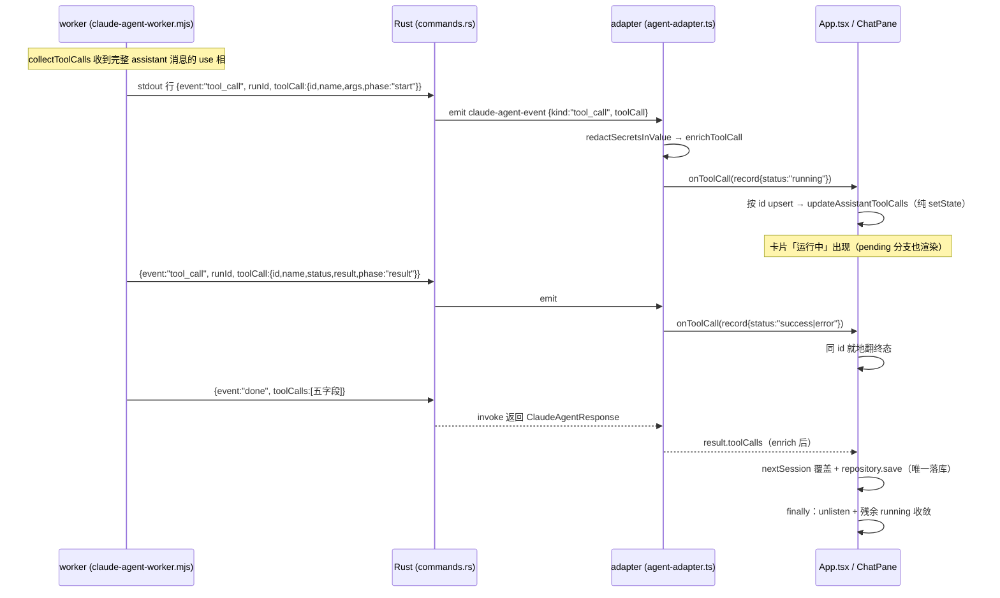

# feat: 流式工具调用卡片（推理过程中实时展示）

## Summary

agent 运行中，工具一被调用就在对话流出现「运行中」卡片（含完整入参），结果到达就地翻成成功/失败并补出参。worker→Rust→前端沿现有 `claude-agent-event` 通道新增 `tool_call` 事件类型；`done` 保持唯一落库权威，run 结束按 `id` 整体覆盖对账。

## Problem Frame

当前工具卡片在推理完整结束后才一次性渲染，长 run 期间用户只见等待动画。同时后续可能更换 agent 后端（qwen 等），工具事件契约必须客户端无关（see origin: docs/brainstorms/2026-06-10-streaming-tool-call-cards-requirements.md）。

---

## Requirements（承自 origin R1-R14）

**契约**

- R1. 流式工具事件 `{id, name, args, status, result, phase}`；`phase` ∈ `start`（args 完整、无 status/result）| `result`（status ∈ success/error，附 result）。
- R2. `phase` 仅存在于流式中间事件；`done` 列表与落库记录保持现有五字段 `RawToolCall`。
- R3. Rust 与前端层不得出现 Claude SDK 专有类型。
- R4. 整个 run 无流式工具事件时，`done` 后一次性渲染，最终展示与流式路径一致（隐式降级）。

**流式展示**

- R5. `start` 事件到达即出「运行中」卡片（工具名+完整入参），折叠摘要复用现有入参显著字段逻辑。
- R6. worker 仅在完整入参可用时发 `start`；前端按 `id` upsert，重复事件就地合并。
- R7. `result` 事件到达，卡片就地翻终态补出参。
- R8. 流式工具数据到达即递归叶子脱敏后才入内存状态，与落库同机制。
- R9. 卡片新增「运行中」视觉态。
- R10. 滚动跟随沿用现有流式文本策略。
- R11. invoke 返回后统一清理订阅，运行中残卡按对账或丢弃收敛。

**落库、对账与诊断**

- R12. `done` 列表按 `id` 对账覆盖 UI 态并作唯一落库来源；就地更新不重排。
- R13. 工具事件诊断日志只记非敏感元数据（工具名、id、phase、字节数）。
- R14. worker 崩溃/超时（无 `done`）时卡片随错误消息丢弃，不落库。

---

## Key Technical Decisions

- **Rust 对工具事件透传 `serde_json::Value`，不解析 schema**：`ClaudeWorkerEvent` 加 `#[serde(default)] tool_call: Option<Value>`（照抄 `stage_results` 模式），`handle_worker_line` 新增 `"tool_call"` 分支直接 emit。Rust 不感知字段语义 → 契约客户端无关（R3），未来后端只需对齐行协议。
- **流式卡片写入内存会话态，不触持久化**：`updateAssistantMessage` 系列（`src/app/hooks/use-session-repository.ts:136-152`）是纯 setState；新增 `updateAssistantToolCalls` 同模式。`repository.save` 仅在 done 后的既有路径触发（`src/app/App.tsx:196`），R12/R14 天然成立。
- **对账 = done 整体替换**：done 路径基于 `repository.list()` 的落库版会话构建 nextSession（不读流式内存态），`setCurrentSession` 覆盖；`id` 相同 → React key 稳定，卡片就地更新不重排（R12）。
- **`ToolCallStatus` 扩 `"running"`，落库不变量双保险**：扩 union 避免双类型并行；running 仅 UI 瞬态——done 覆盖保证时序上不落库，另在 `redactToolCallForStorage` 加 backstop：running 条目过滤掉并记 error 级诊断日志（不静默吞，theoretically unreachable 一旦触发即暴露 bug），消除对时序的单点依赖（R2）。
- **redact-on-arrival**：export `redactSecretsInValue`（`src/sessions/session-repository.ts:352`，现 module-private），事件到达 → redact → `enrichToolCall` → 入 state（R8）。沿用递归叶子方案，禁止 stringify→redact→parse（既往踩坑：Authorization 正则破坏 JSON 静默退回未脱敏）。
- **worker 锚定完整 assistant 消息的 use 相 emit `start`**：判据是 `message.type === "assistant"` 的 use 相（args 即完整入参，**合法空入参 `{}` 也算完整**——`describe_templates`/`inspect` 等零参工具是标准 run 的第一个调用，不能漏卡），stream_event 的早期空信号（`content_block_start` 的 `input:{}`）不触发；每 id 只发一次 start、一次 result（R6 worker 侧）。前端 upsert 仍保幂等（防未来后端重复）。
- **pending 分支渲染卡片**：工具事件通常先于首个文本 chunk 到达，而首 chunk 才清 `pendingAssistantMessageId`（App.tsx:165）——pending 分支（chat-pane/index.tsx:82-84）必须也渲染 `message.toolCalls`，否则流式卡片在最常见时序下不可见。
- **运行中卡片默认折叠**（origin deferred question 收口）：与既有卡片一致；视觉态用 `.tool-call-card.running` modifier + `--accent` 色 + 现有 `.agent-waiting-dots` 同款动画，状态符号用中性「…」，aria-label「运行中」。

---

## High-Level Technical Design

崩溃路径（按现有代码实际机制）：无 done → invoke reject → **adapter 的 catch 吞掉异常并 resolve 一个失败文案结果（不含 toolCalls）**（`src/agent/agent-adapter.ts:176-204`）→ App 仍走 done 写入路径，以 `toolCalls: undefined` 覆盖（卡片不落库，R14）并落库失败文案消息 → finally unlisten。App.tsx 的 catch 错误分支对 worker 崩溃不可达（仅防 adapter 自身异常），保留作 UI 兜底。

---

## Implementation Units

### U1. worker 流式 emit tool_call 事件

- **Goal**: 工具调用开始/结束时实时写出行协议事件，done 行为不变。
- **Requirements**: R1, R2, R6（worker 侧）
- **Dependencies**: 无
- **Files**: `src-node/claude-agent-worker.mjs`、`src-node/claude-agent-worker.test.mjs`
- **Approach**: 行格式（权威定稿）：`{event:"tool_call", toolCall:{id, name, args, status?, result?, phase}}`，`phase:"start"` 时无 status/result，`phase:"result"` 时带 status+result；runId 由 `runWorker` 既有包装（:1448-1454）自动附加到行顶层。`collectToolCalls`（:237-254）内：**`message.type === "assistant"` 的 use 相**首次出现该 id 时 `onEvent?.({event:"tool_call", toolCall:{id, name, args, phase:"start"}})`——args 取 assistant 消息所载（合法空对象也发，零参工具不能漏卡）；stream_event 的早期空信号不触发。result 相首次到达时 emit `{event:"tool_call", toolCall:{id, name, status, result, phase:"result"}}`。每 id 各相至多一次（条目上记已发标志）。
- **Patterns to follow**: 既有 `onEvent?.({event:"chunk",text})`（:225）；测试仿 "emits streaming chunks from partial messages"（test.mjs:695）的 events 收集断言。
- **Test scenarios**:
  - Covers AE1. 串行两工具的消息序列 → events 依序出现 start(含完整 args)/result(工具1)/start/result(工具2)，且 done.toolCalls 仍为五字段完整列表。
  - Covers AE2. stream_event 先发空 `input:{}`、assistant 消息再带完整 args → 仅 emit 一次 start（早期空信号不发）。
  - 零参工具（assistant 消息 use 相 `input:{}`，如 `describe_templates`）→ 仍发一次 start（args 为空对象）。
  - 同 id 重复完整 use 事件 → start 不重发。
  - result 携带 is_error → phase:"result" 的 status 为 "error"。
  - 无 onEvent（undefined）时不抛错（既有可选链模式）。
- **Verification**: `npm test`（worker 测试绿）；`npm run build:worker` 产物含新事件字符串。

### U2. Rust 透传 tool_call 事件

- **Goal**: 行协议 `tool_call` 事件经 Tauri 事件通道透传前端，done 处理不变。
- **Requirements**: R1, R3
- **Dependencies**: U1（协议形状）
- **Files**: `src-tauri/src/commands.rs`
- **Approach**: `ClaudeWorkerEvent`（:50）加 `#[serde(default)] tool_call: Option<serde_json::Value>`——worker 侧已按 U1 行格式把工具字段包进 `toolCall` 对象，Rust 仅透传这一个 Option<Value>，不拆字段。`handle_worker_line` match 加 `"tool_call"` 分支：run_id 非空且 tool_call 为 Some 时 emit。`ClaudeAgentEventPayload`（:65）加 `tool_call: Option<Value>`；`emit_claude_event`（:551）扩参（chunk/session 调用点传 None）。
- **Patterns to follow**: `stage_results` 的 `#[serde(default)]` 模式（:58）；`"chunk"` 分支的非空守卫（:452）。
- **Test scenarios**:
  - `serde_json::from_str::<ClaudeWorkerEvent>` 解析含 toolCall 对象的行 → 字段就位（仿 `parses_worker_json_output` :691）。
  - 不含 toolCall 的既有 chunk/done 行解析不回归。
  - 未知 event 仍静默忽略（前向兼容不变量）。
- **Verification**: `npm run cargo:test` 全绿；`cargo build` 无警告。

### U3. 前端 adapter 监听与脱敏富化

- **Goal**: 前端按 runId 收 `tool_call` 事件，脱敏+富化后经回调交给 App；诊断只记元数据。
- **Requirements**: R1, R8, R13
- **Dependencies**: U2
- **Files**: `src/agent/agent-adapter.ts`、`src/agent/agent-types.ts`、`src/agent/tool-call-record.ts`、`src/sessions/session-repository.ts`（export）、`src/agent/agent-adapter.test.ts`
- **Approach**: `ClaudeAgentEvent`（:42）加 `kind:"tool_call"` 与 `toolCall?: unknown`；`listenToClaudeChunks` 泛化为单 listener 分发 chunk/tool_call 两类（保持一次 listen），入口守卫同步放宽为 `!onChunk && !onToolCall` 才跳过。`TsnAgentRequest` 加 `onToolCall?: (record: ToolCallRecord) => void`。处理链顺序是硬约束：**先对事件 payload 整体 `redactSecretsInValue`（自 session-repository export）→ 再构造 RawToolCall（phase:"start" → status:"running"；phase:"result" → 事件携带的 status）→ 再 `enrichToolCall`**——enrich 的 `buildToolSummary` 从 args 派生 summary，顺序倒置会让 summary 携带未脱敏值且不再被任何 redact 覆盖。`streamStats` 仅加 `toolCallEvents` 计数（不聚合字节数，无读者；不进原始 args/result，诊断日志只落计数）。
- **Patterns to follow**: 既有 runId 过滤（:683-699）与 finally unlisten（:205-207）；测试用 `vi.hoisted` listenMock 捕获 handler 手动 fire（test.ts:7-36 模式的扩展）。
- **Test scenarios**:
  - Covers AE4. fire 含 `Authorization: Bearer xxx` 入参的 start 事件 → onToolCall 收到的 args 已脱敏，**且 summary 字符串不含该 token**（钉死 redact→enrich 顺序）。
  - start → status:"running"；result(success/error) → 对应终态。
  - 仅传 onToolCall、不传 onChunk 时 tool_call 事件仍送达。
  - runId 不匹配的事件被忽略。
  - 无 onToolCall 时事件不抛错。
  - 诊断日志 details 含 toolCallEvents 计数（数字）、不含原始 args/result 字符串与序列化串。
- **Verification**: `npm test`；`npx tsc --noEmit` 干净。

### U4. App 状态、对账与落库保险

- **Goal**: 流式记录按 id upsert 进当前 assistant 消息（纯内存），done 覆盖对账，异常路径收敛，落库 backstop。
- **Requirements**: R4, R6（前端侧）, R11, R12, R14；R2 backstop
- **Dependencies**: U3
- **Files**: `src/app/App.tsx`、`src/app/hooks/use-session-repository.ts`、`src/sessions/session-repository.ts`、`src/app/App.test.tsx`、`src/sessions/session-repository.test.ts`
- **Approach**: `use-session-repository` 加 `updateAssistantToolCalls(sessionId, messageId, toolCalls)`（仿 :136-152 纯 setState）。App.tsx submitIntent：`Map<string, ToolCallRecord>` ref 持流式态，onToolCall 里 upsert → 转数组传 updateAssistantToolCalls。done 路径不改（既有 :169-207 即对账）——**worker 崩溃也走这条**：adapter catch 把 reject 转成不含 toolCalls 的失败文案结果，done 写入以 `toolCalls: undefined` 覆盖即丢卡（R14）；App.tsx 的 catch 分支仅防 adapter 自身异常，保留不动。finally 已 unlisten。`redactToolCallForStorage`（session-repository.ts:347）加 backstop：status 为 "running" 的条目过滤并记 error 级诊断日志（理论不可达，触发即暴露 bug，不静默）。
- **Patterns to follow**: onChunk 回调接线（App.tsx:161-167）；`updateAssistantMessage` hook 模式。
- **Test scenarios**:
  - Covers AE1/AE6. mock adapter fire start→result→done(权威列表) → 渲染先「运行中」后终态，落库等于 done 列表（含流式漏发一条时 done 补齐）。
  - Covers AE3. 整个 run 无 tool_call 事件、仅 done 带 toolCalls → 卡片一次性出现（隐式降级，现状回归测试）。
  - Covers AE5. mock adapter 先 fire start 事件、随后 resolve 不含 toolCalls 的失败文案结果（真实崩溃路径）→ 失败文案展示、无运行中残卡、落库消息无 toolCalls。
  - adapter reject（adapter 自身异常）→ App catch 分支 UI 兜底不崩、无残卡。
  - 重复 start 同 id → 仅一条记录（upsert 幂等）。
  - repository.save 输入含 running 条目时被 backstop 过滤（单测直测 redactSessionForStorage）。
- **Verification**: `npm test` 全绿。

### U5. 卡片渲染：pending 分支 + 运行中视觉态

- **Goal**: 流式卡片在 pending 与普通分支都可见；「运行中」有独立视觉态；滚动跟随既有策略。
- **Requirements**: R5, R7, R9, R10
- **Dependencies**: U4（类型）；可与 U4 并行开发
- **Files**: `src/app/components/chat-pane/index.tsx`、`src/app/components/chat-pane/tool-call-card.tsx`、`src/app/App.css`、`src/app/components/chat-pane/tool-call-card.test.tsx`
- **Approach**: pending 分支（index.tsx:82-95）改为 toolCalls 列表（有则渲染，**卡片在上、AgentWaitingIndicator 在下**——与终态「卡片在文本前」布局一致，指示器表示后续还有内容）+ 并存。ToolCallCard：status "running" → class `running`、状态符「…」、aria-label「运行中」、出参区显示「执行中…」占位；折叠默认不变；**状态翻转就地更新、保持用户当前折叠/展开态**（expanded 是组件内 useState，卡片按 `id` 为 key，翻转只换 props 不卸载组件，天然保持——测试钉住）；running 折叠摘要无需特殊处理（`buildToolSummary` 非 error 即走 args 显著字段，running 复用同逻辑）。App.css 加 `.tool-call-card.running`（`--accent` 左边框）与 `.running .tool-call-status`（accent 底 + `.agent-waiting-dots` 同款脉冲动画）。滚动零改动：scrollDeps 已含 `currentSession.messages`（use-agent-run-controller.ts:88-106），toolCalls setState 触发既有跟随。
- **Patterns to follow**: `failed` modifier 的 class 拼接（tool-call-card.tsx:14）与 CSS 模式（App.css:966/:1001）；UI 文案供应商中性（AGENTS.md）。
- **Test scenarios**:
  - running 记录渲染：含「…」状态符、aria-label「运行中」、入参可展开查看、出参区为「执行中…」。
  - success/error 渲染不回归（既有 4 例保持绿）。
  - pending 消息带 toolCalls 时卡片与等待指示器同时可见。
  - Covers AE1. 同一消息 running→success 状态翻转后类名与出参更新；翻转前已展开的卡片翻转后保持展开。
- **Verification**: `npm test`；`npm run build`（tsc+vite）干净。

---

## Scope Boundaries

承自 origin（see origin: docs/brainstorms/2026-06-10-streaming-tool-call-cards-requirements.md）：用户停止能力（含「中断」态）、入参打字机、timeline 交错、能力协商协议、多客户端 adapter 基建、崩溃尽力落库、Tauri Channel 迁移——全部不做。

### Deferred to Follow-Up Work

- 把「递归叶子脱敏」「worker dist 构建生效路径」「行协议扩展模式」沉淀为 docs/solutions/ 首批条目（learnings-researcher 建议，独立小 PR）。

---

## Assumptions

- 流式卡片直接写入当前 assistant 消息的 `toolCalls` 字段（内存态），复用既有渲染分支——不另设独立流式状态通道。
- 运行中卡片默认折叠、出参区占位「执行中…」；视觉细节（accent 色+脉冲动画）实现时可微调，不回头改需求。
- worker 侧行格式定稿为 `{event:"tool_call", runId, toolCall:{…}}`（整体包对象）：`phase:"start"` 时 toolCall 为 `{id,name,args,phase}`，`phase:"result"` 时为 `{id,name,status,result,phase}`；Rust 仅透传 `toolCall` 字段。
- 工具事件量级低（每工具 2 条），无需节流。

---

## Risks & Dependencies

- **worker dist 构建陷阱**：Rust spawn 的是 `src-node/dist/` esbuild 产物，改 worker 后必须 `npm run build:worker` 并重启 `tauri dev` 才生效——联调时首要排查项（既往踩坑）。
- **首 chunk 清 pending 的时序耦合**：若后续有人改 pendingAssistantMessageId 生命周期，pending 分支卡片渲染可能回归——U5 测试钉住该行为。
- **既有 `ClaudeAgentEvent.kind` 含从未 emit 的 "done"/"error" 空头**：本次不清理，避免无关改动。

---

## Sources & Research

- origin: `docs/brainstorms/2026-06-10-streaming-tool-call-cards-requirements.md`（R1-R14/F/AE 编号均引自此）。
- 前置实现：`docs/plans/2026-06-09-003-feat-inline-tool-call-cards-plan.md`（卡片数据形状与截断策略）。
- 关键代码定位（repo research 核实）：worker 收集与护栏 `src-node/claude-agent-worker.mjs:237-254,1014,1448-1454`；Rust 解析与 emit `src-tauri/src/commands.rs:50-72,436-489,551-567`；adapter 监听 `src/agent/agent-adapter.ts:42-47,683-699`；纯 setState 更新 `src/app/hooks/use-session-repository.ts:136-152`；done 落库 `src/app/App.tsx:169-207`；pending 分支 `src/app/components/chat-pane/index.tsx:82-95`；脱敏链 `src/sessions/session-repository.ts:263-371`。
- 外部研究：本轮跳过——ideation 阶段已完成 Claude Agent SDK 流式事件与 Tauri 推送机制调研（`docs/ideation/2026-06-10-streaming-tool-call-cards-ideation.md`），本地 chunk 链路为直接同构样板。
