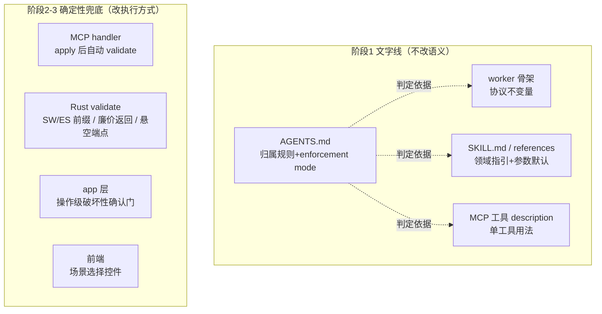
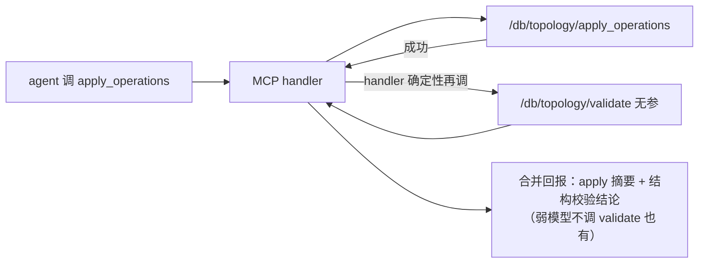
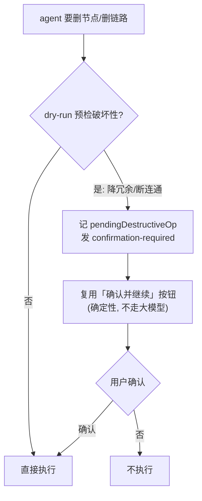

# refactor: 理顺 agent prompt 体系 + 给弱模型补确定性兜底

## Summary

分三阶段、两条线分开 PR。**阶段 1（文字线）**：定三层归属规则写进 AGENTS.md、重写 SKILL.md 与 references、把 worker 骨架与 `buildPrompt` 散文案按性质归位、清掉七类散落矛盾——不改规则语义。**阶段 2（A 档兜底）**：apply 后自动 validate、validate 校 SW/ES 前缀、initialize 后 validate 廉价返回，每门带正例+负例。**阶段 3（C 档受控）**：link_add 悬空端点拦截、`node_add` 加 name、破坏性确认门、场景前端控件——每项先核可行性，可行就做、否则退回文字 + defer。

## Problem Frame

面向 agent 的指令散在 worker 骨架、`buildPrompt`、`buildConversationContext`、MCP 工具 description 多处，同一条规则多份、措辞还互相打架（骨架用废弃键名 `imac`、工具用 `syncName`）。规则散且不一致，agent 被互相矛盾的指令带飘。更要紧的是后续要把 Claude sonnet 换成偏弱的模型——弱模型不一定照 prompt 文字办，靠「请模型遵守」的关键规则会更容易跑偏。所以这次既要把文字理顺到对的层，也要把「违反会破坏数据/误导用户」的规则从「靠文字」改成「代码确定性兜底」。详见 origin 的两条线与三档兜底分析（see origin: `docs/brainstorms/2026-06-19-prompt-consolidation-topology-skill-requirements.md`）。

## Requirements

**Prompt 归位与一致性（阶段 1）**

- R1. 三层归属规则成文：协议不变量 → worker 骨架；领域指引/措辞/参数默认 → SKILL.md 与 references；单个工具怎么用 → 该工具 description。写进 AGENTS.md 作判定依据（origin R1-R4）。
- R2. 每条面向 agent 的规则有单一权威事实源，他处引用或派生、不独立改写措辞（origin R2,R3）。
- R3. 按归属重写 SKILL.md 与 `references/{generic-tsn,aerospace-onboard}.md`，过 `verify:skills` 三方对账（origin R5,R6,R7）。
- R4. 骨架与 `buildPrompt` 散文案按性质归位，清掉七类矛盾：`imac`→`syncName`、仿真没接入、initialize 后不复检 validate、显示名映射、verify 错误文案、切回阶段文案、重试复用 batch 口径（origin R8,R9,R10）。

**确定性兜底（阶段 2-3）**

- R5. 每条规则标 enforcement mode（①纯指引/②文字+兜底/③纯确定性），随归属记进 AGENTS.md；触发点依赖判用户意图的，老实标 ①/② 不标纯确定性（origin R12）。
- R6. A 档三个真确定性兜底落地：apply 后自动 validate、validate 校 SW/ES 前缀、initialize 后 validate 廉价返回（origin R13-A）。
- R7. C 档四项受控：link_add 悬空端点拦截、`node_add` 加 name 字段、破坏性操作确认门、场景前端控件——可行就做，判不可行/超预算则退回文字 + defer + 记 AGENTS.md，不阻塞阶段 1-2（origin R13-C,R14）。

**验证（贯穿）**

- R8. 文字线动手前先存基线（选定关键流程的 agent 回复+工具调用序列，存成结构化序列、非截图），改完逐条比对、不凭记忆；行为不回退。基线含至少一条非 happy-path 流程（如该触发编号澄清的欠定编辑）。注意：本基线验的是当前 sonnet 在重写后措辞中性，弱模型换上后的回退是换模型后的另一道检查（origin R11/R15）。
- R9. 每个新增确定性门除回退基线外，各带正例（绕过文字也守得住）+ 负例（不误拦合法操作）（origin R15）。

## Key Technical Decisions

- 三层职责是既有架构，沿用不重造：worker 骨架守安全/正确性不变量、SKILL.md 守可调指引+参数默认、MCP `describe_templates` 守参数合法域。「归位」是把散落指引各归各层，不是新设结构（learnings: `plan-2026-06-09-002-status`）。
- prompt 注入保持单字符串 + sentinel，不拆成 `string[]`——数组会让 `redactSecrets` / `summarizeSdkOptionsForAudit` 每次抛 TypeError 并破坏 `toContain` 断言。新增片段沿用现有 `<<<SKILL_GUIDANCE>>>` / `<<<SCENARIO_REFERENCE>>>` 的拼接法。
- PR 拆法：阶段 1 文字线 = 第一 PR；阶段 2（A 档 U5-U7）= 第二 PR；阶段 3（C 档 U8-U11）各自或合为第三 PR（推荐与阶段 2 分开，让 C 档逐项 defer 决策不阻塞 A 档合并）。两条线不混 commit/PR。R8 基线在文字线动手前存一次、改完比对；新门各自带正例+负例，不与文字线回归基线混（否则分不清偏差来自搬文字还是新行为）。
- apply 后自动 validate 走 **MCP handler 串联**（boss 定）：`topology.apply_operations` handler 在 apply 成功后自己再调一次 `topology.validate` 合并结果。不改 Rust `ApplyOpsResponse` 契约；handler 是确定性 TS、弱模型跳不过。
- 操作级破坏性确认复用阶段级范式：新增 `pendingDestructiveOp` 平行字段，照搬 `pendingStageChange` 的「记 pending → 发 confirmation-required 事件 → 确认按钮(确定性、不走大模型) → `runConfirmAction` 消费」。避开四个已知状态机坑：幽灵 pending（显隐由 pending 决定、不改写阶段状态）、`...workflow` 带出 stale pending（统一清除）、回退死胡同、工具白名单分叉（learnings: `llm-stage-switch-intent-plan-status`）。**确认按钮是单例、且拓扑编辑后正是 `waiting_confirmation` 态——必须定优先级：`pendingDestructiveOp` 在时占用按钮（文案+`runConfirmAction` 分支都排在 `pendingStageChange`/阶段推进之前），先消化破坏性确认再谈阶段推进，别让两个 pending 抢同一个按钮（见 U10）。**
- U5「apply 后自动 validate」只保证**确定性地算出**结构结论并并进工具返回；但 apply 工具结果是回给模型的、`applyStageResults` 只消费 `mutationId`，所以「呈给用户」这一步若不另接，仍依赖模型转述。用户侧的硬保证仍是确认闸（`verify_topology` 在阶段推进前确定性跑一次）。U5 的价值是让 agent 每次 apply 后都看到结构结论、便于自纠，不是替代确认闸（见 U5）。
- U7「廉价返回」的缓存放在 **sidecar validate 路由层**（`RouteState` 持 `mutation_buffer`），不放进共享核心 `load_and_verify_topology`——否则 fail-closed 的确认闸（Tauri `verify_topology` 命令，够不着 buffer）可能拿到过期结论。确认闸路径永远全量重算（见 U7）。
- validate 三处口径必须一致——「apply 后验、initialize 不验」要在 SKILL.md、工具 description、骨架三处对齐；ce-review 抓过「三处矛盾」P1（learnings: `plan-2026-06-17-003-inet-verification-status`）。
- 仿真「不得声称」的单一住所放 SKILL.md：真正的兜底是运行时 `sanitizeClaudeAssistantText` 守卫，prompt 只留一份领域指引，骨架不留。
- C 档每项受控：先核可行性/体量再决定做或 defer。`node_add` 加 name 镜像已有的 `LinkAddArgs.name`，但命名正确性仍受模型挑 syncName 影响；引用拦截只做 link_add 悬空端点这半（确定性），node_add「引用还是新建」仍是模型判断（标 ①）。

## High-Level Technical Design

**两条线 × 三阶段，规则落在哪一层：**

**apply 后自动 validate（MCP handler 串联）：**

**破坏性操作确认门（复用阶段级 pending 范式）：**

## Implementation Units

### Phase 1 — 文字线（理顺 prompt，不改语义）

两条线分开 PR；本阶段动手前先完成 R8 基线采集（见 U1 Execution note）。

### U1. 定三层归属规则 + enforcement mode，写进 AGENTS.md

- **Goal**: 把「每类指令住哪层」+「每条规则靠什么生效」成文，作为本次归位的判定依据和以后防复发的查阅入口；并作为 R8 基线采集的责任 unit。
- **Requirements**: R1, R5, R8
- **Dependencies**: 无（先行，给 U2/U3 当判定依据）
- **Files**: `AGENTS.md`（在「关键代码入口」节之后、「分阶段工作流约束」之前新增「Prompt 层归属规则」一节）
- **Approach**: 写清三层归属 + 三档 enforcement mode 的判定规则；列出本次七类矛盾各自的归宿与 enforcement mode。沿用骨架注释（`src-node/claude-agent-worker.mjs:446-451`）已声明的「协议不变量收口骨架」语义。
- **Execution note**: 本阶段开工前先按 R8 采集基线——选定四条关键流程（从零初始化、apply 增量编辑后 validate、切阶段意图、重试复用 batch）在 dev/真机各跑一遍，存 agent 回复+工具调用序列。
- **Patterns to follow**: AGENTS.md 现有分节风格。
- **Test scenarios**: Test expectation: none —— 文档变更，无行为。
- **Verification**: AGENTS.md 有「Prompt 层归属规则」一节，照它能判断一条新规则该放哪层、标哪档；R8 基线文件已存、含四条流程 + 至少一条非 happy-path，作为后续对账的出口。

### U2. 重写 SKILL.md 与 references

- **Goal**: 按归属重写可编辑层，让场景路由、领域语义、初始化/编辑流程、澄清与验证规则读得顺、不散、不与别处重复；清掉残留 `imac`/`sync_type` 文案。
- **Requirements**: R2, R3, R4
- **Dependencies**: U1
- **Files**: `.claude/skills/tsn-topology/SKILL.md`、`.claude/skills/tsn-topology/references/generic-tsn.md`、`.claude/skills/tsn-topology/references/aerospace-onboard.md`
- **Approach**: 领域操作流程、推荐参数默认、显示名映射规则归到 SKILL.md（显示名规则从 inspect description 收来、只留一份）；仿真「不得声称」留一份领域指引在 SKILL.md。节点标识一律 `sync_name`，MCP 键 `syncName`/`srcSyncName`/`dstSyncName`。「apply 后验、initialize 不验」与骨架、工具 description 口径对齐。
- **Patterns to follow**: 现有 SKILL.md/references 结构；`verify:skills` 三方对账约束（reference 文件名 == scenarioConfigId、preset templateId ∈ Rust catalog、skill 目录纯文本白名单）。
- **Test scenarios**: `npm run build:worker` 内含 `verify:skills` 通过（文件名/templateId/白名单三方对账）；`scripts/check-no-legacy-types.sh` grep gate 不被新引入的禁词触发。
- **Verification**: `verify:skills` 绿；通读 SKILL.md 无残留 `imac`/`sync_type`、无与 description 重复的显示名规则。

### U3. 骨架 + buildPrompt 散文案归位、清矛盾

- **Goal**: worker 骨架只留协议不变量；`buildPrompt` 用户轮散文案按性质分流；清掉 `imac` 残留、收敛重试规则口径与仿真声明。
- **Requirements**: R2, R4
- **Dependencies**: U1, U2
- **Files**: `src-node/claude-agent-worker.mjs`（`SYSTEM_PROMPT_SKELETON:451`、`buildPrompt:563-622`）
- **Approach**: `imac` 残留共两处——骨架 `:451` 与 `buildPrompt` interactionInstructions 第 8 条 `:598`，都在重试规则里 → `syncName`；建议拆两个 commit（先纯 `imac`→`syncName` 替换、再重试规则收敛），便于跟 R8 基线分别对账。重试「逐字节复用同一 batch」只留一份权威表述（口径与 `apply_operations` description 一致、用 `syncName`）；仿真「不得声称」从骨架/buildPrompt/会话上下文注入收敛到 SKILL.md 一份指引（运行时 sanitize 守卫是真兜底）；initialize-后-不-validate 收敛到 validate description。`buildPrompt` 散文案：协议性进骨架、领域性进 SKILL.md（U2 已收）、单工具用法进对应 description。注入保持单字符串拼接。
- **Execution note**: 改完必 `npm run build:worker`（worker 跑 dist 产物），再按 R8 与基线逐条比对。
- **Patterns to follow**: 现有 sentinel 拼接（`:456` 注释：不可 `string[]`）；`buildAllowedToolsForStage` 的按阶段工具白名单（别让写工具在非拓扑阶段静默分叉）。
- **Test scenarios**: 现有 `src-node/**/*.test.{ts,mjs}` 中针对 system prompt 的 `toContain` 断言更新并通过；grep gate 通过。Covers R4. 关键流程基线比对：四条流程行为与改前一致（人工/真机）。
- **Verification**: `build:worker` 绿；骨架无 `imac`；四类矛盾各只剩一处；R8 基线四条流程不回退。

### U4. verify 错误文案对齐（TS 消费 Rust）

- **Goal**: 正常分支 TS 不另写 verify 文案、直接消费 Rust 逐条错误；`inet_unreachable` 分支保持现有展示层语义合并（不动）。
- **Requirements**: R2, R4
- **Dependencies**: 无（独立小改）
- **Files**: `src/agent/agent-adapter.ts`（`composeVerificationBlockText`）
- **Approach**: 正常分支改为透传 `errors[].messageZh`；`inet_unreachable` 分支是故意分叉（丢 suffix+加复检行），本次不收敛、留 origin OQ。
- **Patterns to follow**: 现有 `composeVerificationBlockText` 分支结构。
- **Test scenarios**: `src/agent/agent-adapter.test.ts` 加用例——正常 verify 错误的对话文案来自 Rust `messageZh`、TS 不再硬编码重复串；`inet_unreachable` 分支文案不变。
- **Verification**: vitest 绿；正常分支文案与 Rust 源一致。

### Phase 2 — A 档兜底（真确定性、改动小）

每门按 R9 带正例 + 负例。

### U5. apply 后自动 validate（MCP handler 串联）

- **Goal**: 每次 `apply_operations` 后由 MCP handler 确定性地再跑一次 validate、把结构结论并进工具返回，让 agent 不靠记得调就能看到结构状态、便于自纠。
- **Requirements**: R6, R9
- **Dependencies**: U3（口径对齐后）
- **Files**: `src-node/mcp/topology-tools.ts`（`apply_operations` handler）、`src-node/mcp/topology-tools.test.ts`
- **Approach**: handler 在 `/db/topology/apply_operations` 成功后追调 `/db/topology/validate`（无参、验库内），把结构校验结论并进工具返回。不改 Rust `ApplyOpsResponse`。`dryRun` 调用不追 validate。**范围界定**：工具返回是给模型的，应用层 `applyStageResults` 只消费 `mutationId`——本 unit 保证的是「结构结论被确定性算出、塞进 apply 返回给 agent」，**呈给用户**仍依赖模型转述或下游消费；用户侧的硬保证是确认闸（阶段推进前 `verify_topology` 确定性跑一次）。若要用户也确定性看到，需应用层另接 apply 的结构结论发确定性 verify 事件——列为可选扩展、不在本 unit 最小范围。
- **Technical design**: 见 HTD「apply 后自动 validate」时序（directional）。
- **Patterns to follow**: `callSidecarTool` / `fetchSidecar`；`load_and_verify_topology` 作为 validate 核心。
- **Test scenarios**: Covers R6. 正例——一批 apply 后拓扑结构有问题（如造出孤立节点），即使不显式调 validate，handler 返回里也带结构错误。负例——一批合法 apply 后，返回不带误报错误、不重复跑出假阳性。`dryRun` 路径不触发追加 validate。
- **Verification**: topology-tools.test.ts 绿；apply 返回稳定带结构结论。

### U12. 统一场景命名为 SW/ES（U6 前提）

- **Goal**: 让所有场景 initialize 出来的节点 name 都走同一前缀规则（交换机 `SW-`、端系统 `ES-`、服务器 `SRV-`），消除 generic（`SW-1`/`ES-1`）与 aerospace（`sw1`/`e1`）的命名分裂，U6 前缀校验才有成立前提。
- **Requirements**: R6
- **Dependencies**: 无
- **Files**: `.claude/skills/tsn-topology/references/aerospace-onboard.md`（preset 节点补显式 `name` 或改 id 派生）、`src-tauri/src/topology_compute.rs`（dual-plane 命名派生）
- **Approach**: aerospace dual-plane preset 现 `id=sw1/e1`、无 `name`，落库 `name=id` → 要么给 preset 节点加显式 `name`（`SW-1`/`ES-1`…），要么让 `topology_compute` 的 dual-plane 路径按 {类型→前缀}+序号派生 name、不再回退 id。统一后与 generic 一致。references 改动须过 `verify:skills`。
- **Patterns to follow**: generic-tsn 的 `SW-{n}`/`ES-{n}` 派生（`topology_compute.rs`）。
- **Test scenarios**: Covers R6. 正例——initialize 一张 aerospace 双平面，节点 name 全是 `SW-`/`ES-` 前缀、无 `sw1`/`e1` 残留。负例——generic 命名不受影响、仍 `SW-1`/`ES-1`。
- **Verification**: `cargo:test` + `verify:skills` 绿；aerospace initialize 后用 U6 校验全过。

### U6. validate 校 SW/ES 前缀

- **Goal**: validate 新增一条命名前缀校验，交换机非 `SW` 开头、端系统非 `ES` 开头即报错，挡不规范命名落库。
- **Requirements**: R6, R9
- **Dependencies**: 无
- **Files**: `src-tauri/src/topology_verify.rs`（`verify_topology` 加校验 + 末尾 `#[cfg(test)] mod tests`）
- **Dependencies**: U12（先统一命名，否则会误判 aerospace 现命名）
- **Approach**: U12 把所有场景命名统一成 SW/ES 之后，本 unit 校验节点 `name` 列（非空时）按 {switch→`SW`, endSystem→`ES`, server→`SRV`}；**跳过 name 为空的节点**（`apply` 新增的节点在 U9 落地前合法无 name）。**别对 `display_name`（`:66`）的返回断言**——它 name 非空时返回 name 列、空时才回退派生前缀，对它断言会混两种语义。新增错误码 + 中文 `message_zh`。负例「ES 叫 SW-2」= endSystem 节点 name 为 `SW-2`。`validate`(无参) 与确认闸同核心——U12 落地前**不得**启用本校验，否则刚 initialize 的 aerospace 拓扑会卡死确认闸。
- **Patterns to follow**: `topology_verify.rs:296+` 现有 `node()/link()/codes()` helper 与 12 个用例（如 `unknown_node_role_blocks`）。
- **Test scenarios**: Covers R6. 正例——`SW-1`/`ES-1` 通过。负例——合法的既有命名不被新校验误挡。错误路径——交换机叫 `X-1` 或端系统叫 `SW-2` 被拒、报对应中文错误。
- **Verification**: `npm run cargo:test` 绿；新用例覆盖正/负例。

### U7. initialize 后 validate 廉价返回

- **Goal**: validate 记住「上次已校验的 mutationId」，无变更时廉价返回，让「initialize 后多调一次」无害、弱模型多调也不浪费。
- **Requirements**: R6, R9
- **Dependencies**: U5
- **Files**: `src-tauri/src/topology_sidecar_routes.rs`（validate 路由层加 last-validated 记忆，`RouteState` 已持 `mutation_buffer`）；`load_and_verify_topology` **保持纯、不动**
- **Approach**: 廉价返回的缓存放 **sidecar validate 路由层**。注意 `mutation_buffer` 是**全局环形队列存 MutationRecord、不是 per-session 的「上次已校验」槽**，且 `next_id` 是全局单调——所以要在 `RouteState` **新增一个 per-session 槽**（如 `Arc<Mutex<HashMap<session_id, u64>>>`）；本会话当前 `mutation_id` 经 `mutation_buffer.since(session,0).mutations.last()` 派生（buffer 容量 1024，淘汰后返回空 → 视为需重算，与 sidecar 重启清零同处理）。**绝不把缓存塞进共享核心 `load_and_verify_topology`**——它同时被 fail-closed 的确认闸（Tauri `verify_topology` 命令，够不着 buffer）调用，缓存会让确认闸拿到过期结论。确认闸路径永远全量重算。
- **Patterns to follow**: `load_and_verify_topology:108`；`TopologyMutationBuffer`。
- **Test scenarios**: Covers R6. 正例——稳定态重复 validate 第二次走廉价路径、结论一致。负例——一次 mutation 后 validate 触发全量重算、不误用旧结论。边界——sidecar 重启（mutation_id 归零）后首次 validate 走全量。安全——确认闸（`verify_topology` 命令）路径永远全量重算、不读路由层缓存。
- **Verification**: cargo:test 绿；廉价路径不产假阳性。

### Phase 3 — C 档（受控 unit：评估后做或 defer）

每项先核可行性/体量，带具体 defer 触发（见各 unit）；判不可行或超预算则退回靠文字 + defer + 在 AGENTS.md 记一条 enforcement mode ① 待办，不阻塞阶段 1-2。四项相互独立——U8/U9/U11 不依赖 U10，任一项 defer 不连累其余。

### U8. link_add 悬空端点拦截

- **Goal**: link_add 端点指向不存在的节点时确定性拒绝/`requires_clarification`；node_add「引用还是新建」仍由模型判（标 ①，不在本 unit）。
- **Requirements**: R7, R9
- **Dependencies**: 无
- **Files**: `src-tauri/src/topology_ops.rs`（link_add 路径）或 `topology_verify.rs`（视实现）+ 内联测试
- **Approach**: link_add 写入前校验 `src_sync_name`/`dst_sync_name` 均存在，否则结构化错误。只覆盖确定性那半；origin 已记 node_add 意图判定非纯确定性。**defer 触发**：无——纯确定性小改、改动小，可行就做。
- **Test scenarios**: Covers R7. 正例——两端都存在则通过。负例——合法 link_add 不被误拦。错误路径——端点指向不存在节点被拒、报中文。
- **Verification**: cargo:test 绿。

### U9. node_add 加 name 字段 + 序号规则

- **Goal**: `node_add` 能带 name 落库，新增节点命名对得上用户叫法、序号按固定规则；模型不再靠派生名兜底。
- **Requirements**: R7
- **Dependencies**: U6（前缀校验先在）
- **Files**: `src-tauri/src/topology_ops.rs`（`NodeAddArgs:22` 加 `name`）、`src-node/mcp/topology-tools.ts`（`nodeAddSchema:294`）、apply_op 写库、`topology-tools.test.ts`
- **Approach**: 镜像 `LinkAddArgs.name` 的完整三处改动，别只停在 schema：① `NodeAddArgs` 加 `#[serde(default)] name: Option<String>`；② `apply_op` 的 `node_add` INSERT 列表 + bind 加 `name`（现在只写 session_id/sync_name/x/y/node_type/insert_order，`topology_nodes.name` 列已存在）；③ `rows_affected==0` 的三态读回：先把读回 SELECT（`topology_ops.rs:133` 现为 `SELECT x, y, node_type, insert_order`）**扩成含 `name`**（镜像 LinkAdd 读回 `:251` 已 SELECT name），再加比对 `a.name.as_ref().is_none_or(|n| row.name == Some(n))`，否则「只改名」会被当幂等 no-op 漏掉、或直接 `row.name` 取不到列 panic。zod `nodeAddSchema` 同步。序号分配规则成文（SKILL.md 指引 + U6 前缀校验兜底）。**动 op schema/新增字段——开工前需 boss 确认实现策略（见 Open Questions）。**
- **Test scenarios**: Covers R7. 正例——带 `name` 的 node_add 落库且显示名一致。负例——不带 name 仍按现有回退、不报错。schema——`nodeAddSchema.safeParse` 接受 name、拒非法。
- **Verification**: vitest + cargo:test 绿；新增节点 name 落库。

### U10. 破坏性操作确认门

- **Goal**: 删节点/删链路若破坏冗余/连通，先回显影响面、等用户确认再执行（操作级，区别于阶段级「确认并继续」）。
- **Requirements**: R7, R9
- **Dependencies**: U3
- **Files**: `src-tauri/src/topology_sidecar_routes.rs`（dry-run 破坏性预检）、`src/project/project-state.ts`（`pendingDestructiveOp` 字段）、`src/agent/agent-adapter.ts`（记 pending + confirmation-required + `runConfirmAction` 分支）、`src/app/components/chat-pane/index.tsx`（按钮条件）
- **Approach**: 这是新建重特性——需在 Rust 端新建「删某项是否把双归属打成单点/降连通」的图论判定（当前 dry_run 只做结构预览、无 destructive 概念；可复用 `topology_verify` 已有的可达图）。检出破坏性则记 `pendingDestructiveOp`、复用确认按钮范式。**按钮仲裁**：确认按钮是单例、拓扑编辑后正是 `waiting_confirmation` 态——`pendingDestructiveOp` 在时优先占用按钮（chat-pane 文案与 `runConfirmAction` 分支都排在 `pendingStageChange`/阶段推进之前），先消化破坏性确认再谈推进。**冗余语义前提**：「破坏冗余」预设了「哪些节点双归属、什么算降级」——当前 `VerifyNode` 无 plane 归属字段、`verify_topology` 只做结构连通、全仓无冗余概念（plane 仅嵌在 `styles_json`）。所以 U10 第一步是**先定义冗余的数据模型**（从 `styles_json` 反解 plane 归属，或给 `VerifyNode` 加字段），这步本身就是可行性核查的内容、不是纯体量。**清除纪律**（必须明确设计、不只测试断言）：`pendingDestructiveOp` 要照 `clearPendingStageChange` 同样的纪律——任一后续自由文本轮、任一阶段转移都作废它，否则在「优先占用按钮」下，残留的破坏性 pending 会挡住用户真正想要的阶段推进确认。**defer 触发**：若冗余判定无法复用现有可达图、需新起遍历模块且体量超约 1 天，则本周期退回「告知式」文字 + defer 到 ideation #6；**退回后该「告知式」文字是一条新 SKILL.md 规则、要在 AGENTS.md 记一条 enforcement mode ① 条目**。U8/U9/U11 不依赖 U10、可独立落地。
- **Technical design**: 见 HTD「破坏性操作确认门」流程（directional）。
- **Patterns to follow**: `pendingStageChange` 三段范式（`applyStageChangeRequest`→`confirmation-required`→`runConfirmAction:306`）；确认按钮 `chat-pane/index.tsx:145-166`；避开四个状态机 P1。
- **Test scenarios**: Covers R7. 正例（**前提**冗余判定已实现）——删一条会降冗余的链路被挂起、确认后才执行；若可行性核查判定冗余语义建不起来，本 unit 连数据模型一起 defer、不写此正例。负例——删一个非破坏性元素不触发确认门、直接执行。状态机——放弃后按钮消失、再点不会误执行；后续自由文本轮/阶段转移后 `pendingDestructiveOp` 被清（不残留挡住阶段推进）。**碰撞**——破坏性 pending 与阶段 `waiting_confirmation` 同时存在时，按钮先走破坏性确认（文案/分支优先级正确），不误把「确认删除」当成「确认推进阶段」。
- **Verification**: vitest 绿；破坏性删除先确认、非破坏性不拦。

### U11. 场景前端控件

- **Goal**: 进门用前端控件选场景、写入 `scenarioConfigId`（不走大模型），定错场景不再靠 agent 猜。
- **Requirements**: R7
- **Dependencies**: 无
- **Files**: `src/app/App.tsx`（新会话编排传入选中场景）、新场景选择组件（`src/app/components/`）、`src/domain/scenario-config.ts`（选项列表）
- **Approach**: 选项从 `scenario-config.ts` 取（`generic-tsn`/`aerospace-onboard`）；选中值传入 `createInitialWorkflowState`/写入新 session.workflow。会话仓库已整体持久化 workflow，无需改 schema。最小完成定义：进门出现固定选项控件、选定后 scenarioConfigId 注入当前会话（纯前端、`createEmptySession`/`normalizeWorkflowState` 现默认 generic-tsn，无需新 Tauri 命令）。**defer 触发**：若超出最小控件、需新 Tauri 命令或会话 schema 改动，则 defer 到 ideation #2。
- **Patterns to follow**: `src/app/components/` 现有组件结构；`createInitialWorkflowState:47`。
- **Test scenarios**: Covers R7. 正例——选「航空箭载」后会话 scenarioConfigId 为 aerospace-onboard、注入对应 reference。负例——不选时走默认 generic-tsn、行为不变。
- **Verification**: `scenario-config.test.ts` + `App.test.tsx` 绿；选场景生效。

## Scope Boundaries

- 阶段 1（R1-R4）不改规则的实际语义，只搬家+去重+对齐措辞。阶段 2-3 改的是执行方式（靠文字 → 代码强制同一意图）并按需新增确定性门。
- #2/#6/#7 的确定性核心（场景控件、破坏性门、SW/ES 校验+node_add name）本计划做；其更大行为/UX 仍各自后续。

### Deferred to Follow-Up Work

- `inet_unreachable` 分支 verify 文案的单一源决策（U4 只收正常分支）。
- 「切回阶段」3 处文案是否抽共享常量（本次只做措辞对齐，origin OQ）。
- 重试「确定性重放」（B 档）——底层写已幂等、重发已安全，重放另建非本计划。
- C 档任一项若评估判不可行/超预算：退回靠文字 + defer 到对应 ideation（#6 破坏性、#7 node_add、#2 场景），记 AGENTS.md 待办。
- ideation #3（validate 当用户可问的可行性检查）、#4（模板按 id 取）、#5 其余澄清、#8（推理态 UI）。

## Risks & Dependencies

- **动 worker 骨架是协议不变量、风险最高**（U3）。靠 R8 基线对账兜底；改完必 `build:worker` 再真机验。
- **U9（node_add name）、U10（破坏性门）属新增字段/新特性**——U9 动 op schema、U10 动数据流 + 新建图论判定。两项开工前需 boss 确认实现策略（见 Open Questions）。
- **CI 不跑 vitest/cargo/build:worker**（只跑 grep gate）——单测/构建是本地把关，每阶段本地 `npm test` + `npm run cargo:test` + `build:worker` 自查。
- **memory 引用的行号经多轮重构已漂移**——落地前对当前代码复核行号/符号名（本计划行号取自本轮 repo 调研，仍以读码为准）。
- **validate 三处口径同步是硬要求**（SKILL.md/工具 description/骨架）——改一处必同步另两处，否则复现「三处矛盾」P1。
- **U12 统一命名触及现有数据与导出**（boss 定「先真统一命名再校」）：① 现有工程库里旧 aerospace 拓扑 name 仍是 `sw1/e1`，U12 后这些旧库会被 U6 校验判错——dev 阶段可接受「旧工程重新 initialize」，但要在 OQ 明确是否做数据迁移；② 节点 name 是显示名，规划器只认 `sync_name`、Qunee/规划器格式由 `build_artifacts` 现导，理论上不受 name 改动影响，但 U12 落地要顺手验一次导出没回归。

## Open Questions

**Resolve Before Phase 3**（不卡阶段 1-2）

- U9：`node_add` 加 `name` 字段 + 序号分配规则的实现策略——镜像 `LinkAddArgs.name` 直接加，还是 app 侧分配？动 op schema，需 boss 确认。
- U10：破坏性「冗余/降级」图论判定的范围与是否本周期做——可行性核完再定做或 defer。判定还预设了「冗余」语义（哪些节点双归属、什么算降级）——这套语义当前是否存在、还是 U10 得先定义「冗余是什么」才能检测「破坏冗余」，读码时一并核。
- 弱模型切换的时机相对这些确定性门：若切换在门落地**之后**，则 R8 的 sonnet 基线从未跑过这些门要防的失败模式（门是对着弱模型设计、却只在强模型上验过）。建议门落地后、切换前补一轮「弱模型/故意不遵守文字」的针对性验证（与 R9 负例并行）。
- 中途窗口：弱模型在一个编辑会话里可 apply 出结构破坏的中间态（孤立节点、`link_delete` 断连通——`apply_op` 不拦这些）且不转述 validate 错误，确认闸只在**阶段推进**时拦，破坏态会在库+画布上留到用户某次点「确认并继续」为止。不是数据损坏（推进被拦），但正是「误导用户」那类危害、且窗口无界。要不要把 U5 的「应用层另接 apply 结构结论、发确定性 verify 事件」从可选提升为 in-scope？（与「U5 范围界定」呼应。）

**Deferred to Implementation**

- 「仿真没接入」收敛进 SKILL.md 后，骨架是否仍需保留一句最简协议性声明（读码时定）。
- `buildPrompt` 回复要求 7 条逐条归属（哪几条协议、哪几条领域）——U3 实施时逐条判。
- R8 关键流程基线的具体快照形式（截图 vs 转存对话/工具序列）。
- U12 统一命名后，现有工程库里旧 `sw1/e1` 命名的 aerospace 拓扑是否做数据迁移，还是接受「旧工程重新 initialize」（dev 阶段倾向后者）。

## Sources & Research

- 代码落点（本轮 repo 调研）：worker 注入 `src-node/claude-agent-worker.mjs`（骨架:451 / `buildSystemPromptForStage`:461 / `buildPrompt`:563）；MCP `src-node/mcp/topology-tools.ts`（apply handler / `nodeAddSchema`:294 / validate desc:86）；确认流程 `src/agent/agent-adapter.ts`（`runConfirmAction`:306 / `applyStageChangeRequest`）；Rust `src-tauri/src/topology_sidecar_routes.rs`（validate:453 / apply:523）、`topology_query_command.rs`（`load_and_verify_topology`:108）、`topology_verify.rs`（`display_name`:66 / tests:296）、`topology_ops.rs`（`NodeAddArgs`:22 无 name、`LinkAddArgs` 有 name）；前端 `src/app/App.tsx`、`src/app/components/chat-pane/index.tsx`、`src/domain/scenario-config.ts`、`src/project/project-state.ts`。
- 测试布局：vitest 同目录并置（`src/agent/agent-adapter.test.ts`、`src-node/mcp/topology-tools.test.ts`、`src/domain/scenario-config.test.ts`、`src/app/App.test.tsx`）；Rust 内联 `#[cfg(test)] mod tests`。跑 `npm test` / `npm run cargo:test` / `npm run build:worker`（含 `verify:skills`）。
- 学到的坑（memory）：注入必须字符串拼接不可 `string[]`（`plan-2026-06-09-002-status`）；SKILL.md 渐进式披露 vs worker 内联两条路（`2026-06-09-session-panel-topology-ideation`）；确认按钮保留确定性 + carry-intent + 四个状态机 P1（`llm-stage-switch-intent-plan-status`）；validate 闸三处口径一致（`plan-2026-06-17-003-inet-verification-status`）；节点身份 sync_name 清 imac 残留（`topology-dequnee-imac-rekey-status`）；改 worker 必 build:worker（`plan-2026-06-09-003-status`）。
- 落地后建议 `/ce-compound` 把「prompt 三层职责 + 弱模型确定性兜底 + SKILL.md 休眠」沉淀进 `docs/solutions/`（目前几乎空白）。
