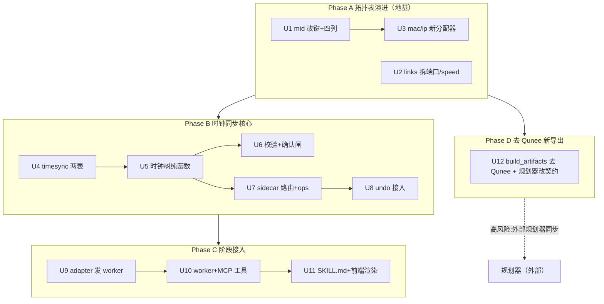

# feat: Stage2 时钟同步阶段做实 + 拓扑表演进 + 去 Qunee 导出

## Summary

把占位阶段 `time-sync` 做实：用户用自然语言指定 GM、系统按「GM + 拓扑」确定性算时钟同步树（端口角色 master/slave/passive）、补默认参数请确认后落库，之后可 NL 换 GM/改参数/启停链路。配套做拓扑表演进（`sync_name→mid`、端口/speed 拆列、加 mac/ip/port_count/queue_count）、两张时钟同步表，并彻底移除 Qunee legacy 导出格式、规划器改吃新格式。

## Problem Frame

`time-sync` 是三阶段工作流的第二阶段，当前是纯本地占位（`runTimeSyncStage` 读固定摘要、零库零工具零校验），用户无法在工具内配置时钟同步。同时拓扑表沿用 Qunee 遗留形态——节点键叫 `sync_name`、端口塞在 `styles_json` 自由文本、节点无 mac/ip、导出走 Qunee `imac`/`_classPath` 格式——这些都挡在时钟同步和后续阶段前面。本计划一并理顺：拓扑表演进作地基，时钟同步核心做实，去 Qunee 让导出格式回归干净（mid/mac/ip/port）。

迁移现实（已 firsthand 验证）：生产库无 `_sqlx_migrations`、`tauri_plugin_sql` 的 `migrations()` 向量在真机不跑；schema 真相源是 `safety_net_schema_sql()` + 命令式 `ensure_*` 守卫。加列照 `ensure_topology_nodes_name_column`、改键照 `ensure_topology_rekey_to_sync_name`，并同步 `P0_DOMAIN_SCHEMA_SQL` + `SESSION_SCOPED_TABLES`。

## Requirements

承自 origin（见 origin: `docs/brainstorms/2026-06-24-stage2-time-sync-requirements.md`），按实现关注分组：

**拓扑表演进** — R1（`sync_name→mid`）、R2（mac/ip/port_count/queue_count 列）、R3（`src/dst_node` 改名）、R4（端口/speed 拆列、真实端口连线）、R5（同周期落地、命令式守卫自动迁移、旧导出不兼容）。
**时钟树与端口角色** — R6（GM 为根 BFS 生成树 + 确定性 tie-break）、R7（端口角色确定性衍生、全量覆盖写、用户不可直填）、R8（非树边/禁用链路两端 passive）。
**阶段交互** — R9（先引导选 GM、未定不推进）、R10（用户可指定参数、系统补默认请确认）、R11（NL 换 GM/改参数/启停链路、重算重确认）、R12（占位升级为有库/工具/确认闸）。
**数据模型与校验** — R13（`timesync_domain` 一行，`gm_mid` 指向现存节点）、R14（`timesync_nodes` 各列与取值域）、R15（禁用链路集 + 切回校验存活）、R16（zod + Rust 双层；重算为权威、快照检测漂移）、R17（切回拓扑后无条件重算整树、端口越界/悬空处理）。
**复用与寻址** — R18（工具走 sidecar）、R19（undo `domain="timesync"`）、R20（确认闸 `{ok,caliber,errors}` 形状）、R21（mac/ip 确定性分配、session 内不重复）、R22（软仿外部只查表、应用不编排）、R23（未覆盖节点告警）。

## Key Technical Decisions

KTD1. **端口角色是确定性衍生，不是输入。** `master_port[]`/`slave_port[]`/`port_ptp_enabled[]` 由纯函数从 `(GM, 启用链路集, 拓扑)` 算出、全量覆盖写；大模型只产 GM/参数/启停链路意图。契合 AGENTS.md「违反破坏数据的规则要确定性兜底」（enforcement ②/③），弱模型切换零回归。

KTD2. **真单域。** `timesync_domain` 一 session 一行一个 GM。dual-plane 塌单树（端系统双挂使图连通、单 GM 覆盖全网），端系统充当跨平面时钟中转是 boss 拍板接受的限制（见 origin Scope Boundaries）。多域留将来表重建。

KTD3. **迁移走 safety_net + 命令式 `ensure_*` 守卫，非 migrations 向量。** 改键（`sync_name→mid`、`src/dst_sync_name→src/dst_node`）用表重建范式（建 `_rekey` 表→`INSERT…SELECT`→DROP→RENAME），加列用 `pragma_table_info` 探测 + `ALTER ADD COLUMN`。每处同步 `P0_DOMAIN_SCHEMA_SQL`（新库）+ `SESSION_SCOPED_TABLES`（导出/导入单一事实源）+ `topology_undo` 的 `NodeRow`/`LinkRow` blob 结构（漏改=静默丢数据/撤销错位）。v7 migration 可加但非承重。

KTD4. **角色与禁用链路存 JSON-in-TEXT 列、校验靠重算。** `timesync_nodes` 三数组、`timesync_domain.disabled_link_seqs` 都是 JSON 列（单域、集小，免新表）。不给数组逐元素写 DB CHECK + zod 双层；校验=重算一遍比对落库快照，不一致以重算为权威覆盖 + 告警。

KTD5. **timesync 工具并进现有 `tsn_topology` registry。** 同 sidecar、同 token、同 `fetchSidecar` 链路，省一个进程；`buildAllowedToolsForStage` 按 `time-sync` stage 放行 timesync 工具。SQL 全在 Rust。

KTD6. **mac/ip 新局域网方案 + 彻底去 Qunee。** MAC 用 `02:` locally-administered 前缀 + 节点序号，IP 用 `10.x` 子网 + host 位，session 内确定性不重复。删除 `derive_legacy_mac`/`derive_legacy_ip` 及全部 Qunee legacy（`imac`/`_classPath`/`sync_type`/`legacy_node_type`/`build_legacy_*`），导出改产 mid/mac/ip/port 新格式（Phase D，依赖外部规划器同步改吃）。

KTD7. **BFS tie-break 复用 `topology_compute` 排序。** 多条等价最短路/有环时按 mid 数值序 + 端口序排序后入队，复用现有转发表 BFS（`sort_by(node_id, out_port)`）的同一规则，保证 R7/AE3 逐次一致。

KTD8. **复用 undo + 确认闸。** `topology_undo` 的 `UNDO_DOMAIN` 常量参数化、blob 序列化按 domain 分派，接 `domain="timesync"`；timesync 校验产 `{ok, caliber, errors:[{code, message_zh, ref}]}` 同形，前端/agent 消费链零改。

## High-Level Technical Design

数据流（确定性核心）：用户 NL → (GM, 启用链路集, 参数) → `compute_clock_tree` 纯函数 → 每端口角色 → 全量覆盖写 `timesync_nodes` → 确认闸重算比对 → 落库 → 外部软仿/规划器查表。

---

## Implementation Units

### U1. topology_nodes：sync_name→mid 改键 + mac/ip/port_count/queue_count 加列

**Goal：** 节点键改名、补四列，存量库自动迁移。
**Requirements：** R1, R2, R5。
**Dependencies：** 无（地基首单元）。
**Files：** `src-tauri/src/db.rs`（`P0_DOMAIN_SCHEMA_SQL` 改列、`SESSION_SCOPED_TABLES` 列清单、新增 `ensure_topology_rekey_mid` + 四列 `ensure_*` 守卫）、`src-tauri/src/session_store.rs`（`connect_app_database` 串新守卫）、`src-tauri/src/topology_ops.rs`、`src-tauri/src/topology_query_command.rs`、`src-tauri/src/topology_sidecar_routes.rs`、`src-tauri/src/topology_undo.rs`（`NodeRow` 字段名 + SELECT/INSERT 列）、`src/app/components/workspace-pane/`（前端引用 `syncName` 处）、`src-node/mcp/topology-tools.ts`（zod `syncName→mid`）。
**Approach：** **U1+U2 共用单一组合重建守卫 `ensure_topology_rekey_mid_and_ports`**（仿现有 `ensure_topology_rekey_to_sync_name` 一次事务同时重建 nodes+links），避免对 `topology_links` 连做两次重建、探测条件互相遮蔽。**守卫探测条件用「目标新列缺失」而非「旧列存在」**（探 `mid` 列不存在才迁），防前一改名遮蔽后一守卫。`sync_name`→`mid` 是纯列改名（同值，连线端点值不变、不悬空）；四列 `port_count`/`queue_count` DEFAULT 8、mac/ip NULLABLE 由 U3 回填。`sync_name` 字面量实测散布约 422 处/29 文件——逐文件清。
**Patterns to follow：** `db.rs` 的 `ensure_topology_rekey_to_sync_name`（imac→sync_name，一次重建 nodes+links 的完整范式）、`ensure_topology_nodes_name_column`（加列守卫）。新守卫排在 `ensure_topology_rekey_to_sync_name` 之后（老库一次 connect 可能先 imac→sync_name 再 sync_name→mid，两守卫条件互斥、各自幂等）。
**Test scenarios：**
  - 迁移幂等：旧 schema（`sync_name` 列）建样本 → 跑守卫 → 列改为 `mid`、四列存在、数据保真；再跑一次 no-op 不报错。
  - 新库直建：safety_net 建表即带 `mid` + 四列，守卫 no-op。
  - 导出/导入 round-trip：含 mid + 四列的 session 导出再导入逐字段一致（`SESSION_SCOPED_TABLES` 同步对）。
  - `session_store.rs` 迁移断言扩到新结构。
**Verification：** 真实库迁移后人工核对 mid/列齐全；`cargo test` 全绿；前端读 `mid` 渲染不崩。**KTD3 漏改检查清单（A 里程碑 go/no-go 发布闸）**：`P0_DOMAIN_SCHEMA_SQL`、`SESSION_SCOPED_TABLES` 列清单、`topology_undo` 的 `NodeRow`/`LinkRow` blob 结构、MCP/前端 zod 的 `syncName→mid` 字面量——逐项确认；`grep -r sync_name src-tauri src src-node` 应只剩迁移守卫自身；**迁移前后 topology 数据逐字段等价断言**（导出/导入 round-trip + undo 盖回）作为发布闸，不只靠人工真机测。

### U2. topology_links：src/dst_node 改名 + src_port/dst_port/speed 拆列

**Goal：** 连线端点改名、端口/速率从 styles_json 拆独立列。
**Requirements：** R3, R4, R5。
**Dependencies：** U1（**同一组合重建守卫 `ensure_topology_rekey_mid_and_ports`、同一迁移事务**——nodes 改键与 links 改名+端口拆列在一次重建里完成，不对 links 连做两次重建）。
**Files：** `src-tauri/src/db.rs`（schema + 共用守卫 + `SESSION_SCOPED_TABLES`）、`src-tauri/src/topology_ops.rs`（`LinkAddArgs`）、`src-tauri/src/topology_sidecar_routes.rs`（`persist_initialized_topology` 写 `src_port`/`dst_port`/`speed` 列而非 styles_json）、`src-tauri/src/topology_undo.rs`（`LinkRow`）、`src-node/mcp/topology-tools.ts`。
**Approach：** 在 U1 的同一组合重建守卫里改 `src/dst_sync_name→src/dst_node` + 新增 `src_port`/`dst_port` INTEGER、`speed` INTEGER 列；`role`/`plane` 仍留 `styles_json`。迁移取 `styles_json.leftLabel/rightLabel`（`port_id` 是 String）best-effort parse 成整数端口，非数字置空 + 标记。**首要调查**：进单元先核验真实库 `leftLabel` 是否多为可解析数字（新建路径写的是 `link.source.port_id`，结构化；历史 fixture 有 `"P1"` 带前缀）——据此定 parse 容错宽度。
**Patterns to follow：** `persist_initialized_topology` 现写 styles_json 的逻辑；U1 的重建范式。
**Test scenarios：**
  - 迁移：styles_json 含数字 `leftLabel` → 拆出 `src_port` 整数；含 `"P1"` → 置空 + 标记；speed 从 styles_json 移到列。
  - round-trip 导出导入含新列保真。
  - `persist_initialized_topology` 新建拓扑直写新列、styles_json 只剩 role/plane。
**Verification：** 迁移后真实库连线端口列填充率核对；`cargo test` 绿。

### U3. mac/ip 新分配器 + 落库填充（删 derive_legacy_*）

**Goal：** 确定性 mac/ip 分配、回填 U1 的 mac/ip 列（只新增，不删 legacy——见 KTD6 顺序约束）。
**Requirements：** R2, R21。
**Dependencies：** U1。
**Files：** `src-tauri/src/topology_intermediate.rs`（新增 `assign_mac`/`assign_ip`）、`src-tauri/src/topology_sidecar_routes.rs`（`persist_initialized_topology` 填 mac/ip 列）。
**Approach：** MAC = `02:00:00:` + 节点序号低 3 字节；IP = `10.<a>.<b>.<host>`（host 取节点序号），session 内确定性不重复。落库在 initialize 时按 `numeric_id` 序填，apply_operations 增量节点同规则补。复用 `topology_ops.rs` 三态写入碰撞挡重号。**`derive_legacy_mac`/`derive_legacy_ip` 本单元不删**——它们的消费点（`topology_compute.rs:2304/2312/2388` 的 Qunee 导出 fallback）在 U12 才清；本单元若删会让 U12 前的 `cargo build` 悬空引用断裂、破坏「A/B/C 可先行」。legacy 派生删除整体并入 U12。**过渡期口径**：U12 前导出仍走 Qunee（读内存 `IntermediateNode.mac_address`，模板已填），不混入新 `02:` 方案；新 mac/ip 列与导出过渡期双轨并存（导出口径冻结直到 U12）。
**Patterns to follow：** 现有 `derive_mac_address(ordinal)`（`topology_intermediate.rs` 已有的序号派生）。
**Test scenarios：**
  - 给定节点集，mac/ip 确定性可复现、session 内两两不重复。
  - MAC 是合法 `02:` locally-administered 格式；IP 落在 `10.0.0.0/8`。
  - initialize 后 mac/ip 列填满；新增节点补地址不撞已有。
**Verification：** 单测覆盖唯一性与格式；真实库 initialize 后 mac/ip 非空。

### U4. timesync_domain + timesync_nodes 表 + disabled-link 存储

**Goal：** 建两张时钟同步表 + 禁用链路集存储。
**Requirements：** R13, R14, R15, R22。
**Dependencies：** U1（引用 mid）。
**Files：** `src-tauri/src/db.rs`（`P0_DOMAIN_SCHEMA_SQL` 加两表 + `ensure_*` 守卫 + `SESSION_SCOPED_TABLES`）、`src-tauri/src/session_store.rs`。
**Approach：** `timesync_domain(session_id PK, gm_mid, one_step_mode, fre_switch, disabled_link_seqs TEXT)`；`timesync_nodes(session_id, mid, master_port TEXT, slave_port TEXT, port_ptp_enabled TEXT, sync_period, measure_period, report_enable, mean_link_delay_thresh, offset_threshold, PK(session_id, mid))`，三 port 列为 JSON 数组串。FK 到 sessions ON DELETE CASCADE。两表进 `SESSION_SCOPED_TABLES`（随 session 导出/导入）。取值域（2^n、0..4095 等）在 zod（U10）+ Rust 校验（U6）做，DB 不写 CHECK。
**Patterns to follow：** 现有 `topology_nodes`/`topology_undo_snapshots` 建表 + 守卫；`db.rs` 的 safety_net 自愈。
**Test scenarios：**
  - 建表幂等；删 session 级联清两表。
  - 导出/导入两表 round-trip 保真。
  - `gm_mid` 写入指向现存 `topology_nodes.mid`（FK 语义靠应用层，U6 校验）。
**Verification：** safety_net 建表测试绿；级联删除验证。

### U5. 时钟树构建纯函数（BFS + tie-break + 端口角色）

**Goal：** `(GM, 启用链路集, 拓扑) → 每端口角色 + 未覆盖节点` 的确定性纯函数。
**Requirements：** R6, R7, R8, R23。
**Dependencies：** U1, U2, U4。
**Files：** 新建 `src-tauri/src/timesync_tree.rs`。
**Approach：** 读 `topology_nodes`/`topology_links`（去掉禁用链路集），以 `gm_mid` 为根做 BFS 生成树：每非 GM 节点朝根端口=slave（恰 1）、朝子端口=master（1..n）、非树边/禁用链路两端=passive。**tie-break 自写**：mid 是数值序号字符串，按 `mid.parse::<i64>()` 整数序 + 端口整数序入队（**不能原样复用** `topology_compute.rs:2443` 那个 `sort_by` —— 它是 String `node_id` 字典序（"10"<"2"）、且跑在内存 IntermediateTopology 上；本函数读 DB、要数值序）。输出 `{per_node: {master_port[], slave_port[], passive_port[]}, uncovered: [mid]}`。纯函数、不碰网络、不落库（落库在 U7）。`port_ptp_enabled` = 参与树的端口（master∪slave）。
**Patterns to follow：** `topology_verify.rs:328` 的 `build_adjacency`（读 DB 键、可借邻接结构，但无端口角色/无排序）；生成树+端口角色+数值序 tie-break 是新逻辑。把数值序 tie-break 抽成共享小函数供本模块单点使用，防与他处 BFS 排序漂移。
**Test scenarios：**
  - 线性拓扑单 GM：端口角色与参考图一致（slave 朝父、master 朝子）。
  - 有环拓扑：非树边两端 passive、无环。
  - Covers AE3：同拓扑+同 GM+同禁用集连算两次逐字节一致（数值序 tie-break 生效）。
  - Covers AE1：禁用一条链路 → 该链路两端 passive、子树重算。
  - mid 非连续/含两位数（如 "2"/"10"）时排序按数值序非字典序（"2"<"10"）。
  - Covers AE5：dual-plane 单 GM 经端系统覆盖全网。
  - 不连通子图：`uncovered` 列出无法到达的节点。
**Verification：** 纯函数单测全绿、确定性反复运行一致。

### U6. timesync 校验 + 确认闸接入

**Goal：** 时钟同步结构校验（重算为权威）+ 接进确认闸。
**Requirements：** R16, R17, R20, R23。
**Dependencies：** U5。
**Files：** 新建 `src-tauri/src/timesync_verify.rs`、`src-tauri/src/lib.rs`（注册 `verify_time_sync` Tauri 命令）、`src/agent/agent-adapter.ts`（confirm-stage 对 time-sync 跑校验）。
**Approach：** `verify_time_sync(session)`：读库 timesync 快照 + 调 U5 重算，比对——不一致以重算为权威覆盖快照 + 告警；校验 `gm_mid` 指向现存节点（悬空报错）、`master_port[]` 元素 ≤ `port_count`（越界报错）、未覆盖节点（R23 告警）、禁用链路集内链路仍存在（悬空剔除）。返回 `{ok, caliber:"timesync_structural", errors:[{code, message_zh, ref}]}`。确认闸全量重算（不走缓存）。
**Patterns to follow：** `topology_query_command.rs` 的 `load_and_verify_topology`/`verify_topology`（同形 + caliber 范式）。注意：`agent-adapter.ts:118` 的确认闸分支硬编码 `currentStep === 'topology'`——time-sync 要**新增一条并列的 `currentStep === 'time-sync'` 分支**调 `verify_time_sync`（不是改条件），并复制 fail-closed 处理（catch 不冒泡、`verdict.ok` 拦截）；`composeVerificationBlockText` 的拓扑语气文案需为 time-sync 另写一份，不复用。
**Test scenarios：**
  - 快照与重算一致 → ok。
  - 快照漂移 → 以重算覆盖 + 告警。
  - `gm_mid` 指向已删节点 → 错误码 `GM_DANGLING`。
  - `master_port` 越界 → 错误码 `PORT_OUT_OF_RANGE`。
  - Covers AE2：GM 悬空拦截。Covers AE6：未覆盖节点告警。
**Verification：** 校验单测覆盖各错误码；确认闸 time-sync 不过关不推进。

### U7. timesync sidecar 路由 + ops（落库 + 重算）

**Goal：** GM/参数/启停链路写库工具，每次重算整树落库。
**Requirements：** R7, R11, R15, R18。
**Dependencies：** U5, U6。
**Files：** `src-tauri/src/topology_sidecar.rs`（`build_router` 加 `/db/timesync/*` route）、新建 `src-tauri/src/timesync_sidecar_routes.rs`、可能 `src-tauri/src/timesync_ops.rs`。
**Approach：** route：`set_gm`（设 gm_mid + 重算落库）、`set_params`（改同步参数）、`toggle_link`（增删禁用链路集 + 重算）、`inspect`（读当前配置给 agent）。每次写：调 U5 重算端口角色 → 全量覆盖写 `timesync_nodes` + 更新 `timesync_domain` → push mutation + emit。三态写入幂等复用 `topology_ops` 范式。Bearer/session 自动复用（同 sidecar middleware）。
**Patterns to follow：** `topology_sidecar_routes.rs` 的 route + sqlx 落库；`topology_position_command.rs` 的 push mutation + `emit_session_db_changed`。
**Test scenarios：**
  - `set_gm` → timesync_nodes 端口角色按新 GM 重算落库。
  - `toggle_link` 禁用 → 端口角色变化、disabled_link_seqs 更新。
  - `set_params` → 参数列更新、端口角色不变。
  - 重试同 batch 幂等（三态写入）。
**Verification：** route 单测（in-memory pool）+ 落库行核对。

### U8. 单步撤销接入 domain="timesync"

**Goal：** timesync 写库可一键撤销。
**Requirements：** R19。
**Dependencies：** U4, U7。
**Files：** `src-tauri/src/topology_undo.rs`（`UNDO_DOMAIN` 参数化 + timesync 表 blob 序列化 + 按 domain 分派 restore）、`src-tauri/src/timesync_sidecar_routes.rs`（写前 snapshot）。
**Approach：** **改的是 PR#46 已 MERGED、真机验过的承重模块，回归面覆盖已上线 topology 撤销——务必不改语义。** 现状：`UNDO_DOMAIN` 写死 `"topology"`、`TopologyPreImage`/`NodeRow`/`LinkRow` struct 字段写死 topology 列、`restore_pre_image` 的盖回循环 `for table in ["topology_nodes","topology_links"]` **硬编码表名无条件 DELETE+INSERT**、4 处 caller（`topology_sidecar_routes.rs:268/691/786`、`topology_undo_command.rs:35`）无 domain 参数。改法：`snapshot_pre_image`/`restore_pre_image` 加 `domain` 参数；**restore 的 DELETE/INSERT 目标表集合必须按 domain 查表分派**（`topology`→`[topology_nodes, topology_links]`，`timesync`→`[timesync_domain, timesync_nodes]`），**绝不**让 timesync 撤销跑硬编码的 topology 表名（否则清空 topology 数据）；blob 反序列化按 domain 选 struct（新增 `TimesyncPreImage`）。4 个 caller 改签名做机械全量替换、断言无遗漏（漏一处 = topology 撤销盖回错 domain）。
**Patterns to follow：** `topology_undo.rs` 现有 snapshot/restore + `topology_undo_snapshots(session_id, domain)` 表（主键已为多 domain 预留）。
**Test scenarios：**
  - **PR#46 原 topology 撤销回归套件全绿**（`snapshot_then_restore_round_trips_both_tables` 等，语义不变）。
  - timesync 改 GM → 撤销 → 盖回 timesync 前态、**topology 两表一行不动**。
  - 撤销后再撤返 false（R11 无可再撤）。
  - domain 隔离：topology 撤销不碰 timesync 快照、反之亦然；restore 表名按 domain 分派（断言 timesync restore 不 DELETE topology 表）。
**Verification：** undo 单测覆盖 domain 隔离 + 盖回正确 + topology 回归不破；4 caller 编译全绿无遗漏。

### U9. time-sync 做实：adapter 发 worker 分支

**Goal：** 把 `runTimeSyncStage` 从本地占位改为可调大模型。
**Requirements：** R9, R10, R12。
**Dependencies：** U7。
**Files：** `src/agent/agent-adapter.ts`（`runTimeSyncStage` 改发 worker + `applyStageResults` 处理 time-sync 结果）、`src/project/project-state.ts`（如需 time-sync 阶段状态字段）。
**Approach：** 机制澄清：自由文本路径本就对任意 `currentStep`（含 time-sync）调 `invoke("run_claude_agent")`，worker 已被调到；真正拦 time-sync 的是 `applyTopologyStageResults` 里 `candidate.stage !== 'topology' → rejections.push('暂未启用')`（agent-adapter.ts:607）。所以本单元改的是**让 time-sync 结果不被 `applyStageResults` 拒**，而非「放开 worker 调用」。**决策**：timesync 写库走 sidecar 工具（U7 的 set_gm 等），**不走 stageResult payload**——前端靠查库渲染（U11）；故 time-sync 无需 topology 那样的 stageResult 通道，`applyStageResults` 对 time-sync 改为「接受并忽略 payload、仅放行流转」。`runTimeSyncStage` 从读固定摘要改为允许进入对话。GM 未定时确认闸 U6 兜底不推进。
**Patterns to follow：** `agent-adapter.ts` topology 阶段的 `invoke("run_claude_agent")` 分支 + `applyTopologyStageResults`。
**Test scenarios：**
  - 进 time-sync 自由文本触发 worker 对话（非本地固定摘要）。
  - `applyStageResults` 不再拒 time-sync 结果（不 push「暂未启用」）。
  - GM 未定时不能推进 → 确认闸 U6 兜底阻挡、提示选 GM。
  - 确认推进/回退路径保留确定性（不走大模型）。
**Verification：** adapter 单测；dev 真机进 time-sync 能与 agent 对话。

### U10. worker 阶段注入 + MCP timesync 工具

**Goal：** worker 按 stage 选 SKILL.md + 门控 timesync 工具；工具并进 tsn_topology registry。
**Requirements：** R11, R16, R18。
**Dependencies：** U7, U9。
**Files：** `src-node/claude-agent-worker.mjs`（`buildSystemPromptForStage` 按 stage 选 `tsn-time-sync/SKILL.md`、`skills` 数组加、`buildAllowedToolsForStage` 加 time-sync 门控）、`src-node/mcp/topology-tools.ts`（timesync 工具 + zod schema 并进 registry）、`src-node/mcp/tsn-topology-server.ts`。
**Approach：** `buildSystemPromptForStage` 现硬编码读 `tsn-topology/SKILL.md`——按 `stageRunnerInput.stage` 选 `tsn-time-sync/SKILL.md`（单字符串注入 + sentinel，**绝不 string[]**）；`buildAllowedToolsForStage` 加 `stage==="time-sync"` 放行 timesync 工具分支。timesync 工具（set_gm/set_params/toggle_link/inspect）加进 `createTopologyToolRegistry`，zod schema 镜像 Rust serde、取值域 `.min().max()` 早失败。改 worker 后须 `npm run build:worker`。
**Patterns to follow：** worker 现 topology 工具门控 + SKILL 注入；`topology-tools.ts` 现有 8 工具的 registry + zod。
**Test scenarios：**
  - time-sync stage：放行 timesync 工具、不放行 topology apply。
  - SKILL.md 注入是单字符串（`redactSecrets` 不崩）、含 time-sync 指引。
  - zod 越界（如 sync_period 非 2^n、offset_threshold>4095）早失败。
  - zod↔Rust 取值域 drift 测试（双写一致）。
**Verification：** worker 单测；`build:worker` 后真机 agent 能调 timesync 工具落库。

### U11. tsn-time-sync SKILL.md + 前端时钟树渲染 + 确认按钮

**Goal：** 领域指引 + 画布渲染时钟树 + 确认推进接 time-sync 校验。
**Requirements：** R9, R10, R12, R20（R11 的 NL 工具实现归 U10，本单元只承 SKILL 指引 + 前端 + 确认）。
**Dependencies：** U6, U10。
**Files：** `.claude/skills/tsn-time-sync/SKILL.md` + `references/`（新建/补全）、`src/skills/skill-catalog.ts`（`tsn-time-sync` 状态 draft→enabled）、`src/app/components/workspace-pane/`（时钟树渲染 + 确认按钮接 verify_time_sync）。
**Approach：** SKILL.md 写：进阶段先引导用户给 GM（参与感）、可指定参数、系统补默认请确认、NL 改树语义（换 GM/改参数/启停链路，不能直填端口角色）、推荐参数默认。前端画布渲染时钟树（端口角色可视）、确认按钮走 `verify_time_sync` 确认闸。SKILL.md 是 enforcement ①（纯指引），关键不变量靠 U5/U6/U7 确定性兜底。
**Patterns to follow：** `tsn-topology/SKILL.md` 的结构 + 注入；topology 阶段画布 + 确认按钮。
**Test scenarios：**
  - skill-catalog `tsn-time-sync` enabled。
  - 前端渲染时钟树（master/slave/passive 视觉区分）。
  - 确认按钮触发 verify_time_sync、不过关不推进。
  - Covers AE4：只给 GM 不给参数 → 系统补默认、整理完整配置请用户确认（不要求逐个手填）。
**Test expectation：** SKILL.md 内容无单测（纯文本指引）；前端渲染/确认按钮有组件测试。
**Verification：** dev 真机走通「进 time-sync→选 GM→看树→确认推进」全流程。

### U12. build_artifacts 去 Qunee + 新导出格式（外部规划器依赖）

**Goal：** 移除全部 Qunee legacy（KTD6），导出改产 mid/mac/ip/port 干净格式。
**Requirements：** R5。
**Dependencies：** U1, U3（新字段就位）。
**Files：** `src-tauri/src/topology_intermediate.rs`（`IntermediateNode`/`IntermediateLink` 加 mid/mac/ip/port_count/端口/speed 字段；删 `derive_legacy_mac`/`derive_legacy_ip`）、`src-tauri/src/topology_compute.rs`（`build_topology_artifacts` 改产新格式，删 `build_legacy_topo_feature`/`build_legacy_mac_forwarding_table`/`imac_by_node_id_map`/`legacy_node_type`/`legacy_class_path` + 三处 `derive_legacy_*` fallback 调用）、`src-tauri/src/topology_sidecar_routes.rs`（`legacy_node_type` 删/改）、导出契约文档。
**Approach：** **数据源真相**：`build_topology_artifacts(&req.topology)` 吃的是 agent 经 sidecar 传的**内存 `IntermediateTopology` Value，不读库**（topology_compute.rs:2026、sidecar_routes.rs:151）。所以「直读库列」站不住——改法是**把新字段（mid/mac/ip/port_count、端口、speed）加进 `IntermediateNode`/`IntermediateLink`**，由 initialize/compute 落库时同源填充，`build_topology_artifacts` 从内存对象产新格式（保持「读内存」契约不变）。删全部 legacy 函数 + `derive_legacy_*` 定义与三处 fallback 调用（2304/2312/2388）**同单元一并删**——函数与调用点同删，编译自洽。
**交付门控（高风险外部依赖）：** 外部规划器（独立工具，memory 证实 xz_em 旧配置只认 sync_name/Qunee）必须同步改吃新格式。**本单元代码可进同分支，但通过独立 PR 或 feature flag 隔离，与规划器联调完成前不暴露新格式给规划器**——A/B/C 三阶段可独立合入上线、不被 D 阻塞。
**Patterns to follow：** 现 `build_topology_artifacts` 结构（改产出 + 扩 Intermediate 字段，不改读内存时机）。
**Test scenarios：**
  - 新格式导出含 mid/mac/ip/端口/speed、无 imac/_classPath/sync_type。
  - 删 legacy 函数 + 三处 fallback 调用后全仓无悬空引用（`cargo build` + `clippy -D warnings` 绿）。
  - 契约测试：新格式样本符合与规划器约定的 schema。
**Verification：** `cargo test` + `clippy -D warnings` 绿；**与规划器侧联调通过 + feature flag 开启**方可对规划器暴露新格式。

---

## Scope Boundaries

**本期做** — 拓扑表演进（mid/端口/mac-ip）、时钟同步两表 + 确定性树 + 校验 + 交互、去 Qunee 新导出格式。

**本期不做（将来）**
- 多时钟域 / 每平面独立 GM 冗余——随真单域推后；dual-plane 进 time-sync 端系统当跨平面时钟中转是接受限制（见 origin）。
- 软仿（INET）/ 硬仿（task）编排——外部自查表自调接口，应用只产可查数据。
- 手动直填端口角色——衍生模型不开此口。

**Deferred to Follow-Up Work**
- 用户主导选 GM vs 系统自动推荐默认（origin FYI，本期用户主导）。
- mac/ip 不重复作用域扩到跨 session（本期 session 内）。

---

## Risks & Dependencies

- **外部规划器契约（U12，高风险）**：去 Qunee 导出格式要求外部规划器同步改吃 mid/mac/ip/port 新格式。规划器是独立工具、可能不在本仓控制范围——U12 上线须与规划器维护方协调发布窗口，未就绪则 U12 阻塞（A/B/C 阶段可先行）。
- **mid 改名牵连面（U1）**：`sync_name` 实测散布约 288 处/29 文件，横跨 Rust/TS/SQL/`SESSION_SCOPED_TABLES`/undo blob/前端。漏改=运行时 panic 或导出/导入静默丢数据。逐文件清单核对。
- **历史端口数据可解析性（U2 首要调查）**：`leftLabel`/`rightLabel`（String）能否可靠 parse 成整数端口决定迁移容错；进 U2 先核验真实库数据。
- **迁移回归已发布 topology 阶段**：A 阶段动已在用的拓扑表，须真机验证 topology 阶段不回归（boss 一直在测）；A 里程碑以「迁移前后 topology 数据逐字段等价」为发布闸（U1 Verification），不只靠人工测。

**分阶段交付（里程碑可独立验收）**：A（U1-U3 拓扑表演进）是 B/C/D 共同地基、可独立发并回滚——先发 A 把「迁移回归」与「时钟同步新功能」两类风险解耦；B+C（U4-U11 时钟同步）独立给用户价值、可独立发；D（U12 去 Qunee）通过独立 PR / feature flag 隔离，待外部规划器就绪窗口对齐再对其暴露新格式，不阻塞 A/B/C。

## Open Questions（Deferred to Implementation）

- U2 起手核验真实库 `leftLabel` 数据形态，定 best-effort parse 容错宽度。
- U12 与规划器维护方的发布窗口协调 / 新格式 schema 最终对齐。
- timesync 工具并进 `tsn_topology` registry 后的 stage 门控粒度（同 server 工具按 stage 分别放行的实现细节）。
