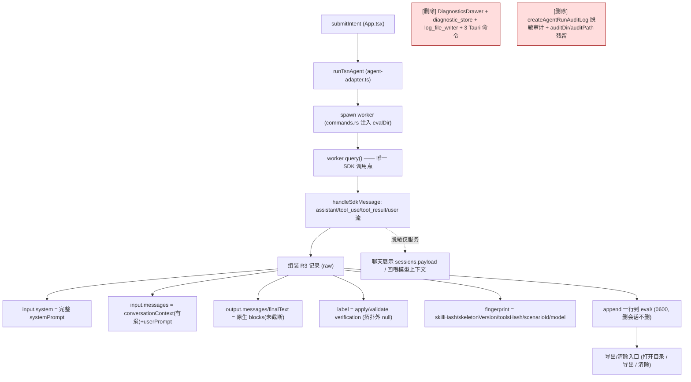

# feat: 大模型交互 eval 采集管道（替换审计/执行日志）

## Summary

把每次 agent run 的大模型交互**原样（raw、不脱敏）**存成一条 eval 样本，落在独立、不随会话删、无上限的 JSONL store，提供一个导出/清除入口。实现上**进化既有的 `createAgentRunAuditLog` 审计钩子**（它已是每轮捕获点），而非新增并行路径；同时**删除**界面执行日志模块（DiagnosticsDrawer + diagnostic_store）与既有脱敏审计的残留。脱敏只保留在 agent↔用户聊天展示那一层。

## Problem Frame

现有两条 run 记录都不适合 eval：①界面执行日志（diagnostic_store/log_file_writer/DiagnosticsDrawer）是脱敏+截断+10MB上限+删会话即删的事件时间线；②worker 的 `createAgentRunAuditLog` 审计是脱敏+摘要+随会话删的排查产物。boss 要的是一份 raw、可累积、可导出的 eval 数据集（建评估集 + 为未来弱模型切换回放门攒数据），并把上面两条合并成**唯一一条 raw 记录 + 一个导出口**。

## Requirements Trace（origin: R1–R8 + R5b）

| 需求 | 落点 |
|---|---|
| R1 worker SDK 边界采集（redact 前） | U3 |
| R2 Run 级一条 | U1 / U3 |
| R3 记录 schema（原生 blocks input/output + label + fingerprint + 元数据） | U1 / U2 / U3 |
| R4 所有模型调用都采（单一 worker 路径，已核实） | U3（见 KTD5） |
| R5 独立 append-only JSONL、无上限、删会话不删 | U4 / U5 |
| R5b toolsHash 指纹（全量快照推迟） | U2 |
| R6 eval 路径全程不脱敏；脱敏只留聊天展示层 | U3（见 KTD3） |
| R7 导出/清除入口 | U6 / U7 |
| R8 废弃执行日志模块 + 既有审计 | U8 |

---

## Key Technical Decisions

- **KTD1 — store 落盘归属：worker 直写**。沿用既有 `agent_audit_dir`（`src-tauri/src/commands.rs:656`）注入机制，把注入目录从 `auditDir` 重定向到 app-config 下的 `eval/`，worker 直接 append 写 JSONL，不经 Rust sidecar。worker 已有直写磁盘先例（`createAgentRunAuditLog`），无需新通道。
- **KTD2 — 进化而非并行**：eval 采集**替换** `createAgentRunAuditLog`，复用其已接好的每轮数据收集（assembled `systemPrompt`、SDK 消息流里的 toolCalls/result、`conversationContext`），但①写 raw（本路径剥掉所有 `redactSecrets`）②重塑成 R3 原生-blocks schema ③写到 durable 的 `eval/`（不随会话删）。删掉审计专用的脱敏/摘要 helper 与 `latest.json`/按会话目录。
- **KTD3 — input 保真边界**：`input.system` 与 `output.*` 为 raw、不截断；`input.messages` 历史侧只存 worker 实际持有的 `conversationContext`（已是最近6条/截260字/剥工具行的有损摘要）+ 本轮 userPrompt，记录里**显式标注为有损摘要**。`redactSecrets` 从本写路径移除，但**保留**在 `src/sessions/session-repository.ts`（聊天展示落库）与回喂模型上下文处（R6）。
- **KTD4 — label 源**：取 worker 内 apply/validate 工具结果携带的 verification `{ok,caliber,errors}`（采集点即可见，`collectToolCalls`/tool_result 流里），**不是**确认时 Rust 的 `verify_topology`（worker 退出后才有、不采）。拓扑外 run label=null。
- **KTD5 — 单一采集点成立**：已核实所有模型调用都经 `App.tsx → runTsnAgent（src/agent/agent-adapter.ts:67）→ worker → query()`，无第二条直连 SDK 的路径，故一个 worker 采集点覆盖 R4"全采"。
- **KTD6 — raw store 落盘约束**：文件 0600；放 app-config 下 `eval/`（非 iCloud/Dropbox/TimeMachine 默认同步目录）；**排除在既有 session 导出之外**（`src-tauri/src/session_export.rs` 不得遍历到）；删会话不删。
- **KTD7 — append-only JSONL**：一行一 run。run 串行（`isAgentRunning` 守卫），worker 以 append 模式写单一 JSONL（按需可日期分片），无需既有 `log_file_writer` 的全局串行器（随 U8 删）。

---

## High-Level Technical Design

> 图为权威设计；散文与图冲突时以散文为准。

---

## Implementation Units

### U1. Eval 记录 schema 与序列化

- **Goal**：定义 R3 记录的类型与 JSONL 行序列化（原生 content-blocks 形状）。
- **Requirements**：R2, R3。
- **Dependencies**：无。
- **Files**：`src-node/eval/eval-record.ts`（新建：类型 + `buildEvalRecord()` + `serializeEvalRecordLine()`）；`src-node/eval/eval-record.test.ts`（新建）。
- **Approach**：定义 `EvalRecord` = `{ schemaVersion:"tsn-agent.eval-record.v1", runId, sessionId, claudeSessionId, stage, scenarioConfigId, model, createdAt, durationMs, fingerprint{skillHash,skeletonVersion,scenarioId,model}, input{system, toolsHash, messages[]}, output{messages[], finalText}, label }`。`messages[]` 用 Anthropic 原生 block 结构（`{type:"text"|"tool_use"|"tool_result", ...}`）。`label = {ok,caliber,errors} | null`。序列化成单行 JSON（末尾换行）。
- **Patterns to follow**：既有 worker 内 `tsn-agent.agent-run-audit.v1` 记录的字段命名与 schemaVersion 约定（`src-node/claude-agent-worker.mjs:767+`）。
- **Test scenarios**：
  - happy：完整字段 → 序列化为合法单行 JSON、可 parse 回等价对象。
  - edge：`label=null`（非拓扑）正确序列化；`output.messages` 含 tool_use+tool_result 原生 blocks 保形。
  - edge：含敏感字符串（sk-ant-…）时**不脱敏**透传（验证 raw 契约）。
- **Verification**：单测覆盖序列化/反序列化与 raw 契约。

### U2. Worker 内指纹计算

- **Goal**：在 worker 算出 `skillHash`、`skeletonVersion`、`toolsHash`、`scenarioId`、`model`。
- **Requirements**：R3（fingerprint）, R5b（toolsHash）。
- **Dependencies**：U1。
- **Files**：`src-node/eval/fingerprint.ts`（新建）；`src-node/eval/fingerprint.test.ts`；改 `src-node/claude-agent-worker.mjs`（接入）。
- **Approach**：`skillHash` = SKILL.md 内容 hash（内容已在 `buildSystemPromptForStage` 读到）；`skeletonVersion` = `SYSTEM_PROMPT_SKELETON` 内容 hash（同法）；`toolsHash` = 当时可用 MCP 工具定义（`buildAllowedToolsForStage` 产物）规范化后 hash；`scenarioId`/`model` 直取现有变量。统一一个 sha256→hex helper。全量工具定义快照**本期不落盘**（随回放链推迟）。
- **Patterns to follow**：worker 现有 `buildSystemPromptForStage` / `buildAllowedToolsForStage`。
- **Test scenarios**：
  - happy：同输入→同 hash（稳定）；不同 SKILL.md 内容→不同 skillHash。
  - edge：工具列表顺序无关（规范化后 toolsHash 稳定）。
- **Verification**：单测哈希稳定性 + 字段齐全。

### U3. 改造捕获钩子：写 raw eval 记录（替换脱敏审计）

- **Goal**：把 `createAgentRunAuditLog` 路径改造成"组装 R3 raw 记录"，移除本路径的脱敏/摘要。
- **Requirements**：R1, R2, R3, R4, R6。
- **Dependencies**：U1, U2。
- **Files**：改 `src-node/claude-agent-worker.mjs`（`createAgentRunAuditLog` → eval 记录组装；`handleSdkMessage` 收 output blocks；从 apply/validate tool_result 取 label；剥本路径 `redactSecrets`/`redactJsonValue`/`buildAuditSummary`/`summarizePromptForAudit` 等审计专用 helper）；`src-node/claude-agent-worker.test.*`（若有）补采集断言。
- **Approach**：复用已收集的 `systemPrompt`、SDK 消息流（assistant/tool_use/tool_result）、`conversationContext`、`userPrompt`、`result`、`runId`/`appSessionId`/`stage`/`scenarioConfigId`/`model`/`durationMs`。组 `input.system`（raw 完整 systemPrompt）、`input.messages`（conversationContext 有损摘要 + 本轮 userPrompt，**带 lossy 标记**）、`output.messages/finalText`（原生 blocks，未截断）、`label`（apply/validate verification，拓扑外 null）、`fingerprint`（U2）。**本写路径不调用任何 redactSecrets**。
- **Patterns to follow**：现有 `handleSdkMessage` 的 message 分支（assistant/stream_event/user/tool_result）与 `collectToolCalls`。
- **Test scenarios**：
  - happy：一次拓扑 run → 记录含 raw system/output、label={ok,caliber,errors}。
  - edge：非拓扑自由问答 run → label=null，其余齐全。
  - edge：input.messages 历史部分确为 conversationContext 摘要（不假装原生历史）。
  - integration：含 sk-ant- 的 prompt → eval 记录里**原文保留**（raw），而聊天展示路径仍脱敏（交叉验证 R6 边界未被破坏）。
- **Verification**：worker 跑一轮产出符合 U1 schema 的 raw 记录；`build:worker` 后 dist 生效。

### U4. Eval store 写盘 + 目录注入

- **Goal**：worker append 写 JSONL 到 Rust 注入的 `eval/` 目录，0600。
- **Requirements**：R1, R5, R5b。
- **Dependencies**：U3。
- **Files**：改 `src-tauri/src/commands.rs`（`agent_audit_dir` → eval 目录解析：app-config 下 `eval/`，mkdir，注入键由 `auditDir` 改 `evalDir`；run 响应里 `auditPath`→撤除或改 `evalAppendOk`）；改 `src-node/claude-agent-worker.mjs`（以 append 模式写单一 JSONL + chmod 0600）。
- **Approach**：复用 `agent_audit_dir` 的 app-config 定位逻辑，目录改 `eval/`。worker 拿到 `evalDir` 后 append 一行；首次创建文件设 0600。run 串行（`isAgentRunning`）保证 append 不交错。
- **Patterns to follow**：`commands.rs:211/656` 的目录注入与 `strip_verbatim_prefix`；worker 现有 audit 写盘。
- **Test scenarios**：
  - happy：连续两轮 → JSONL 两行、可逐行 parse。
  - edge：文件权限 0600（Unix）。
  - edge：`evalDir` 缺失/不可写 → worker 不崩、降级（记一条 stderr，不阻断本轮 agent）。
- **Verification**：真机一轮后 `eval/*.jsonl` 出现且 0600；cargo + vitest 绿。

### U5. Store 隔离与持久（不随会话删、排除导出）

- **Goal**：eval store 与会话生命周期解耦、且不被既有 session 导出带出。
- **Requirements**：R5, R6（导出隔离）。
- **Dependencies**：U4。
- **Files**：查 `src-tauri/src/session_export.rs`（确认导出清单**不**遍历 `eval/`；如有遍历 app-config 的逻辑则显式排除）；`src-tauri/src/session_store.rs`（确认 `remove_session` 不触 `eval/`——它原只删 sessions 行 + 旧 diagnostic 文件）。
- **Approach**：eval/ 既不在 `logs/sess-<id>/` 下、也不在 session 导出根，天然解耦；本单元是**显式核验 + 加测试护栏**，必要时在导出处加排除断言。
- **Test scenarios**：
  - integration：导出某会话 → 产物不含 eval store 内容/路径。
  - integration：删除会话 → `eval/` 文件原样保留。
- **Verification**：上述两条测试通过。

### U6. 导出/清除入口（替代界面执行日志）

- **Goal**：在一个合适的位置提供"打开 eval 目录 / 导出 JSONL / 清除"。
- **Requirements**：R7。
- **Dependencies**：U4。
- **Files**：新增 Tauri 命令 `open_eval_dir` / `export_eval_dataset` / `clear_eval_store` / `clear_eval_for_session`（`src-tauri/src/` 新模块，如 `eval_command.rs`）+ `lib.rs` 注册；前端一个轻量入口（接管原 DiagnosticsDrawer 入口位置，如会话抽屉/工具区一个按钮）。
- **Approach**：导出≈定位文件（磁盘格式即数据集）：`open_eval_dir` 用系统文件管理器打开；`export_eval_dataset` 可选拷贝到用户选定路径；`clear_*` 删对应 JSONL 行/文件。落点取原执行日志入口处（boss："某个合适的地方"）。
- **Patterns to follow**：既有 `open`/文件对话框命令、`session_export.rs` 的文件落地与 transferNotice 反馈。
- **Test scenarios**：
  - happy：clear_eval_store 后目录空；clear_eval_for_session 只删该会话样本。
  - edge：空 store 时打开/导出不报错。
  - Test expectation：前端按钮交互以最小渲染测试覆盖（命令调用打桩）。
- **Verification**：真机点按可打开目录/导出/清除。

### U7. 删会话告知（eval 不随之删）

- **Goal**：删除会话时明示"eval 记录不会被删除"，并提供清除路径。
- **Requirements**：R7（隐私兜底）, R8（删会话告知）。
- **Dependencies**：U6。
- **Files**：改删除确认弹窗（`src/app/App.tsx` `confirmDeleteSession` / 删除确认组件）。
- **Approach**：在删除确认文案补一行"eval 记录不随会话删除，可在 <入口> 手动清除"；指向 U6 的 `clear_eval_for_session`。
- **Test scenarios**：
  - happy：删除确认弹窗含该告知文案。
- **Verification**：渲染测试断言文案存在。

### U8. 废弃执行日志模块 + 既有审计残留（R8，同期）

- **Goal**：删干净界面执行日志模块与既有脱敏审计的残留。
- **Requirements**：R8。
- **Dependencies**：U3, U4（eval 路径已接管捕获后再删）。
- **Files**：删 `src-tauri/src/diagnostic_store.rs`、`src-tauri/src/log_file_writer.rs`、`src/ui/diagnostics/DiagnosticsDrawer.tsx` 及 `src/diagnostics/*`（diagnostic-log/-repository/app-diagnostics）；删 3 Tauri 命令 `append_diagnostic_log`/`list_diagnostic_logs`/`clear_session_diagnostic_logs`；改 `src-tauri/src/session_store.rs` `remove_session`（去 `DiagnosticStore` 入参 + `clear_logs_for_session_fs` 调用）；改 `src-tauri/src/lib.rs`（去 `.manage(DiagnosticStore)` + 命令注册）；确认 `src-tauri/src/redaction.rs` 删 diagnostic_store 后独立自洽；清 `logDiagnostic` 全部调用点（16 处：`src/app/App.tsx`×8 / `src/app/hooks/use-session-repository.ts`×5 / `src/agent/agent-adapter.ts`×2 / 模块定义）；撤 `auditDir`/`auditPath` 残留（`commands.rs:245/283/483/509/647`、`agent-adapter.ts:303` 透传）。
- **Approach**：U3/U4 落地并验证产出后再删（同一批次/同一 PR）。逐个删调用点、改签名、跑编译器兜空引用。`redactSecrets`（TS）与 `redaction.rs`（Rust）**保留**——它们仍服务聊天展示，仅从 eval 写路径移除（U3 已做）。
- **Patterns to follow**：本仓既往"删空壳表/backfill 子系统"的干净切换（命令式、编译器兜引用）。
- **Test scenarios**：
  - integration：`remove_session` 去掉 DiagnosticStore 后仍正确删会话（既有 session 删除测试更新并通过）。
  - regression：全量 vitest + cargo 绿、biome 无新增 warning。
  - edge：grep 确认无残留 `logDiagnostic`/`diagnostic_logs`/`auditDir` 引用。
- **Verification**：build:worker + vitest + cargo + biome 全绿；真机删会话/跑一轮正常。

---

## Scope Boundaries

**本期做**：U1–U8（采集进化 + 独立 store + 导出/清除入口 + 删会话告知 + 废弃旧日志与审计）。

**Deferred to Follow-Up Work**：
- 全量工具定义快照落盘（随 live 回放链）。
- 长期保留策略 / rotate（本期无上限、手动清）。
- 每条存 token usage/cost（廉价加项，可后补）。

**Outside this product's identity（origin 携带）**：
- app 内置 eval-run/打分 harness、Langfuse 式 trace→dataset 精选/标注 UI、live 回放回归工具链。
- 把 app 变 eval 平台/服务端遥测；任何上传/分享/联网外发。

---

## Risks & Dependencies

- **同期删旧观测性（boss 接受）**：U8 与新采集同批落地，存在"采集未经长期实战即删旧路径"的盲飞窗口；且**调模型前就失败的 run（auth/worker 崩）本期两边都不留记录**——已知告知式缺口。缓解：U8 依赖 U3/U4 验证产出后再删；保留 stderr。
- **raw 密钥落盘（boss 接受）**：eval store 含未脱敏密钥/系统提示。缓解：0600 + 非同步目录 + 排除导出 + 手动清除 + 删会话告知（KTD6/U5/U6/U7）。
- **input 保真有损**：input.messages 历史是摘要，回放门需 deferred 的 live harness——记录里已显式标注，避免下游误判（KTD3）。
- **依赖**：改 `src-node` 后必 `build:worker`（worker 跑 dist 产物）。

---

## Open Questions（execution-time）

- U6 入口的确切落点（会话抽屉按钮 vs 工具区 vs 设置）——实现时取原 DiagnosticsDrawer 入口处定。
- JSONL 是否日期分片 vs 单文件——实现时按体量定（默认单文件 append）。
- `export_eval_dataset` 是否需要"导出时可选脱敏开关"——boss 定导出也原文，本期默认不脱敏；如需另议。
