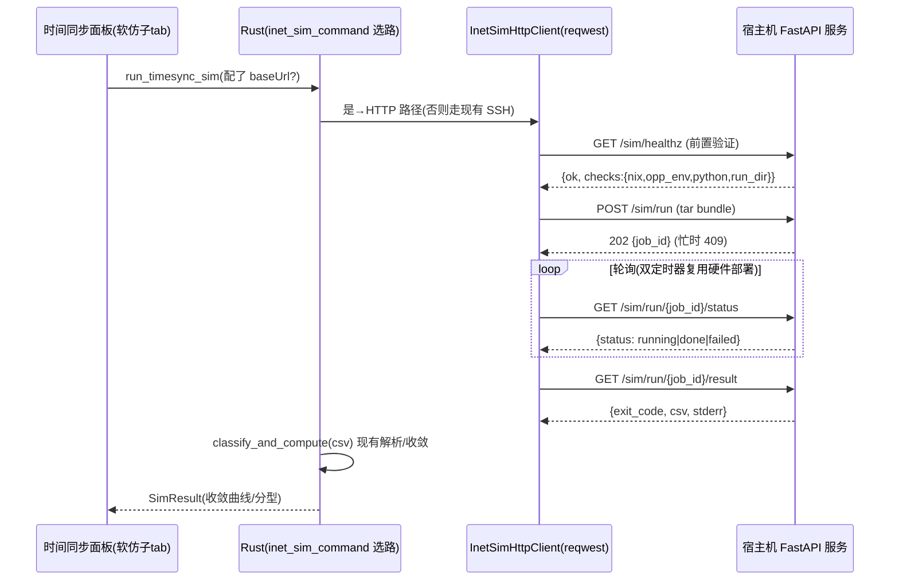
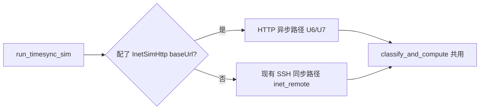

# feat: INET 宿主机薄 HTTP 软仿服务 + app HTTP 客户端

## 摘要

在 INET Ubuntu 宿主机上跑一个薄 HTTP 服务，把那条 nix+opp_env 软仿指令沉淀在宿主机；app 端新增一条 HTTP 软仿路径（配置只要 host+port，镜像硬件部署 API），与现有 SSH/scp 软仿路径并存——配了 INET HTTP 服务地址就走 HTTP，否则 SSH 兜底。服务薄=只回原始 CSV+exit+stderr，app 现有解析/收敛逻辑不动。本期不做认证。真机验通后另开 PR 清 SSH。

两大块：**宿主机服务**（新建 Python FastAPI，进本仓 `services/inet-sim-http/`）+ **app 客户端**（Rust reqwest + TS，镜像硬件部署的 trait/轮询/配置三层/task 表）。

---

## 问题背景

现状软仿是 app→宿主机 **SSH/scp**：`inet_sim_bundle.rs` 生成 bundle（`network.ned`/`omnetpp.ini`/`manifest.json`）→ `inet_remote.rs` 用 `ssh mkdir` + `scp -r` + `ssh 跑 opp_env...inet` + `ssh 跑 scavetool` → `inet_sim_command.rs::classify_and_compute` 本地解析收敛。依赖免密、known_hosts、authorized_keys，配置摊到每个客户端，刚因配免密反复受阻。

硬件部署 API（`hardware_api.rs`/`hardware_command.rs`，tsn-sim `http://host:port/sim/*`）已经把"app 只配 baseUrl + reqwest trait + 长任务轮询 + 配置三层 + task 表"跑通且过 code-review。本计划把软仿也接到这套 HTTP 模式，服务端是新建的薄壳。

---

## 关键技术决策

### KTD1. 薄服务 + 异步任务（回原始 CSV）
服务只负责"收 bundle → 跑沉淀指令 → 回 raw CSV+exit+stderr"，**不解析**。app 拿 CSV 后走现有 `classify_and_compute`（load_failed/scavetool_failed/empty/parse_failed/converged，含跳 opp_env 横幅）原样复用。异步：`POST run`→`job_id`，轮询 `status`/`result`。（见 origin D1/D3）

### KTD2. 服务技术栈 = Python FastAPI + uvicorn，代码进本仓 `services/inet-sim-http/`
宿主机有 nix+python，FastAPI 写这层最薄（收 multipart、起子进程跑命令、回 body）。代码版本化在本仓，带部署脚本 + systemd unit + README，可复现部署。（origin D8/R10/R12）

### KTD3. 沉淀指令固化在服务配置（宿主机），不再由 app 传
服务侧配置写死/读环境：`source /nix/var/nix/profiles/default/etc/profile.d/nix-daemon.sh && /home/zhang/.local/bin/opp_env run inet-4.6.0 -w /home/zhang/inet-workspace --build-modes=release`，运行目录 `/tmp/tsn-agent-runs`。app 不再配 inetEnvCmd/baseDir。（origin D2）

### KTD4. app 选路 = 独立 `InetSimHttpConfig{baseUrl}`，配了走 HTTP 否则 SSH 兜底
新增独立配置（不复用 inet-host-config 四字段、也不混 hardware_api_config），app_state key + env>UI>默认三层解析，镜像 `hardware_api_config.rs`。`run_timesync_sim` 入口按"是否配了 baseUrl"分流：配了→HTTP 异步路径；没配→现有 SSH 同步路径。（origin D4/D5/R8）

### KTD5. 复用硬件部署框架，不重建
Rust 侧 reqwest trait（真实现 + Fake 测试替身）+ 超时（connect 10s / read 视情况放宽，见 KTD7）+ 错误分类，镜像 `hardware_api.rs`。前端轮询复用 `hard-deploy-panel.tsx` 的双定时器/终态权威源/会话切换守卫模式。task 表复用 `task_store.rs` 记 job。（origin D5/R5/R6）

### KTD6. 单运行
服务一次只跑一个软仿，已有任务在跑时 `POST run` 返回 409 明确拒绝（非静默、非排队）。单用户场景。（origin D6/R3）

### KTD7. 长任务超时：异步轮询而非长请求
opp_env 首次编译可能数分钟。`POST run` 立即返回 job_id（不阻塞），实际执行在服务端后台子进程；app 轮询 status。reqwest 各端点超时短（10s 级），不靠单条长请求扛数分钟。（origin R6）

### KTD8. 本期不做认证
tailnet plain HTTP，连 token 也不加。服务端跑**固定**沉淀指令、不拼接用户可控串；bundle 解包路径约束在 `run-<id>` 目录内防穿越。（origin D7/R9）

---

## 高层设计

### 异步软仿流（HTTP 路径）



### 选路与并存



> 上述 API 路径/字段为**方向性设计**，确切 schema 由 ce-work 落地时定。

---

## Output Structure（新建宿主机服务）

```
services/inet-sim-http/
├── app.py                # FastAPI 应用：healthz/run/status/result 端点
├── runner.py             # 起子进程跑沉淀指令 + scavetool，job 状态管理
├── preflight.py          # 前置验证：nix/opp_env/python/run_dir
├── config.py             # 沉淀指令、运行目录、端口（环境可覆盖）
├── requirements.txt      # fastapi + uvicorn（薄依赖）
├── deploy/
│   ├── inet-sim-http.service   # systemd unit
│   └── install.sh              # 部署脚本
└── README.md             # 前置依赖/部署/配置/排障
```

---

## 实现单元

### U1. 宿主机服务骨架 + 前置验证

**目标**：FastAPI 应用骨架 + `GET /sim/healthz` 前置验证。
**需求**：R1（部分）、R11。
**依赖**：无。
**Files**：`services/inet-sim-http/app.py`、`preflight.py`、`config.py`、`requirements.txt`、`services/inet-sim-http/tests/test_preflight.py`。
**方法**：`config.py` 固化沉淀指令 + 运行目录 + 端口（环境变量可覆盖）。`preflight.py` 检查：能 source nix-daemon profile、`opp_env` 二进制存在且 `opp_env --version` 类可跑、Python/FastAPI 就绪、运行目录可写。`healthz` 返回 `{ok, checks:{nix,opp_env,python,run_dir}}`，任一缺失 `ok=false` 并带缺失原因。
**Patterns**：对齐硬件部署 `healthz`+`task_check` 的"探活+环境检查"语义。
**Test scenarios**：
- preflight 全通 → `{ok:true, checks 全 true}`。
- opp_env 不存在 → `{ok:false, checks.opp_env:false}` 带原因。
- 运行目录不可写 → `{ok:false, checks.run_dir:false}`。
- healthz 端点在依赖缺失时仍能响应（不 500）。
**验证**：本地起服务，`curl /sim/healthz` 在依赖齐/缺两种情况下返回正确 JSON。

### U2. 提交 + 执行端点（异步 + 单运行）

**目标**：`POST /sim/run` 收 bundle、后台跑沉淀指令+inet+scavetool、返回 job_id；单运行闸。
**需求**：R1、R2（提交）、R3、R9。
**依赖**：U1。
**Files**：`services/inet-sim-http/app.py`、`runner.py`、`services/inet-sim-http/tests/test_runner.py`。
**方法**：收 tar（multipart）→ 解包到 `/tmp/tsn-agent-runs/run-<id>`（路径约束防穿越）→ 后台子进程跑 `config` 里的沉淀指令 `-c 'cd run-<id> && inet -u Cmdenv -f omnetpp.ini -n .'` → 再跑 `opp_scavetool export ... timeChanged:vector ... CSV`，把 raw CSV/exit/stderr 落 job 记录。已有任务在跑 → 409。job_id 用随机 hex（不用时钟，避碰撞，对齐 SSH 套件 KTD8）。
**Approach 注意**：跑**固定**指令、bundle 文件名/路径不拼进 shell；解包目标强校验在 run 目录内。
**Test scenarios**：
- POST 合法 bundle → 202 + job_id；run 目录被创建、文件解包到位。
- 已有任务在跑时再 POST → 409。
- tar 内含 `../` 路径穿越 → 拒绝，不写出 run 目录外。
- 子进程非 0 退出 → job 记 exit_code + stderr（不抛 500）。
**验证**：本地 POST 一个真 bundle，确认后台起子进程、run 目录有产物、并发第二个被 409。

### U3. 状态 + 结果端点 + run 目录 GC

**目标**：`GET status`、`GET result`（raw CSV+exit+stderr）、旧 run 目录回收。
**需求**：R2（查/取）、R4。
**依赖**：U2。
**Files**：`services/inet-sim-http/app.py`、`runner.py`、`services/inet-sim-http/tests/test_endpoints.py`。
**方法**：`status` 回 `queued|running|done|failed`；`result` 回 `{exit_code, csv, stderr}`。GC：服务启动时清理 + 保留最近 N 个/超龄清理（具体策略见待解决）。job 状态内存表（单运行，无需持久化）。
**Test scenarios**：
- 运行中 → status `running`；完成 → `done` + result 可取。
- 未知 job_id → 404。
- result 在 done 后返回完整 CSV（含 scavetool 导出内容）。
- GC：超过保留上限的旧 run 目录被清，当前 job 目录不被清。
**验证**：跑一次完整软仿，轮询 status 直到 done，取 result 拿到 CSV；重启服务确认旧目录被 GC。

### U4. 部署形态 + README

**目标**：systemd unit + 部署脚本 + README。
**需求**：R10、R12。
**依赖**：U1–U3。
**Files**：`services/inet-sim-http/deploy/inet-sim-http.service`、`deploy/install.sh`、`services/inet-sim-http/README.md`。
**方法**：systemd unit 开机自起 + 崩溃重启，监听配置端口。install.sh 装依赖 + 落 unit + enable。README 覆盖：前置依赖清单、部署步骤、配置（端口/运行目录/沉淀指令在哪改）、前置验证自查（curl healthz）、常见故障排查。
**Test scenarios**：`Test expectation: none -- 部署脚本与文档，无单元行为`（验证靠真机部署走通 README）。
**验证**：照 README 在宿主机部署，systemd 起服务、healthz 通、重启自起。

### U5. app 端 HTTP 软仿配置（InetSimHttpConfig）

**目标**：新增独立 baseUrl 配置 + 设置面板表单 + 三层解析。
**需求**：R5。
**依赖**：无（可与服务端并行）。
**Files**：`src-tauri/src/inet_sim_http_config.rs`(新)、`src-tauri/src/lib.rs`(注册命令)、`src/app/inet-sim-http-config.ts`(新)、`src/app/components/workspace-tools/index.tsx`(设置面板加表单)、`src-tauri/src/inet_sim_http_config` 对应测试。
**方法**：镜像 `hardware_api_config.rs`——`InetSimHttpConfig{base_url}`，app_state key `inet_sim_http_config`，env `TSN_AGENT_INET_SIM_HTTP_URL` > UI > 默认（默认可空=未启用）；`get_/set_` 命令；设置面板表单（label「INET 软仿服务地址」+ 提示「配了走 HTTP，留空走 SSH」）。
**Patterns**：`hardware_api_config.rs` + `hardware-api-config.ts` + workspace-tools 的 `HardwareApiConfigForm`。
**Test scenarios**：
- 未配（空）→ resolve 返回空/未启用。
- env 覆盖 > UI 持久 > 默认 的三层优先级。
- 非法 URL（无 http(s) 前缀）→ set 校验拒绝。
**验证**：设置面板填 baseUrl 保存、重启读回；env 覆盖生效。

### U6. app 端 Rust HTTP 客户端（reqwest trait）

**目标**：InetSimHttpClient trait + 真实现 + Fake，调 healthz/run/status/result。
**需求**：R5、R6（backend）。
**依赖**：U5。
**Files**：`src-tauri/src/inet_sim_http.rs`(新)、`src-tauri/src/inet_sim_http_test`(测试)、`src-tauri/src/lib.rs`。
**方法**：镜像 `hardware_api.rs`——trait（healthz/submit/status/result）+ `ReqwestInetSimClient`（复用 SHARED client + 超时）+ `FakeInetSimClient`（测试替身）。tar 打包 app 端已 staged 的 bundle 目录上传。错误分类 Network/Server/Decode → String。
**Patterns**：`hardware_api.rs` 的 trait+Reqwest+Fake+parse_json。
**Test scenarios**：
- submit 成功回 job_id；服务 409 → 明确"忙"错误。
- status 轮询到 done；result 解出 csv/exit/stderr。
- 网络超时 → Network 错误（不 panic、不卡）。
- healthz 缺依赖 → 把缺失项透出给上层。
**验证**：用 Fake 跑通 submit→poll→result；真机连服务跑一次。

### U7. app 选路 + 异步轮询接入软仿 UI

**目标**：`run_timesync_sim` 按配置分流；HTTP 路径接异步轮询 + 复用现有解析。
**需求**：R6、R7、R8。
**依赖**：U6；服务端 U1–U3（真机联调）。
**Files**：`src-tauri/src/inet_sim_command.rs`(选路 + HTTP 分支)、`src/app/components/workspace-pane/timesync-sim.ts`(异步轮询客户端)、`src/app/components/workspace-pane/time-sync-panel.tsx`(软仿子 tab 接轮询态)、对应测试。
**方法**：`run_timesync_sim` 读 InetSimHttpConfig：配了 baseUrl → 走 U6 客户端的异步流（submit→轮询→result→`classify_and_compute`），没配 → 现有 SSH 同步流不变。前端软仿子 tab 复用 `hard-deploy-panel.tsx` 的双定时器/终态权威/会话切换守卫模式展示"运行中/收敛曲线"。**SSH 路径与解析逻辑（classify_and_compute）保持不动**。
**Execution note**：HTTP 路径先用 U6 的 Fake 客户端把"选路 + 轮询 + 解析"单测打通，再真机联服务。
**Test scenarios**：
- 配了 baseUrl → 走 HTTP 流（Fake 客户端注入，断言 submit/poll/result 被调）。
- 没配 → 走 SSH 流（现有路径不回归）。
- HTTP 路径拿到 CSV → 经 classify_and_compute 得收敛曲线，与 SSH 路径同拓扑结果一致。
- 轮询期间切会话 → 守卫生效不串结果（沿用硬件部署 sessionId 守卫教训）。
- 服务 409/不可达 → UI 明确报错，不静默。
**验证**：配 baseUrl 跑软仿出曲线；清空 baseUrl 跑 SSH 兜底；两路同拓扑结果一致（真机对照）。

---

## 风险与依赖

- **R1 真机联调是主风险**：opp_env 首编译慢、scavetool 取数命令、parser 跳横幅这些坑历史上靠真机揪出。服务端跑的命令必须与现有 SSH 路径**逐字一致**（同一沉淀指令 + 同一 scavetool filter `timeChanged:vector`），否则结果对不上。验证：HTTP 与 SSH 同拓扑结果一致。
- **R2 bundle 传输格式**：现 SSH 是 scp 整个 staged 目录；HTTP 需打 tar 上传 + 服务端解包。保证解包后目录结构与现有远端一致（`tsnagent/generated/network.ned` 等）。
- **R3 并存期不回归 SSH**：选路只新增 HTTP 分支，SSH 路径代码与 `classify_and_compute` 零改。
- **依赖**：宿主机 nix+opp_env（已验证可跑）+ python；由 U1 前置验证显式校验。硬件部署 reqwest/轮询框架可复用（已 code-review）。INET 机在 tailnet，plain HTTP 可接受。

---

## 范围边界

**本期做**：宿主机服务 U1–U4 + app 客户端/选路/轮询 U5–U7 + 与 SSH 并存。

### Deferred to Follow-Up Work
- 真机验通后另开 PR 删 app 的 SSH 软仿路径（`inet_remote.rs` 软仿部分 + `inet-host-config` 四字段）。
- 认证（token + HTTPS）——仅公网暴露时才需要。
- 并发队列、多用户隔离（当前单用户单运行）。
- 服务自带解析回结构化 JSON（薄服务本期回 raw CSV）。

---

## 整体验收

- app 配 INET HTTP 服务地址后跑软仿，收敛曲线/分型**与现有 SSH 路径同拓扑结果一致**（真机对照）。
- opp_env 首编译数分钟期间 UI 不阻塞、有"运行中"反馈。
- 清空 baseUrl → SSH 兜底照常工作（无回归）。
- 宿主机缺依赖时 healthz 前置验证明确报缺哪项。
- 服务照 README 在宿主机一键部署、systemd 自起。
- `npm run build:worker`/tsc/biome/vitest、`cargo test`、服务端 pytest 全绿。

---

## 待解决（execution-time）

- API 确切 schema：run 用 multipart tar 还是分文件；result 把 CSV 放 JSON 字段还是 body。
- run 目录 GC 具体策略（保留 N 个 / 超龄阈值 / 取完即删）。
- 服务端 job 状态表是否需落盘（单运行内存表大概率够）。
- 软仿子 tab 复用硬件部署轮询组件的具体拆分（共用 hook vs 复制）。
- `run_timesync_sim` 选路后 SSH 同步分支与 HTTP 异步分支的返回类型如何统一给前端。
